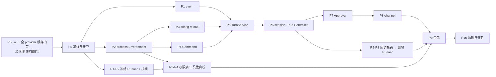

# TUI-First 重构 · 开发任务清单

> 配套文档：`TUI_FIRST_RUNTIME_REFACTOR.md`（架构与设计）。本文件是**可直接排期与执行的
> 任务分解**：每一行对应一个可独立 review、可 revert 的提交或 PR。
>
> 基线：HEAD `693f9c64` + 工作区未提交的 `pkg/agent` 迁移与 CLI 冻结。
>
> **最高优先级约束（I0）**：**6 个 provider（Anthropic / OpenAI / 智谱 GLM / DeepSeek /
> Kimi / 阿里云百炼 Qwen）的 prompt 缓存命中率都只能提高，不能降低。** P0-5a…P0-5g 是全部后续任务的前置门；
> 任一 provider 命中率低于基线，**立即 revert**，不接受"先合完包再优化"。与包结构、命名、
> 分层冲突时，牺牲后者。
>
> **包结构目标**：144 → **25 个包**，全部在 `pkg/` 下，取消 `internal/`。
> 分层 `agent/llm(L0) → 基础(L1) → 能力(L2) → turn,run(L3) → engine(L4) → tui,gateway(L5)`，
> 采用控制反转：消费者定义接口、`process` 是唯一组合根。
>
> ⚠ **阻断性缺口**：go-openai 的 `Usage` 结构体只有 `prompt_tokens_details`，
> DeepSeek 的 `prompt_cache_hit_tokens`、Kimi 的顶层 `cached_tokens`、百炼的
> `cache_creation_input_tokens` **在 SDK 解码阶段即被丢弃**。这三个 provider 的命中率
> 目前无法验证，**必须先做 P0-5f**（需在 transport 层取原始 JSON）。

---

## 0. 使用说明

### 0.1 任务粒度

一个任务 = 一个 PR = 一个可回滚提交。任务规模标记：

| 标记 | 含义 | 预期改动 |
| --- | --- | --- |
| S | 半天内 | < 300 行 |
| M | 1–2 天 | 300–1000 行 |
| L | 3–5 天 | 1000–3000 行 |
| XL | 需再拆 | > 3000 行；表中已拆到 L 以下，若执行时发现超出必须继续拆 |

### 0.2 三类提交不得混合

| 类型 | 内容 | 标记 |
| --- | --- | --- |
| **B** Behavior | 下沉语义、改 owner，尽量不改包名 | `[B]` |
| **M** Mechanical | 只改目录/包名/import，控制流一字不动 | `[M]` |
| **C** Cleanup | 删死代码、删旧包，在全部 caller 迁移后 | `[C]` |

一个 PR 同时含两类以上必须拆分，否则行为回归无法与 import 移动区分。

### 0.3 每个任务的通用完成标准

除表中"完成判据"外，所有任务都必须满足：

```text
[ ] go build ./... 通过
[ ] go vet ./... 通过
[ ] go test ./... 通过（新增/改动包必须有测试）
[ ] 【最高优先级 I0】触碰 prompt 组装时：前缀字节 golden 未变、断点结构断言通过、
    命中率回归 >= 基线；PR 描述附前后命中率数值
[ ] 触碰 TUI 路径时：TUI characterization suite 全绿（I1）
[ ] 未新增 nil guard / fallback / retry 掩盖症状（I4）
[ ] 未新增 alias / forwarder / feature flag（I5）
[ ] 旧代码在本 PR 内删除，不留"以后再删"
```

### 0.4 PR 描述模板

```text
类型：[B|M|C]   任务号：Pn-m
当前 owner → 目标 owner：
不变的对外语义 / golden：
新依赖方向是否符合分层规则：
【I0】是否触碰 prompt 组装？改变了 conversation 之前的内容吗？多久变一次？
【I0】命中率 基线值 -> 当前值（未触碰 prompt 组装可填「不适用」）：
删除清单：
执行过的命令：
```

### 0.5 阶段依赖



P3 与 P4 可并行；P9 内部各领域任务在 P9-0 完成后可并行。

**R 线（附录 F · `Runner` 解散）与主线并行**：R1–R2 在 P0 后即可开始，R3–R4 依赖 P2，
**R1–R4 必须在 P9 之前完成**；R5 核销 P1-6/P6 的成果，R7–R8 收尾于 P9-12。

---

## P0 · 基线与守卫

**目标**：把 TUI 现有行为固定成可自动验证的 contract，并在移动任何代码前封死反向依赖。
**出口**：无生产代码改动；每个关键语义都能指向具体 fixture/assertion。

| ID | 类型 | 任务 | 操作要点 | 完成判据 | 依赖 | 规模 |
| --- | --- | --- | --- | --- | --- | ---: |
| P0-1 | C | 提交工作区存量改动 | 提交 `internal/phero/* → internal/agent` 迁移与 `cmd/forebrain` 命令面冻结（已删除 `advanced/completion/config/doctor/memory/model/onboard/session/skills/status/supervisor/weixin`） | `git status` 干净；`go test ./...` 全绿，作为唯一基线 | — | S |
| P0-2 | B | package/import graph fixture | 新增可重生成脚本，从 `go list -json ./internal/...` 产出 `package`/`LOC`/`fan-in`/`fan-out`/`edges` 快照，落到 `pkg/architecture/testdata/graph.json` | 重跑脚本输出稳定；`architecture` 测试能读取并断言 | P0-1 | S |
| P0-2b | B | **修复空转的现有守卫** | `pkg/architecture/entrypoint_boundaries_test.go` 断言的 `internal/forebraintui` 目录已不存在，且 `_ = filepath.WalkDir(...)` 吞掉了错误，导致测试恒定通过（实测 PASS）。按 I4 做根因修复：断言目标目录存在，`WalkDir` 的错误必须导致失败；把目标改为真实的 TUI 入口 | 人为把目标指向不存在的目录时测试必须失败；改回后能真实捕获违规 import | P0-1 | S |
| P0-3 | B | 反向依赖守卫（第一批） | `architecture` 增加断言：`agentrun !-> uinotify, tui, gateway, clifacade`（`agentrun -> uinotify` 记为已知违规并 allowlist，其余立即生效）；`gateway !-> supervisorrun, kernel` 记为已知违规。**最高优先级那条同时生效：Layer 0–4 不得 import surface** | 新增任一违规边即失败；已知违规条目数只减不增 | P0-2b | S |
| P0-4 | B | 包深度与命名守卫 | 断言路径为 `pkg/<单词>`，两段仅允许 `llm/anthropic`、`llm/openai`；断言不存在顶层 `internal/` 与 `adapters`；断言包名不含 `common/utils/misc/manager/facade/host/core/base`；**断言无单文件包**（`workerhost` 等记为待删 allowlist） | 新建三级包、黑名单包名或单文件包立即失败 | P0-2 | S |
| P0-5a | B | **【I0】前缀字节 golden** | 构造一个 session，连续两次走到"即将调用 LLM"的位置，序列化 tools + system + developer instruction，断言两次逐字节相等 | 人为把某处改成每次重新读盘即失败 | P0-1 | M |
| P0-5b | B | **【I0】顺序确定性断言** | 断言 tool 表、skill 表、context source 的序列化顺序在重复运行间相同；用打乱 map 插入顺序的测试反向验证 | 把某个表改成 `range map` 即失败 | P0-5a | M |
| P0-5c | B | **【I0】断点结构断言** | 针对 `agentrun/anthropic_prompt_cache.go` 断言：渲染顺序 tools → system → messages；`cache_control` 数量 ≤ 4；相邻断点间距 = 15 个 content block；第一个断点落在 system 块末尾；TTL = 1h | 任一常数或位置被改动即失败 | P0-5a | M |
| P0-5f | B | **【I0·阻断性】cache usage 跨 provider 归一化** | 根因：go-openai v1.41.2 `Usage` 结构体只建模 OpenAI 的字段，其余 provider 的缓存字段在 SDK 解码时即丢失，换字段读没用。实现：新增**只读响应**的 `http.RoundTripper`（同 `openAIPromptCacheKeyRoundTripper` 模式但不改请求，故可对所有 provider 安装，不会扰动被测前缀）；非流式读完 body 解析后 `io.NopCloser` 复原，流式包一层 reader 边透传边扫 `data:` 行（只缓存当前不完整行）。读取优先级：`prompt_cache_hit_tokens` → `cache_read_input_tokens` → 顶层 `cached_tokens` → `prompt_tokens_details.cached_tokens`，另取 `cache_creation_input_tokens`；相减并 clamp 到 0，保持 `read+creation+input` = prompt 总量 | DeepSeek / Kimi / Qwen 的 `CacheReadInputTokens` 不再恒为 0；6 个 provider 的真实响应样本表驱动测试全部解析正确 | P0-1 | M |
| P0-5g | B | **【I0】`prompt_cache_key` 收敛复核** | `promptCaching` 开关目前只对 OpenAI 打开（`config.go:392`），第三方兼容端点不会收到该未知字段。复核这一门对 Qwen / GLM / DeepSeek / Kimi 都关着，且 OpenAI 侧该 key 在 session 内稳定 | 6 个 provider 均能正常请求；OpenAI 路径 key 稳定且 ≤ 64 字符 | P0-5f | S |
| P0-5d | ~~B~~ | **【已完成，owner 决策收口】** ~~逐 provider 命中率基线与回放工具~~ | 录制工具 `cmd/cachebaseline` 六个场景全部实现（含 compaction）；对比命令 `scripts/hitrate.sh` 已存在。DeepSeek 6/6 场景已用真实 key 录制，写入 `cache_baseline.json`。OpenAI 被账号侧 404（非模型/代码问题，见附录 G 2026-09-03c）挡住，未补全 6 场景，但 owner 已明确"provider相关的测试和验证全部结束，不需要再继续，可以标记完成"——工具与 DeepSeek 的完整交付即视为本任务的最终形态，OpenAI 的缺口不再追 | 按 owner 决策标记完成，非字面 6×2 全覆盖 | P0-5f, P0-5c | — |
| P0-5e | ~~B~~ | **【已收口，不再需要】** ~~命中率回归门禁接入 CI~~ | 同 P0-5d，owner 2026-09-03 决定 provider 验证工作到此结束，CI 门禁不再要求接入 | 不适用 | P0-5d | — |
| P0-5h | B | 【均已完成，前提已变】**【I0】工具集合单调性断言** | 原判据点名的 `agentrun/tool_visibility_llm.go`（连同 `revealed`/`tool_search` 整套机制）已随 `66c39ae6` 删除，不再存在可以"再消失"的已暴露工具集合；单调性现在是删除本身带来的结构性事实，断言收口为 `TestCharacterizationToolArrayIsStableAcrossTurns`（前半）。后半（限制工具时不改变数组）同理不再需要独立修复，见 E-3 与附录 G 的更新 | 全量测试通过，含真实 OpenAI 端点复测（见附录 G 2026-09-03 更新） | P0-5c | — |
| P0-5i | B | **【I0】模型参数稳定性断言** | 断言 reasoning effort、verbosity、`parallel_tool_calls`、`/fast` 等在一次 session 中途不切换（切换只在新 session 生效，与 skill 变更同策略） | 中途切 reasoning effort 的测试必须失败 | P0-5c | M |
| P0-6 | B | ScenarioResult 采集框架 | 新增测试辅助：跑完一个场景后从 SQLite + event sink 采集 `Messages/Runs/Steps/Actions/Waits/Events/Permissions`，提供 diff 输出 | 能对同一场景稳定产出可比较结构 | P0-1 | M |
| P0-7 | B | TUI characterization · 主链路 | 覆盖：普通 text turn、streaming assistant/reasoning、tool start/delta/complete 顺序、slash handled/continue/ephemeral、attachment 的 raw/display/model 三种输入 | 5 个场景各有 golden ScenarioResult | P0-6 | L |
| P0-8 | B | TUI characterization · 审批矩阵 | 覆盖：approve / deny / cancel、accept once / for session / remember to local settings、network approval、`request_permissions`、ask user question、enter+exit plan mode（含 clear context）、审批后再次 RequiresAction、进程重启后 resume | 10 个场景各有 golden；重启场景通过重开 store 验证 | P0-6 | L |
| P0-9 | B | TUI characterization · 中断与输入队列 | 覆盖：LLM/tool/stream 三个位置 cancel、瞬时错误 partial 落库、steer/retract/follow-up、跨审批门的队列存续、活动 run 期间配置变更 | 8 个场景各有 golden | P0-6 | L |
| P0-10 | B | Gateway 待删代码调用点清单 | 用 `rg` + `go list` 统计 `gateway/{server,post_turn_runtime,supervised_run,auto_compact,approval_ws,network_approval,run_input,run_cancel,slash_handlers,channels_bind}.go` 中每个导出符号的调用点（含非 WebSocket 的 HTTP 路径与 `AttachExtraRoutes`） | 产出 `docs/gateway-callsites.md`，每个待删符号有调用点数量与位置 | P0-1 | S |

---

## P1 · `event` 与依赖倒置

**目标**：先统一输出契约，为后续迁移 turn pipeline 提供稳定观察面。
**出口**：执行层不再认识 TUI/Gateway 类型；存储层不再做投影。

| ID | 类型 | 任务 | 操作要点 | 完成判据 | 依赖 | 规模 |
| --- | --- | --- | --- | --- | --- | ---: |
| P1-1 | M | `protocol → event` | `git mv internal/protocol pkg/event`，包名改 `event`，全仓改 import。**不改任何类型定义** | 编译通过；`protocol` 零命中 | P0-3 | S |
| P1-2 | M | `metasafe` 并入 `event` | `metasafe` 仅被 `protocol` 使用，直接并入为 `event` 内部 encoding helper，删包 | `metasafe` 零命中 | P1-1 | S |
| P1-3 | M | `taskbus`、`notifyq` 并入 `event` | `taskbus` 的 task event DTO 与 in-process notifier、`notifyq` 的无界 FIFO 一并入 `event`（`notifyq` 当前被 `gateway` 与 `tui` 共用，合入 `event` 后两者继续共用） | 两包零命中；gateway/tui 编译通过 | P1-1 | S |
| P1-4 | B | 补齐 typed event payload | 按设计文档 §4.4 的 18 个事件类型补齐 typed payload；不新增第二套协议 | 每个事件类型有构造函数与单测 | P1-1 | M |
| P1-5 | B | canonical event builder 从 `agentnotify` 提炼 | `agentnotify` 的 tool metadata / formatting 逻辑拆为两半：canonical builder 进 `event`，surface 投影暂留 `clifacade` 与 `gateway` | `event` 不 import 任何 surface 包 | P1-4 | M |
| P1-6 | B | **消除 `agentrun → uinotify`** | `agentrun/subagent_tool.go` 中构造 `uinotify` 消息的代码改为发布 `event`；由 `clifacade` 的 projector 转成 `uinotify` | `agentrun` 不再 import `uinotify`；P0-3 的该条 allowlist 删除；subagent 相关 TUI 输出 golden 不变 | P1-5 | M |
| P1-7 | B | **C3：`runrt` 停止投影** | `runrt.ProjectRunEvents` 移到 gateway/TUI 侧的 projector（P5 后再进 `turn`）；`runrt` 删除对 `protocol`/`diffview` 的 import | `go list` 显示 `runrt` 只依赖 `llm`/`telemetry`/`store` | P1-1 | M |
| P1-8 | B | TUI event projector | `clifacade` 新增 `event.RunEvent → uinotify.Message` 的单一投影入口，`tool_step_notify.go`/`run_event_notify.go`/`subagent_notify.go` 改为调用它 | P0-7/P0-9 的事件顺序 golden 零变化 | P1-5 | M |
| P1-9 | B | Gateway WS projector | `gateway` 新增 `event.RunEvent → wsServerMsg` 的单一投影入口，替换 `gatewayToolMetaPayload`/`gatewayToolStartedStepData`/`gatewayToolCompletedStepData` 中散落的 `map[string]any` 构造 | 现有 `ws_run_events_test.go`、`agentnotify_step_test.go` 等 wire schema 测试全绿 | P1-5 | M |
| P1-10 | B | per-run FIFO 与慢 consumer 隔离 | `event` 提供 dispatcher：同 run 严格 FIFO，单 sink 阻塞不影响其他 sink，sink 失败不回滚工具 | 新增并发测试：两个 sink，其中一个 sleep，另一个仍按序收全 | P1-3 | M |

---

## P2 · `process.Environment`

**目标**：消除 TUI 与 `workerhost` 的初始化重复，但不改 turn 流程。
**出口**：`workerhost` 删除；三个 surface 共用一套组装。

| ID | 类型 | 任务 | 操作要点 | 完成判据 | 依赖 | 规模 |
| --- | --- | --- | --- | --- | --- | ---: |
| P2-1 | B | 新建 `pkg/process` 骨架 | 定义 `OpenOptions`、`Environment`（字段见设计文档 §6）与 `Open`/`Close`；先只做 config 解析与 home 解析 | 包可编译，有最小单测 | P0-4 | S |
| P2-2 | B | 移动 store/DB 组装 | 从 `clifacade.openChatSessionWithConfigForProject`（`chat_session.go:258`）移出 state DB 打开、`session.Store`/`actionrt.Service`/`runrt.Service`/`memories.Store` 创建 | `ChatSession` 不再自行创建这些实例 | P2-1 | M |
| P2-3 | B | 移动 runner/pipeline 组装 | 移出 `newChatSessionRunner`（`chat_session.go:572`）、`kernel.AgentPipeline` 构建、active primary agent 解析、MCP 接线 | TUI 启动路径行为不变；`TestChatSessionRunnerBindsActivePrimaryAgent` 等测试改为跑 `process` | P2-2 | L |
| P2-4 | B | 移动 project/sandbox 组装 | 移出 launch dir → project root/project key 算法（`runnerProjectKey`、`normalizeProjectContextPath`、`sameProjectContextPath`）与 `sandboxrt.Manager` 构建。**以 TUI 算法为准**，`workerhost` 版本作废 | `TestChatSessionProjectContextAddendumUsesLaunchGitRoot` 通过且断言迁到 `process` | P2-3 | M |
| P2-5 | B | 移动 hook 注册 | 移出 `projectContextPreHook`（`chat_session.go:463`）、`planmodehooks`、`forebrainrules`、`assembly.Hook`、`runtimecontext` 的注册顺序 | hook 注册顺序与现状逐条一致（新增顺序断言测试） | P2-4 | M |
| P2-6 | B | `SessionSource` 显式化 | `OpenOptions.SessionSource` 取代按包名推断；TUI 传 `"tui"`，Gateway 传其现值 | memory defaults 与 session 来源标记行为不变 | P2-1 | S |
| P2-7 | B | 可选模块合并 | 把 `workerhost.Open` 独有的 uploads(`filert`)、channel registry、telemetry、approval TTL sweeper 作为 `Enable*` 可选模块合入 `process` | TUI 默认不启用这四项；Gateway 启用后行为与现状一致 | P2-5 | M |
| P2-8 | B | `ChatSession` 改持 `*process.Environment` | `ChatSession` 的 `Home/Config/Sandbox/SQL/MemoryStore/SessStore/ActionSvc/Runner/Pipe/RunSvc/CtxHook` 字段全部改为读 `Environment` | TUI 全量测试通过；字段不再重复持有 | P2-7 | M |
| P2-9 | B | Gateway 改用 `process.Open` | `gateway` 与 `cmd/forebrain` 的启动路径改调 `process.Open` | Gateway 启动与现状一致 | P2-7 | M |
| P2-10 | B | **C2：`platform` 停止 seeding** | `datadir → systemskills` 与 `datadir → modelcatalog` 两条边删除；bundled skill 安装与 model catalog 落盘的调用点上移到 `process.Open` | `datadir` 的 internal fan-out 为 0 | P2-9 | M |
| P2-11 | C | 删除 `workerhost` | 删 `open.go`/`config_reload.go`/`agent_once.go`/`subagent_exec.go`/`batchwork.go`/`context_snapshot.go`/`log.go`/`worker_cli.go`（one-shot 与 subagent 执行先临时放 `agentrun`，P9 再归位） | `workerhost` 零命中；P0-4 的 allowlist 条目删除 | P2-10 | M |
| P2-12 | B | runtime composition contract test | 同一 options 下断言 TUI 与 Gateway 拿到相同的 runner 配置、hook 顺序、store 实例数、sandbox effective config | 两条路径断言结果一致 | P2-11 | M |

---

## P3 · 统一配置热加载

**目标**：删掉两个 watcher 中的一个，统一采用 TUI 的 defer-while-running。

| ID | 类型 | 任务 | 操作要点 | 完成判据 | 依赖 | 规模 |
| --- | --- | --- | --- | --- | --- | ---: |
| P3-1 | B | 抽取 `ConfigWatcher` | 从 `clifacade/chat_session_config_reload.go:37 startConfigHotReload` 抽出通用 fsnotify + debounce watcher 到 `process` | 幂等启停测试（对应现有 `TestStartConfigHotReloadIsIdempotent`/`TestStopConfigHotReloadIsIdempotent`）迁移后通过 | P2-11 | S |
| P3-2 | B | `process.ConfigManager` | 迁移 `reloadConfigHot`/`applyConfigHotReload`/`reloadConfigFromDisk`/`reloadConfigAfterRun`/`ReloadConfig`，实现 pending 标记与 validate-then-swap（先在临时 runner view 上验证 load，成功才替换 live config） | 对应现有 4 个 reload 测试迁移后通过 | P3-1 | M |
| P3-3 | B | 活动 run 计数接口 | `ConfigManager` 通过窄接口查询"是否有活动 foreground run"；P3 期先由 `ChatSession` 实现，P6 换成 `run.Controller` | `TestReloadConfigHotDefersDuringActiveRun`、`TestReloadConfigDefersDuringActiveRunInsteadOfDropping` 通过 | P3-2 | S |
| P3-4 | B | 原子应用与回滚 | 实现完整替换序列：YOLO/preset/effective sandbox → startup validation → 临时 view 验证 → 替换 live config → 更新 MCP/memory defaults/sandbox/rules hook/context hook/skills；任一步失败保留旧 config | 新增 broken config 测试：live runtime 完全不变，无半应用状态 | P3-2 | M |
| P3-5 | B | Gateway 接入并删旧 watcher | Gateway 改用 `ConfigManager`；删除 `workerhost` 遗留的直接 `ReloadConfig` 语义（P2-11 已删文件，此处确认无残留调用） | 全仓只有一个 watcher 实现 | P3-4 | S |
| P3-6 | B | reload race 与缓存门禁 | 新增：reload 与 run completion 竞争的 race test；reload 后 prompt prefix golden 断言"当前 session 前缀不变，新 session 前缀才变" | `go test -race` 通过；I0 三层门禁通过（含命中率 ≥ 基线） | P3-4 | M |

---

## P4 · `turn` 骨架与 `CommandService`

**目标**：先迁移重复最明显、风险最低的 slash 语义，同时立起 `turn` 包。

| ID | 类型 | 任务 | 操作要点 | 完成判据 | 依赖 | 规模 |
| --- | --- | --- | --- | --- | --- | ---: |
| P4-1 | B | 新建 `pkg/turn` 骨架 | 建 `turn.Service`，内部字段为 5 个子服务（Submit/Approval/Command/Compaction/EventDispatcher）；`appcore` 的现有内容并入。**`Sessions` 与 `Runs` 不在此**——分属 `session`/`run` | `appcore` 零命中；`turn` 不 import 任何 surface 包 | P2-11 | S |
| P4-2 | M | `surface` 并入 `turn` | `surface.TurnSubmission`/`ToolApprovalRequest`/`ToolApprovalDecision`/`SlashOutcome`/`PendingInputPreview` 等类型迁入 `turn/model.go`，全仓改 import | `surface` 包删除 | P4-1 | S |
| P4-3 | M | `slashcmd`、`mention` 并入 `turn` | registry/executor 进 `turn/command.go`，mention 解析进 `turn/input.go`。**`sessionctx` 不在此**——它随 P6-0 进 `session` | 三包删除；`skilllifecycle → slashcmd` 改为 `→ chat`（若形成上行依赖则改为 `turn` 注册回调） | P4-2 | M |
| P4-4 | B | CommandService · 第一批命令 | 从 `clifacade/chat_session_slash_handlers.go` 迁移 `/compact`、`/context`、`/status` 的业务 handler 到 `turn.CommandService`；格式化留在 TUI | `TestHandleContextSlashSharedHelper`、`TestManualCompactSlashEmitsRunningAndTerminalFailureEvents` 迁移后通过 | P4-3 | M |
| P4-5 | B | CommandService · 第二批命令 | 迁移 `/permissions explain`、`/mcp`、`/sandbox`、`/diff` | `TestHandlePermissionsSlashExplain*`、`TestHandleMCPSlashVerbose` 迁移后通过 | P4-4 | M |
| P4-6 | B | CommandService · 第三批命令 | 迁移 `/model`、`/fast`、`/memories`、`/clear`；`slashmodel` 的 picker 留 TUI，配置写入走 `CommandService` | `TestApplyModelSelection*`、`TestResetMemoriesRequiresStoreBeforeClearingFiles` 迁移后通过 | P4-5 | M |
| P4-7 | B | surface intent 命令 | session 选择、权限管理、skill 选择、quit 统一返回 typed intent；TUI 弹 UI，Gateway 转 typed response，二者都不得重新执行命令 | 新增 intent 契约测试 | P4-6 | S |
| P4-8 | B | TUI handler 变纯委托 | `ChatSession.Handle*Slash` 只剩参数映射与格式化调用 | `chat_session_slash_handlers.go` 行数从 1674 降到 < 300 | P4-7 | M |
| P4-9 | B | Gateway 接入 CommandService | `parseSlashCommand`/`parseSlashCommandWithOptions`（`server.go:1785`）改调 `turn.CommandService` | Gateway slash 行为与 TUI 一致（`api_slash_test.go`、`server_slash_test.go` 通过） | P4-8 | M |
| P4-10 | C | **删除 `gateway/slash_handlers.go`** | 删除 `HandleCompactSlash`/`HandleContextSlash`/`HandleStatusSlash`/`HandlePermissionsSlash`/`HandleMCPSlash`/`HandleSandboxSlash`/`HandleDiffSlash`/`HandleModelSlash` 及全部 gateway 私有 formatter | 文件删除；`slash_handlers_test.go` 改为契约测试 | P4-9 | S |
| P4-11 | B | 跨 surface command contract test | 同一命令行输入分别经 TUI 与 Gateway 执行，比较 canonical `SlashOutcome`（不比较文本格式） | 11 个共享命令全部一致 | P4-10 | M |

---

## P5 · `TurnService`（正常 turn）

**目标**：迁移不含 approval resume 的正常 turn 主链路。
**风险**：本阶段起触碰落库与事件顺序，每个任务后必须跑 P0-7/P0-9 golden。

| ID | 类型 | 任务 | 操作要点 | 完成判据 | 依赖 | 规模 |
| --- | --- | --- | --- | --- | --- | ---: |
| P5-1 | B | canonical 模型定型 | 在 `turn/model.go` 定义 `Origin`/`Surface`/`TurnRequest`/`Attachment`/`TurnStatus`/`TurnOutcome`（设计文档 §4） | 类型有完整字段注释与 JSON round-trip 单测 | P4-2 | S |
| P5-2 | B | 输入归一化与 parts | 迁移 `surfaceTurnContentParts`、`buildSurfaceUserPartsJSON`（`chat_surface_attachments.go:91,126`）与 `displayTextOrUserText`（`chat_surface.go:235`） | attachment 的 raw/display/model 三路 golden 不变 | P5-1 | M |
| P5-3 | B | per-session foreground lock | 新增 per-session 串行锁；**不得复用全局锁**（R2）。**该锁归 `session`**，`turn` 通过注入接口借用 | 新增测试：同 session 串行、不同 session 并发 | P5-1 | S |
| P5-4 | B | 前置守卫 | 迁移 pending approval guard（`surfaceNeedsToolApproval`）与悬空 tool result 修复 | 已等待审批时提交新 turn 被拒绝，行为与 TUI 一致 | P5-3 | M |
| P5-5 | B | CompactionService | 迁移 `maybeAutoCompactBeforeAppend`、`notifyAutoCompact`、`appendPreflightCompactStep`、`compactService`、`compactExplicitLimit`（`chat_auto_compact.go`） | auto-compact 成功/失败 golden 不变；compact step 追加时机不变 | P5-4 | M |
| P5-5b | B | **session 创建收口** | 实测四处各自创建：`appcore/session_store.go` 与 `gateway/server.go` 硬编码 `sessionid.New("web")`、`clifacade/chat_session.go` 传 prefix、`slashcmd/executor.go` 用 `NewForSurface`。统一为 `session.Create(...)`，source 取自 `process.Options.SessionSource`；`state` 只负责 ID 生成与写行 | 四个调用点收敛为一；surface 不再直接生成 ID 或写库；两处 `"web"` 硬编码删除 | P5-4 | M |
| P5-6 | B | user transcript append policy | 迁移"`content` 存 RawInput/display、`parts_json` 存展开输入、append 前确保 session 存在"的规则 | transcript golden 不变；单一 append owner | P5-5 | M |
| P5-7 | B | agent context 与 hook 安装 | 迁移 `prepareTUIAgentBase`（`chat_supervisor_turn.go:449`）、`installRunAuditStepHook`、`installCompactedHook`、`streamAccumulator`；hook 不再直接持有 TUI callback，改为发布 `event` | tool step / stream delta 顺序 golden 不变 | P5-6 | L |
| P5-8 | B | 成功落库 | 迁移 `appendAssistantOutcome`、`resultParts`、`resultLastResponseUsage`、`isReasoningOnlyAssistantEcho`、memory citation 规则 | assistant 落库 golden 不变（含 reasoning/model/usage/时间戳） | P5-7 | L |
| P5-9 | B | cancel/error 落库 | 迁移 `persistCancelledTurnOutcome`、`persistReplayResults`、`emitPartialAssistantFromRAE`、`capturedAssistantTextForCurrentTurn` 与悬空修复 | 三个 cancel 位置的 partial golden 不变 | P5-8 | L |
| P5-10 | B | `TurnService.Submit` 组装 | 按设计文档 §5.1 的流程图串起 P5-2…P5-9，产出 `TurnOutcome` | `Submit` 单测覆盖 completed / cancelled / failed 三条出口 | P5-9 | M |
| P5-11 | B | TUI 改为委托 | `DispatchSurfaceTurn`（`chat_surface.go:16`）与 `dispatchUserTurnContent`（`chat_session.go:1630`，267 行）改为映射 + `Submit` + 投影 | 两个函数合计 < 120 行；P0-7/P0-9 全绿 | P5-10 | L |
| P5-12 | B | Gateway 普通 turn 切换 | `HandleChatWS`（`server.go:537`，约 1200 行）中的 turn 段改调 `TurnService.Submit`；**按入口整体切换，禁止双写** | Gateway 普通 turn / tool turn / cancel / error 的 wire 输出不变 | P5-11 | L |
| P5-13 | C | 删除 Gateway 重复实现 | 删 `supervised_run.go`（`runAgentWithSupervisor`）、`post_turn_runtime.go`（`finishSuccessfulTurn`/`appendTranscriptTurns`/`persistCancelledGatewayTurn`/`gatewayUserPartsJSON`/`gatewayResultParts`/`gatewayResultLastResponseUsage`）、`auto_compact.go`（`autoCompactBeforeUserAppend`/`assembleContextSnapshotForUserInput`/`compactService`/`appendPreflightCompactStep`） | 三个文件删除；Gateway 不再 import `supervisorrun` | P5-12 | M |
| P5-14 | B | 跨 surface turn contract test | 同一 `TurnRequest` 经 TUI 与 Gateway WS 执行，比较 `ScenarioResult` | transcript / run / step / event 序列一致 | P5-13 | M |

---

## P6 · `session` 抽取 与 `run.Controller`

**目标**：抽出 `session` 包；统一 cancel、steer、follow-up、retract 与活动 run 生命周期。
**关键改造**：`ChatSession` 当前是**单活动 run** 模型（`tuiActiveRunID`/`tuiRunCancel`/
`tuiTurnInputRT` 各一个字段），必须改成按 session/run 索引的 map。

| ID | 类型 | 任务 | 操作要点 | 完成判据 | 依赖 | 规模 |
| --- | --- | --- | --- | --- | --- | ---: |
| P6-0 | B | **抽取 `session` 包** | 从 `clifacade` 抽出 session 生命周期实测 248 行（`ResumeSession` 31、`ensureSessionStartHooks` 32、`NewSessionID` 3、`IsFastMode` 29、`SetFastMode` 15、`preferredSessionIDForFast` 10、`EnsureSurfaceTranscript` 10、`PreferredSurfaceTranscriptSessionID` 10、`ClearSurfaceSession` 31、`ListSessionsRecent` 6、`SurfaceTranscript*` 71），加 `sessionctx` 186 行 → `pkg/session`。**`surfaceTurnContentParts`/`buildSurfaceUserPartsJSON` 不在此**，它们是 turn 输入归一化 | 约 434 行、≥2 文件；`session` 不 import `turn`/`run`（`ActiveRunProbe` 走注入） | P5-14 | M |
| P6-1 | B | 数据结构 | 定义 `run.Controller`/`RunState`/`RunPhase`（设计文档 §5.2） | 结构体有并发注释；`go vet` 无锁拷贝告警 | P5-14 | S |
| P6-2 | B | 单实例字段 → 按 run 索引 | 迁移 `tuiTrackCancel`/`tuiSuspendCancel`/`tuiForgetCancel`/`tuiEndRun`/`tuiRunActive`/`CancelActiveRun`/`ensureTUITurnInputRuntime`/`discardTUITurnInput`（`chat_session.go:846-1000`），字段改为 `map[runID]*RunState` | 单 run 行为与现状完全一致；新增多 run 并发测试 | P6-1 | L |
| P6-3 | B | turn input runtime 归位 | `agentrun/turn_input_runtime.go` 移到 `run`（它是 run 作用域状态），`agent` 侧只保留消费用的 input source 接口 | `agent` 不再拥有 turn input 生命周期 | P6-2 | M |
| P6-4 | B | cancel 幂等序列 | 实现设计文档 §5.2 的 6 步；第二次 cancel 返回 typed no-op | 新增测试：并发两次 cancel 只产生一个 cancelled event | P6-3 | M |
| P6-5 | B | steer/follow-up/retract | 迁移 `QueueSurfaceFollowUp`/`SteerSurfaceRun`/`RetractSurfaceSteer`/`SurfacePendingSteerCount`（`chat_session.go:1002-1072`）与 `installTUITurnInputRuntimeHookLocked`；保留"已 drain 不可 retract""审批门只 suspend cancel 不清队列""队列在 surface turn 最终结束时才清理" | P0-9 的 steer/retract golden 不变 | P6-4 | L |
| P6-6 | B | preview 由共享层发布 | `PendingInputPreview` 更新统一由 `run.Controller` 发布 `pending_input_updated` event，adapter 不自行推断 | TUI composer 与 Gateway preview 同源 | P6-5 | M |
| P6-7 | B | Gateway run input 改为 mapper | `run_input.go` 的 `activeRunInputState` 及其 10 个方法、`trackRunInput`/`getRunInput`/`forgetRunInput`/`rejectPendingSteersForRun`/`enqueueRunFollowUp`/`drainNextRunFollowUp`/`previewRunInput`/`forgetRunInputIfEmpty` 全部删除，`handleRunInput`/`handleRunQueuedInput` 只做 HTTP ↔ canonical 映射；附件 follow-up 先转 canonical `TurnInput` | `run_input.go` 从 471 行降到 < 150 行；`run_input_test.go`/`run_input_recall_test.go` 改为契约测试 | P6-6 | L |
| P6-8 | B | Gateway cancel 改为 mapper | `run_cancel.go` 的 `trackRunCancel`/`forgetRunCancel`/`trackRunCancelCause`/`AttachRunCancel`/`DetachRunCancel`/`takeRunCancel`/`finalizeRunCancelDB` 删除，`handleRunCancel` 只调 `RunController.Cancel` | `run_cancel.go` < 60 行；HTTP handler 不再写 transcript | P6-7 | M |
| P6-9 | B | ConfigManager 换接线 | P3-3 的活动 run 计数改由 `run.Controller` 提供，跨 session 计数纳入判断 | reload defer 行为在多 session 下正确 | P6-8 | S |
| P6-10 | B | 并发与 race 门禁 | 覆盖：同/不同 session 并发 submit、cancel 与 tool completion 竞争、steer drain 与 retract 竞争 | `go test -race ./pkg/turn ./pkg/run ./pkg/session` 通过 | P6-9 | M |

---

## P7 · `ApprovalService` 与 resume

**目标**：以 TUI 实现替代 Gateway 全部 approval/resume 语义。**本阶段风险最高。**
每个任务后必须跑 P0-8 的 10 个审批 golden。

| ID | 类型 | 任务 | 操作要点 | 完成判据 | 依赖 | 规模 |
| --- | --- | --- | --- | --- | --- | ---: |
| P7-1 | B | request builder 迁移 | 迁移 `baseApprovalRequest`（`chat_surface_approval.go:112`）、`buildSurfaceToolApprovalRequest`（:194）、`approvalToolInputJSON`、`surfacePermissionDecisionContext`、`surfacePersistentCommandRule`、`surfaceBashPersistentRuleProposed`，依赖改为窄接口 | 同一 action 在两个 surface 得到逐字段相同的 typed request | P6-10 | L |
| P7-2 | B | decision 校验与应用 | 迁移 `completeSurfaceToolApprovalDecision`（:419，198 行）：校验 → 预构建 effect → 原子更新 action → 应用 effect → clear context → audit → plan mode → 清 wait → 恢复 run（严格按设计文档 §5.3 的 10 步） | approve/deny/cancel + accept once/session/remember 六个 golden 不变 | P7-1 | L |
| P7-3 | B | network approval | 迁移 `promptInlineNetworkApproval`（:36）、`networkApprovalFromJSON`、`validateSurfaceNetworkSessionUpdate` | network approval golden 不变 | P7-2 | M |
| P7-4 | B | request_permissions 与 ask user | 迁移 `requestPermissionsFromJSON`、`submitAskUserQuestionApproval`（`chat_session.go:1107`）、`appendToolApprovalAudit`（:1076）、`ApproveCallback`（:1195） | 两个 golden 不变 | P7-3 | M |
| P7-5 | B | plan mode 与 clear context | 迁移 `yoloExitPlanModeDecision`、`markPendingApprovalClearedContext`、`minimalClearedResumeSnapshot`（`chat_supervisor_turn.go:149`） | enter/exit plan mode + clear context golden 不变 | P7-4 | M |
| P7-6 | B | pending approval 改为持久化恢复 | `setPendingApproval`/`clearPendingApproval`/`takePendingApprovalIfMatch`/`takePendingApprovalForAction`/`hasPendingToolApproval`/`peekPendingApproval`/`ResetTUIPendingState`（`chat_supervisor_turn.go:117-243`）的内存单例改为以 `runrt.FindRunByAction` + `actionrt` 为准；内存只作活动执行缓存 | 进程重启后 resume golden 通过（P0-8） | P7-5 | L |
| P7-7 | B | resume pipeline | 迁移 `resumeAfterApproval`（:777）、`resumeAfterDenial`（:1039）、`runResumeApprovedTurn`/`runResumeDeniedTurn`/`runResumeTurn`（:907）、`resumeAgentContext`（:836）、`abortPendingApproval`、`notifyToolApprovalDenied`、`attachRunWaitForRequiresAction`、`persistRequiresActionSnapshot`、`originatingApprovalToolStepID`、`pendingApprovalToolCall`、`pendingApprovalToolStepID`、`latestAssistantToolUseMessage` | resume 复用同一 RunID/RunState/input queue；二次 RequiresAction golden 不变 | P7-6 | L |
| P7-8 | B | plan review 子流程 | 迁移 `planReviewOptions`/`planReviewNotes`/`planReviewResults`/`appendPlanReview`/`clearPlanReviews`/`planReviewDenyReason`/`completeSurfacePlanReviewRequest`/`runPlanReview`/`planReviewerFor`/`planReviewTaskContext`（`chat_plan_review.go`）；review model 选择与展示留 TUI | plan review golden 不变；`planreview` 包并入 `turn` | P7-7 | M |
| P7-9 | B | resume 并发保护 | action transition + `RunState` phase CAS + resume guard，防止同一 run 被并发恢复两次 | 新增并发 decision 测试：只启动一个 resume | P7-7 | M |
| P7-10 | B | Gateway decision 改为 wire mapper | `network_approval.go` 中 `handleGatewayApprovalMessage` 只保留解析；删除 `applyGatewayApprovalDecision`/`validateGatewayApprovalDecision`/`prepareGatewayApprovalDecision`/`prepareGatewayRememberedApproval`/`gatewayRememberedApprovalUpdate`/`checkGatewayRememberAvailable`/`applyGatewayRequestPermissionsDecision`/`abortGatewayRunForAction`/`promptGatewayNetworkApproval`；按设计文档 §5.3 的表做 wire → canonical 映射 | `network_approval.go` 从 488 行降到 < 120 行 | P7-9 | L |
| P7-11 | B | Gateway approval 投影 | `approval_ws.go` 的 `approvalWSData`/`gatewayApprovalDecisionWire` 只从 typed request 投影，不再自行计算 available decisions | `approval_ws_test.go`、`actions_permission_suggestion_test.go` 通过 | P7-10 | M |
| P7-12 | C | 删除 Gateway resume 实现 | 删除 `api_extra.go` 中的 resume 分支与 `tryResumeRunAfterActionWithClear` 等；所有 action decision endpoint 只调 `ApprovalService.Decide` | `action_resume_snapshot_test.go`、`approval_http_test.go` 改为契约测试 | P7-11 | M |
| P7-13 | C | **删除 `ChatSession` facade 与 `clifacade`** | 剩余 TUI 代码已无业务分支；本任务把它并入 `pkg/tui`。`ChatSession`(54 字段) 至此按 owner 全部拆完：turn/session/run/process/tui | `clifacade` 零业务逻辑；facade 方法只做映射 | P7-12 | L |

---

## P8 · `channel` 独立

| ID | 类型 | 任务 | 操作要点 | 完成判据 | 依赖 | 规模 |
| --- | --- | --- | --- | --- | --- | ---: |
| P8-1 | M | 新建 `pkg/gateway` 的 channel 部分 | `channelbind` + `channels/common` + `channels/{httpbridge,oauth,wsbridge}` 合并为 `channel`；删除无 importer 的 `channels/httpproto`。provider 合并留到 P9-16 | 四包删除；provider 只依赖 `channel` | P7-13 | M |
| P8-2 | B | `TurnPort` 依赖反转 | `channel` 定义 `TurnPort` 窄接口（提交 turn / 订阅 event），由 `turn` 实现，`process` 注入 | `channel` 不 import `turn` 实现，只 import 其类型 | P8-1 | M |
| P8-3 | B | `channelBus → channel.Service` | 迁移 `gateway/server.go` 的 `channelBus.PublishInbound`（:297）、`deliverOutbound*`（:257-265）、`DeliverChannelOutbound`（:250）、`bus()`（:242）与 `BindChannels`（`channels_bind.go:22`） | 入站走 `TurnService.Submit`，出站走 canonical projector | P8-2 | L |
| P8-4 | B | webhook 最小 listener | `channels/webhook` 的路由挂到 `channel` 自有的可替换 route table，可选挂到 Gateway router（`channelRoutes`） | 不加载 Web UI / WS chat 也能收 webhook | P8-3 | M |
| P8-5 | B | active agent rebind | 迁移 agent 切换时的 channel 重绑定，与 `process` 的原子替换对齐 | 新增 race test：agent switch 与 channel rebind 竞争 | P8-3 | M |
| P8-6 | C | 删除 Gateway channel 业务 | 删 `channels_bind.go`；`gateway` 只保留可选的 route 挂载 | `gateway` 不再 import `channel` 的业务方法 | P8-4 | S |
| P8-7 | B | 独立启动集成测试 | 只启动 Channel service（不启 Web/WS Gateway）跑通 bot-token channel 与 webhook channel 各一条收发链路 | 两条链路通过 | P8-6 | M |

---

## P9 · 按领域合包与拆分

**前置**：附录 F 的 **R1–R4（`Runner` 解散前四步）必须已完成**——它们在现有目录结构内做
行为保持提取，若拖到本阶段与搬目录同时进行，回归无法定位。此外 P9-0a…0f 必须先解决——0a/0b/0c 是结构性冲突（不解会成环），0d/0e/0f 是控制反转自查项（不解会把违背原则的设计固化进新包）。
**并行**：P9-0 全部完成后，P9-1…P9-10 各领域可并行；P9-11/P9-12 依赖 P9-0b/0c/0d。

### P9-0 · 结构性冲突（必须最先做）

| ID | 类型 | 任务 | 操作要点 | 完成判据 | 依赖 | 规模 |
| --- | --- | --- | --- | --- | --- | ---: |
| P9-0a | B | **C1：`ExecutionTiming` 归位** | 把 `toolruntime.ExecutionTiming`/`NewExecutionTiming`/`AggregateExecutionTimings`（30 行）移入 `llm`；`llm` 不再 import `toolruntime` | `llm` 的 internal fan-out 中无 tool 相关包 | P8-7 | S |
| P9-0b | B | **C4：`tool.AgentSpawner` port** | `toolreg` 与 `codetools` 当前只用 `agent.Agent`/`agent.New`；改为在 tool 侧定义 `AgentSpawner` 接口，由 `agentrun` 实现、`process` 注入 | `toolreg`/`codetools` 不再 import `agent` | P9-0a | M |
| P9-0c | B | **C4：`tool.ForkRunner` port** | 删除 `kernel → agentrun`、`kernel → codetools`、`hooks → forkagent`、`hooks → codetools` 四条上行边，改为 `ForkRunner` 接口注入 | `kernel`/`hooks` 只 import `tool`/`llm`/`config`/`state` | P9-0b | M |
| P9-0d | B | **【IoC】provider 注入化（自查 V2）** | 实测 `agentrun/config.go:367–392` 按 config 分支构造 anthropic/openai-responses/openai-compat。改为 `process` 按 config 构造 `llm.LLM` 注入 `run`；`run` 只认接口 | `run` 不 import `llm/anthropic`、`llm/openai`；6 个 provider 的 I0 命中率基线不变 | P9-0a | M |
| P9-0e | B | **【IoC】Layer 3 层内边清零（自查 V3/V4）** | `turn` 定义 `RunExecutor`/`SessionContext`，`session` 定义 `ActiveRunProbe`，签名只用 Layer 0/1 类型；由 `process` 注入 | `session`/`turn`/`run` 互不 import，架构测试断言层内边为 0 | P9-0d | M |
| P9-0f | B | **【IoC】Environment 接口化 + hook 注册收口（自查 V1/V5/V6）** | 导出字段改接口，`db` 不导出，`Config` 改只读接口；`Options` 支持 port 覆盖。能力包只返回 hook 值，由 `process` 注册 | 第三方可替换 `state`/`run` 实现；能力包不持有 pipeline 实例 | P9-0e | M |

### P9-1 · `state`

| ID | 类型 | 任务 | 操作要点 | 完成判据 | 依赖 | 规模 |
| --- | --- | --- | --- | --- | --- | ---: |
| P9-1a | B | `Turn → Message` 全量改名 | 在原 `session` 包内一次性改：`session.Turn → Message`、`ListRecentTurns → ListRecentMessages`、`ListAllTurns → ListAllMessages`、`AppendTurnWithSource → AppendMessageWithSource`、`AppendStructuredTurn → AppendStructuredMessage`、`SurfaceTranscriptTurns → SurfaceTranscriptMessages`、`SurfaceActiveContextTurns → SurfaceActiveContextMessages`、`appcore.SessionTurn` 删除。**不留 alias**（I5） | 全仓 `\.Turn\b` 在 session 语境下零命中 | P9-0a | M |
| P9-1b | M | SQLite 三包合并 | `store` + `session` + `runrt` + `actionrt` 合并为 `internal/state`，包名 `state`；跨表查询（如 `FindRunByAction`）改为包内直连 | 四包变一包；`state` 只依赖 `llm`/`config`/`platform`/`telemetry` | P9-1a | L |
| P9-1c | M | `filert` 并入 `state` | 上传文件元数据/解析/对象存储进 `state`；HTTP multipart 留在 `gateway` | `filert` 删除 | P9-1b | M |
| P9-1d | M | 5 个 JSON store 并入 `state` | `modestore`/`faststate`/`planstore`/`todostore`/`intermediatestore` 合并，统一 atomic write、路径校验与 scope 类型（project scope 与 session scope 用不同类型区分） | 五包删除；`fastctx` 一并并入 `agent` | P9-1c | M |
| P9-1e | B | 验证 `state` 不做投影 | 确认 P1-7 的成果未回流：`state` 不 import `event` | 分层守卫断言通过 | P9-1d | S |

### P9-2…P9-10 · 其余领域

| ID | 类型 | 任务 | 操作要点 | 完成判据 | 依赖 | 规模 |
| --- | --- | --- | --- | --- | --- | ---: |
| P9-2 | M | `llm` 合并 | `llm/middleware`（retry/limiter/fallback）、`modelcatalog`、`reasoningcarry`、`tokestimate`、`contextwindow`、`forebrainstr` 的 API error 并入 `llm`；guardrail middleware 拆去 `safety` | 六包删除；`llm` fan-out ≤ 3 | P9-0a | L |
| P9-3 | M | `safety` 合并 | `permissions` + `sandboxrt` + `guardrails` + `projecttrust` + `skilltrust` → `safety`；平台 backend 用 build tag 文件分隔，不建子包 | 五包删除；各平台交叉编译通过 | P9-0a | L |
| P9-4 | M | `skill` 合并 | `skill` + `skillhub` + `skilllifecycle` + `skillmeta` + `skillroots` + `skillrt` + `skilltoggle` + `systemskills` → `skill`；删除无 importer 的 `skillpath` | 八包变一包；skill 表构建顺序稳定（I0 三层门禁通过） | P9-3 | L |
| P9-5 | M | `memory` 合并 | `memories` + `memories/localbackend` + `texttruncate` → `memory`（单数）；`codetools/memory_tools.go` 的产品工具随之迁入 | 三包删除；memory 指令注入的字节稳定性 golden 通过 | P9-4 | M |
| P9-6 | M | `telemetry` 合并 | `trace` + `inprocmetrics` + `logfile` + `logredact` + `paniclog` → `telemetry`，按 tracing/metrics/logging 分文件 | 五包删除 | P9-0a | M |
| P9-7 | M | `platform` 合并 | `datadir`（已去 seeding）+ `envguard` + `workspacebootstrap` + `buildinfo` + `pathguard` + `forebrainstr` 的 path → `platform` | 六包删除；`platform` internal fan-out = 0 | P9-6 | M |
| P9-8 | M | `config` 合并 | `primaryagent`（active agent profile/roster/state）+ `cli/agentmodel` 的配置读写 → `config` | 两包删除；`config` 不吸收 runtime 对象与 surface default | P9-7 | M |
| P9-9 | M | `event` 收尾 | 确认 P1 的 `protocol`/`metasafe`/`taskbus`/`notifyq` 合并完成，`agentnotify` 只剩已迁走的投影代码后删包 | `agentnotify` 删除 | P9-6 | S |
| P9-10 | M | `assembly` 合并 | `gitcontext` + `forebrainrules` + `contextdebug` 快照 + `compact` + `agentrun/{compact_chain,proactive_compact}.go` → `assembly`；删除无 importer 的 `contextmap`；`contextdebugfmt` 去 `tui` | 六包删除；context source 组装顺序稳定（I0 三层门禁通过） | P9-2 | L |

### P9-11 · `tool`

| ID | 类型 | 任务 | 操作要点 | 完成判据 | 依赖 | 规模 |
| --- | --- | --- | --- | --- | --- | ---: |
| P9-11a | B | product tools 出栈 | `codetools` 的 `memory_tools.go` → `memory`、`session_tools.go`/`intermediate_tool.go` → `state`、`subagent_tools.go`/`product_tools.go` → `agent`；均以 tool adapter 形式对接 registry | tool catalog golden 不变（名称/schema/顺序） | P9-1d, P9-5 | L |
| P9-11b | M | 输出流水线合并 | `toolruntime`（去 ExecutionTiming）+ `outfilter` + `rewrite` + `textpager` + `outputbudget` + `forebrainstr` truncate → `tool` | 六包删除；output envelope golden 不变 | P9-0a | L |
| P9-11c | M | diff 合并 | `diffview` + `turndiff` + `codetools/turndiff.go` → `tool` | 两包删除；diff 渲染 golden 不变 | P9-11b | M |
| P9-11d | M | registry 与工具实现合并 | `toolreg` + `tool/human` + `codetools` 剩余（filesystem / shell / web / registry / policy / state / orchestration / approval gate）→ `tool`，按文件组织：`registry_*.go` `policy_*.go` `file_*.go` `shell_*.go` `web_*.go` `approval_*.go` `output_*.go` `diff_*.go` | `codetools`/`toolreg`/`tool/human` 删除；`pathguard` 已去 `platform`；tool catalog + permission decision + sandbox request golden 全部不变 | P9-11a, P9-11c, P9-0b | L |

### P9-12 · `agent` 与 `run` 拆分

| ID | 类型 | 任务 | 操作要点 | 完成判据 | 依赖 | 规模 |
| --- | --- | --- | --- | --- | --- | ---: |
| P9-12a | M | provider 拆出 | `agentrun/anthropic_*.go` → `llm/anthropic`；`agentrun/openai_*.go` + `chatgptauth` → `llm/openai`；`fallback_llm.go`/`recoverable_llm.go`/`retry_policy.go` → `llm` | provider 包只依赖 `llm`；prompt cache 相关测试（`anthropic_prompt_cache_test.go`）通过 | P9-2 | L |
| P9-12b | M | subagent 合并 | `agentrun/subagent_*.go` + `agentrun/fork_*.go` + `forkagent` + `subagents` + `agentdefs` → `agent` | 三包删除；subagent 并发与历史行为不变 | P9-12a, P9-0c | L |
| P9-12c | M | `run` 包成型 | `supervisorrun` + `goalcontinuation` + `runutil` + `workerhost` 遗留的 one-shot/subagent 执行 → `agent`；对外 API 为 `agent.Run(ctx, req)` | 三包删除；`turn` 只调 `agent.Run` | P9-12b | L |
| P9-12d | M | **`agent` 保持纯净** | `agentrun` 剩余全部进 `run`；`pkg/agent` **只含**原 `internal/agent`+`trace`+`tool/human`+compact 算法，**不吸收 `agentrun`**（C9/C11）。`agent` 三方依赖为零、内部依赖只有 `llm` | `agent` fan-out=1 且三方依赖为零；`agentrun` 包删除 | P9-12c | L |
| P9-12e | M | `hook` 合并 | `kernel` + `hooks` → `hook`，按 pre/post/tool hook 分文件。保持独立不并入 `tool`：它拦截整个 turn 生命周期（含 `UserPromptSubmit`），并入会让 `tool` 包名失准 | 两包删除；`hook` 不 import `agent`（改用 port） | P9-0c | M |

### P9-13…P9-16 · Surface 归位

| ID | 类型 | 任务 | 操作要点 | 完成判据 | 依赖 | 规模 |
| --- | --- | --- | --- | --- | --- | ---: |
| P9-13 | M | `tui` 合并（第一批） | `uinotify` + `tuilog` + `slashfmt` + `slashmodel` + `planupdate` + `contextdebugfmt` + `clifacade` 剩余 → `tui` | 七包删除 | P7-13, P9-10 | L |
| P9-14 | M | `tui` 合并（第二批） | `tui` → `tui`；同时把 session replay 转换移到 projector，renderer 只接收 view model | `tui` 删除；`tui` fan-out 从 27 降到 ≤ 4（只剩 `turn`/`event`/`config`/`llm`） | P9-13 | L |
| P9-15 | M | `gateway` 合并 | `rest` + `httpauth` + `httprouter` + `webui` + `workercallback` 的 DTO + `clifacade/gateway_http.go` → `gateway`；删除 `workercallback` 的 client | 五包删除；`gateway` fan-out ≤ 4 | P9-14 | M |
| P9-16 | M | channel provider 合并 | `channels/*` 全部 21 个目录并入 `channel`，17 个 provider 各成一个文件（`telegram.go`、`slack.go`…）。`weixin` 的 `silk_cgo.go`/`silk_nocgo.go` build tag 对保持原样，包内照常生效 | `internal/channels` 目录消失；CGO_ENABLED=0/1 两种构建均通过 | P8-7 | M |
| P9-17 | M | `process` 吸收 setup | `cli/runtime` + `cli/setup` + `cli/onboard`（流程）+ `cli/llmsetup`（非 UI）+ `cli/onboardlog` + `clifacade/setup_resolve.go` → `process`；terminal prompt 进 `tui`，通用日志进 `telemetry` | `internal/cli` 目录消失 | P9-13 | M |
| P9-18 | B | **【I0】前缀单次计算收口** | 把 system 文本、tool 表、skill 表、memory 指令的派生全部收口到 `process` 在建立 session 时算一次，`turn` 与 `agent` 全程复用同一份；扫描并消灭所有 per-call 重新派生的路径 | 前缀派生函数在一次 session 内只被调用一次（用计数断言）；命中率 **高于** 基线 | P9-12d, P9-10, P9-4, P9-5 | L |

---

## P10 · 死代码清除与守卫收口

| ID | 类型 | 任务 | 操作要点 | 完成判据 | 依赖 | 规模 |
| --- | --- | --- | --- | --- | --- | ---: |
| P10-1 | C | 删除无 importer 的包 | 删 `jobs`、`reviewrt`、`shellargv`、`workerproc`（`contextmap`/`skillpath`/`mcprt`/`channels/httpproto` 已在各自阶段删）；删除 `workercallback` client | 四包删除；`go list` 无残留 | P9-17 | S |
| P10-2 | C | 删除 `fb_jobs` 表 | 按 I5 直接删表与建表语句，不写 migration | schema 中无 `fb_jobs` | P10-1 | S |
| P10-3 | M | `mcp` 合并 | `mcpbridge → mcp`（14 个文件，满足非单文件包要求）；`mcprt` 无 importer，直接删 | 两包处理完毕 | P9-17 | M |
| P10-4 | B | 分层依赖表全量守卫 | 按设计文档 §11.1 编码全部规则，删除 P0 期的所有 allowlist 条目 | 任一违规边失败；allowlist 为空 | P10-3 | M |
| P10-5 | B | 包结构守卫收口 | 断言：package 总数 ≤ 30；两段路径只允许 `llm/anthropic`、`llm/openai`；**禁止单文件包（生产文件数 ≥ 2）**；包名黑名单；§3.6 fan-out 门槛 | `go list ./internal/...` 输出 23 个包；无单文件包 | P10-4 | M |
| P10-6 | B | 每包 `doc.go` | 每个包写明"领域是什么、内部文件组、包名为何贴合该领域" | 19 个生产包全部有 `doc.go` | P10-5 | S |
| P10-7 | B | 清单报告接入 CI | 生成 package 数、LOC、fan-in/fan-out、无 importer 包、prompt prefix diff 的报告并与基线比较 | CI 产出报告并在超阈值时失败 | P10-5 | M |
| P10-8 | ~~B~~ | **【已完成，owner 决策收口】** ~~命中率交付验证~~ | DeepSeek 6 场景真实基线已交付（`cache_baseline.json` + `scripts/hitrate.sh` 自比对全绿）；OpenAI 因账号侧问题未补全，owner 已明确 provider 验证工作到此结束 | 按 owner 决策标记完成 | P10-7 | — |
| P10-9 | B | 最终全量验证 | 跑设计文档 §13 的完整 DoD 清单 | 全部勾选 | P10-8 | M |

---

## 附录 A · 待删 Gateway 代码总清单

按阶段核销，全部完成即达成"Gateway 只剩 transport"：

| 文件 | 行数 | 删除内容 | 阶段 |
| --- | ---: | --- | --- |
| `slash_handlers.go` | 420 | 全部 8 个 `Handle*Slash` 与私有 formatter | P4-10 |
| `supervised_run.go` | 40 | `runAgentWithSupervisor` | P5-13 |
| `post_turn_runtime.go` | 234 | 全部落库逻辑 | P5-13 |
| `auto_compact.go` | 116 | 全部 compact 编排 | P5-13 |
| `run_input.go` | 471 → <150 | `activeRunInputState` 及全部队列状态 | P6-7 |
| `run_cancel.go` | 119 → <60 | 全部 cancel 状态与 DB 收尾 | P6-8 |
| `network_approval.go` | 488 → <120 | 全部审批业务计算与应用 | P7-10 |
| `approval_ws.go` | 133 | available decisions 计算 | P7-11 |
| `api_extra.go` | 部分 | resume 分支、直接 store 访问的管理 API | P7-12 |
| `server.go` | 1943 → <600 | turn 编排、channelBus、slash 解析、event map 构造 | P5-12 / P8-3 |
| `channels_bind.go` | 48 | `BindChannels` | P8-6 |

## 附录 B · 包收敛核销表

144 → 25（上限 30），全部落在 `pkg/` 下。「吸收源包数」按**每个源包只归属一个目标**统计，
合计必须恰好等于 144。「语义与职责」是该包存在的唯一理由，也是包名的判据：迁移时若发现某个
源包放进去之后这一列不再成立，说明放错了，应另立包或换 owner，而不是把描述改宽。

| 目标包 | 层 | 语义与职责 | 源包数 | 阶段 | 状态 |
| --- | --- | --- | ---: | --- | --- |
| `agent` | L0 | **通用 agent 内核**：loop、tool call、handoff、agent-as-tool、Tracer 契约、compaction 算法。**fan-out 恰为 1（只依赖 llm）**，这是 SDK 属性的硬指标 | 3 | P9-12 | ☐ |
| `llm` | L0 | **LLM 契约**：Message/Tool/Usage、`LLM` 接口、model catalog、token 与 window、retry/limiter/fallback | 6 | P9-2 | ☐ |
| `llm/anthropic` | L0 | Anthropic client，含 prompt cache 断点算法（4/15/1h 为红线） | 0 | P9-12a | ☐ |
| `llm/openai` | L0 | OpenAI / 兼容端点 client 与 auth | 1 | P9-12a | ☐ |
| `state` | L1 | **持久化状态**：session/transcript、run/step/wait/usage、approval action、上传、session 作用域文件状态 | 11 | P9-1 | ☐ |
| `config` | L1 | **用户配置**：schema、load/save、validation、agent profile | 3 | P9-8 | ☐ |
| `home` | L1 | **本机环境**：FOREBRAIN_HOME、目录布局、workspace bootstrap。**fan-out 为 0** | 3 | P9-7 | ☐ |
| `telemetry` | L1 | **运维可观测**：OTEL、metrics、logging、redaction、panic、build info | 6 | P9-6 | ☐ |
| `channel` | L1 | **channel 扩展点契约**：Bus/Inbound/Outbound/provider 接口，第三方据此写 provider | 1 | P8-1 | ☐ |
| `tool` | L2 | **工具**：registry、policy、审批门、文件/shell/web 工具、输出流水线 | 6 | P9-11 | ☐ |
| `hook` | L2 | **扩展点**：turn 与工具调用各阶段的拦截与 dispatch | 2 | P9-12e | ☐ |
| `mcp` | L2 | **MCP 协议接入**：server 生命周期、OAuth、transport、结果处理 | 1 | P10-3 | ☐ |
| `event` | L2 | **产品事件协议**：run/tool/approval/compact event、tool metadata、脱敏、FIFO、**diff 模型** | 7 | P1, P9-9 | ☐ |
| `assembly` | L2 | **上下文窗口管理**：装配、source、rules、快照、压缩编排 | 5 | P9-10 | ☐ |
| `safety` | L2 | **可做什么**：permission、sandbox、guardrail、project trust、路径与环境守卫、命令归一化 | 7 | P9-3 | ☐ |
| `skill` | L2 | **技能**：discovery、install、metadata、roots、toggle、runtime、trust | 9 | P9-4 | ☐ |
| `memory` | L2 | **记忆**：抽取管线、store、evidence、job、backend | 3 | P9-5 | ☐ |
| `session` | L3 | **一段会话的生命周期与上下文**：create/resume/clear/switch、mode/plan/fast 上下文、transcript 视图、foreground 串行锁 | 1 | P6 | ☐ |
| `run` | L3 | **一次 agent 执行的生命周期与控制**：执行、cancel、steer、follow-up、retract、subagent、fork、goal continuation | 10 | P9-12 | ☐ |
| `turn` | L3 | **一次用户交互的状态机**：提交、审批、slash、compaction 编排、event 分发。唯一会话语义 owner | 6 | P4–P7 | ☐ |
| `process` | L4 | **进程组装与生命周期**：`Open` 装配全部、首次 setup、config 热加载、agent 切换。**唯一组合根** | 8 | P2, P9-17 | ☐ |
| `tui` | L5 | **终端应用**：renderer、composer、overlay、event → view model 投影 | 8 | P9-13, P9-14 | ☐ |
| `gateway` | L5 | **HTTP/WS 与消息平台应用**：认证、限流、连接、上传、静态 UI、wire projector，以及 channel service、bind、17 个 provider、webhook | 27 | P8, P9-15, P9-16 | ☐ |
| `architecture`, `testutil` | — | **非领域**：约束断言集 / 共享测试设施 | 2 | P0 | ☐ |
| **直接删除** | — | 无生产 importer | 8 | 各阶段 + P10-1 | ☐ |
| **合计** | | | **144** | | |

目标包数核对：L0 四个 + L1 五个 + L2 八个 + L3 三个（session, turn, run）+ L4 一个（process）
+ L5 两个（tui, gateway）+ 测试两个 = **25**，在 30 上限内。

## 附录 C · 全局风险看板

| 风险 | 触发阶段 | 早期信号 | 处置 |
| --- | --- | --- | --- |
| **`Runner`/`ChatSession` 解散中途卡住** | R2–R7, P4–P7 | 字段数不降反升；出现"临时"转发方法长期不删 | R1 的冻结守卫强制字段数只减不增；每个 R 任务出口都断言字段数下降 |
| **【最高优先级】prompt 缓存命中率下降** | P3, P9-4, P9-5, P9-10, P9-11d, P9-12a, P9-12d, P9-18 | 前缀字节 golden diff / 断点结构断言失败 / 命中率回归低于基线 | 立即 revert。回到"每 session 算一次"，易变内容移到消息尾部；不接受"先合完包再优化" |
| TUI 事件顺序变化 | P1, P5 | P0-7/P0-9 golden diff | 立即 revert，先补顺序断言再重做 |
| Gateway 并发退化 | P5-3, P6 | 跨 session 并发测试超时 | 检查锁作用域是否退化为全局 |
| 审批重复恢复 | P7-6, P7-9 | 并发 decision 测试出现两次 resume | 补 phase CAS 与 resume guard |
| transcript 双写 | P5-12 | ScenarioResult 的 Messages 数量翻倍 | 确认入口整体切换，无双写 |
| 合包成环 | P9 | `go build` 报 import cycle | 回到 P9-0，用 port 反转而不是拆包绕开 |

## 附录 D · 缓存敏感任务清单（I0，全 provider）

以下任务会改动 prompt 前缀的产生方式，**必须跑完整三层门禁**；前两层（前缀字节 golden、
结构断言）与 provider 无关，全部必须跑。第三层（命中率回归的逐 provider 实测出数）范围
已收缩为 **DeepSeek、OpenAI**（owner 决策，2026-09-03；其余 provider 退出计划，见附录 G），
在 PR 描述里附这两家的前后命中率。其余任务只需跑前两层。

| 任务 | 触碰点 | 受影响最重的 provider | 风险 |
| --- | --- | --- | --- |
| P2-5 | hook 注册顺序影响 context source 组装顺序 | 全部 | 顺序漂移 → 前缀每次变化 |
| P2-10 | model catalog 落盘时机上移 | 全部 | 影响参与前缀的取值 |
| P3-2 / P3-4 | config reload 重建 tool 表与 skill 表 | **OpenAI**（tool 变化被官方列为失效条件） | 活动 run 中途重建 → 当前 session 前缀作废 |
| P3-6 | reload 后的前缀断言 | 全部 | 必须验证"当前 session 前缀不变，新 session 才变" |
| P4-6 | `/model`、`/fast` 改动模型参数 | **OpenAI**（reasoning effort / verbosity 变化即失效） | 中途切参数 → 整个前缀作废 |
| P9-2 | `modelcatalog` 并入 `llm` | 全部 | 模型能力参与 system 文本派生 |
| P9-4 | 9 个 skill 包合并 | 全部 | skill 表构建与排序 |
| P9-5 | memory 合并 | 全部 | memory 指令注入的字节稳定性 |
| P9-10 | assembly 合并（含 compact） | **OpenAI**（上下文压缩被列为失效条件） | context source 组装顺序与内容 |
| P9-11a | product tools 出栈 | **OpenAI / Kimi** | tool catalog 成员变化 |
| P9-11d | tool registry 合并 | **OpenAI / Kimi** | tool catalog 排序与 schema 序列化 |
| P9-12a | provider 拆出到 `llm/anthropic` `llm/openai` | **Anthropic**（搬动断点逻辑本体） | 见下方红线 |
| P9-12d | `agent` 保持纯净 / `run` 成型 | 全部 | tool 注册顺序、system 组装、`revealed` 单调性 |
| P9-18 | 前缀单次计算收口 | 全部 | 本任务目标即提升命中率，须给出高于基线的数值 |

### 红线：搬动 provider 客户端时

- `anthropic_prompt_cache.go`（P9-12a）**只允许改包名与 import**：
  `anthropicCacheBreakpointBudget=4`、`anthropicCacheBlockStride=15`、`TTL=1h` 三个常数与
  放置算法一个字符都不能动。如需调整，单独立项并附 A/B 命中率数据。
- `tool_visibility_llm.go` 的 `revealed` **只增不减**不变量（P9-12d）同理：它现在是全
  provider 关键，OpenAI 官方把 tool 定义与顺序变化直接列为缓存失效条件。
- `openAIPromptCacheKeyRoundTripper` 的 key 派生（P9-12a）必须保持一个 session 内稳定。

## 附录 E · 缓存提升任务（兑现"只能提高"）

"不下降"是底线，以下任务是必须交付的**提升项**，全部在 P0-5f 完成、命中率可观测之后进行。

| ID | 类型 | 任务 | 操作要点 | 完成判据 | 依赖 | 规模 |
| --- | --- | --- | --- | --- | --- | ---: |
| E-1 | B | 【DeepSeek 部分已完成；Kimi 部分已退出计划范围，owner 决策 2026-09-03】DeepSeek 命中率现状摸底 | P0-5f 落地后，用真实场景实测 DeepSeek 的真实命中率，定位前缀被破坏的具体位置 | 产出问题清单与量化数值（DeepSeek：§1.10，80~97%，无需修复） | P0-5f | M |
| E-2 | B | **【已解除暂缓·凭据已具备】**OpenAI 缓存保留期延长 | 评估显式设置 `prompt_cache_options.ttl="30m"` 或 `prompt_cache_retention="24h"`；forebrain 是交互式工具，用户读 diff / 答审批的间隔常超过默认 5–10 分钟——与当初把 Anthropic TTL 设为 1h 是同一理由 | A/B 显示命中率提升且成本未上升 | P0-5d | M |
| E-3 | ~~B~~ | **【已解决·非代码修复】**~~工具限制改用 `allowed_tools`~~ | 违规根源（`tool_visibility_llm.go`、`tool_search`、hybrid selector）已随 `66c39ae6` 整体删除，不是打了补丁：skill 改为 prompt 文本注入，从未进入 tool 数组，全部 provider 的数组因此在会话内恒定，不存在"从数组里移除工具"的路径需要排查了 | 2026-09-03 复核：全仓审计确认无残留的按状态收窄主 agent 数组的路径；真实 ChatGPT/Codex 端点三轮复测（含一次"use a skill"轮）`cache_read_input_tokens` 三轮恒定，无崩溃 | P0-5h | — |
| E-4 | B | 前缀单次计算收口 | 即 P9-18，合包后统一由 `process` 每 session 算一次 | 命中率高于基线 | P9-18 | L |
| ~~E-5~~ | ~~B~~ | ~~GLM / Kimi 前缀结构对齐~~ **已从计划移除**（owner 决策，2026-09-03：GLM、Kimi 均已退出逐 provider 实测范围） | 不适用 | 不适用 | E-1 | — |
| E-7 | B | 百炼 Qwen 显式缓存 A/B | 百炼显式与隐式**互斥**：显式 = 最多 4 断点、块 ≥1024 token、TTL 5 分钟命中续期、创建 125% 命中 10%；隐式 = 免创建成本、无固定 TTL、命中 20% 计价但不确定。forebrain 的形态是"turn 内密集调用 + turn 间用户长时间思考"，两者各有优势，必须实测 | A/B 给出两种模式下的命中率与成本，按数据选型；不得照搬 Anthropic 显式断点做法 | E-1 | M |
| E-6 | B | 新模型自动纳入基线（范围收缩：owner 已将逐 provider 实测限定为 DeepSeek、OpenAI，2026-09-03，不再暂缓） | 增加守卫：catalog 中任何具备 `tool_call` 能力的 DeepSeek 或 OpenAI 模型若在 `cache_baseline.json` 中缺基线，CI 失败——避免新模型成为 I0 盲区。其余 provider 的 catalog 变动不触发此守卫 | 新增 DeepSeek/OpenAI 模型未录基线即报红 | P0-5d | S |

## 附录 F · `Runner` 解散序列（R1–R8）

`agentrun.Runner` 有 40 个字段、31 个导出方法，是本次重构最难的单点。绞杀式推进——
每一步之后它仍可编译可用，只是越来越薄。设计依据见设计文档 §9.1。

**调度要点**：R1–R4 在**现有目录结构内**完成（目标包 `permissions`/`codetools` 今天就存在），
必须**早于 P9 合包**，避免"解散 god object"与"移目录"两类风险叠加。

| ID | 类型 | 任务 | 操作要点 | 完成判据 | 依赖 | 规模 |
| --- | --- | --- | --- | --- | --- | ---: |
| R1 | B | **冻结 `Runner`** | 架构测试断言 `agentrun.Runner` 的字段数（当前 40）与导出方法数（当前 31）**只减不增** | 人为新增一个字段，测试必须报红 | P0-1 | S |
| R2 | B | **按关注点拆锁** | `Runner.mu` 实测被三个不相关关注点共用：`runner.go` 16 处、`permissions_api.go` 14 处、`fork_cache.go` 4 处。拆成 `loadMu`/`permMu`/`forkMu`。**纯机械，不改控制流** | 34 处改完；`go test -race ./internal/agentrun` 通过 | R1 | M |
| R3 | B | **权限簇出栈** | 把 `permissionStore`/`permissionEngine`/`guardian`/`YOLO`/`permMu` 与 6 个权限方法（`permission*.go` 共 1.6k 行）移入 `internal/permissions`（将成为 `safety`）。`Runner` 暂时持有 `permissions.Runtime` 并转发，调用点逐批改指新 owner | ~56 个外部调用点改完；权限 golden 与 `TestApplyPermissionPreset*` 全绿 | R2 | L |
| R4 | B | **工具簇出栈** | `tools *codetools.State`、`loadedTools`、`FileResolver`、`Tools()` 移入 `internal/codetools`（将成为 `tool`） | 40 个调用点改完；**tool catalog golden 与 I0 前缀 golden 不变** | R2 | L |
| R5 | C | **surface 回调核销** | 确认 `UINotify`（P1-6）、`AttachRunCancel`/`DetachRunCancel`（P6）已删除 | `Runner` 结构体中无 func 字段 | P1-6, P6 | S |
| R6 | B | **paths/config/stores 归 Environment** | 删除 `Runner` 上的 13 个路径/配置/store 字段副本，改为读 `process.Environment`。**这是消除 I6 双 owner 的关键一步** | `StateRoot()` 等 13 处改指 Environment；两个对象不再重复持有同一批依赖 | P2, R3, R4 | L |
| R7 | B | **子系统出栈**（判据已按 owner 决策改写，见表后说明） | `hookRT`→`hook`；`memPipeline`→`memory`；`forkCacheBySession`→`forkCacheStore`；`subagentFlight`→`subagentSemaphore`；permission cluster→`safety.Runtime`；`SubagentHost`/`SkillCommands`→消费方定义接口、由 `process` 注入 | `Runner` 上不再有可归属于某个子系统的字段；剩余字段全部是「一个 Runner 一份」的运行时状态 | R6 | M |
| R8 | ~~C~~ | ~~**删除 `Runner`**~~ **已关闭·不做**（owner 决策，见表后说明） | `agentrun` 包已删除；`Runner` 类型保留 | 不适用 | R7, P9-12 | — |

> **R7/R8 判据改写说明（owner 决策，2026-09-03）**
>
> R7 原判据是「`Runner` 只剩 `main`、`mainCfg`、`Load()`」，其中「`mcpStop`→`mcp`」
> 这一条已被 owner 后来的另一项决策推翻：他要求 `mcp.Registry` **按 Runner/session
> 键控**，也就是 `mcpReg` 必须长期留在 `Runner` 上——否则 `GlobalRegistry().Close()`
> 会拆掉另一个 Runner 的连接，这是当时修掉的一个真实 bug。
>
> 到 R7 收尾时，hook、memory、fork cache、subagent 并发闸、permission cluster 五个
> 子系统都已出栈。`Runner` 剩下的字段——`main`、`tools`、`mcpReg`、`permRuntime`、
> `forkLLM`/`forkCache`、`userTracer`、本轮的 `toolRunHint`/`hookRunIDStack`——每一个
> 都是「一个 Runner 一份」的运行时状态。把它们搬出去只能变成以 `Runner` 为 key 的
> 旁表，那比现在更差。
>
> R8「删除 `Runner`、全仓零命中」同理：`Runner` 是一个 67 方法的内聚对象，被 261 处
> 生产代码与 336 处测试引用。拆成自由函数加旁表没有功能收益，只是把内聚换成散落。
> `agentrun` 包本身已经删除（R8 的另一半目标），因此 R8 关闭为不做。


### 与 `ChatSession`（54 字段）的关系

它是同一病理的 surface 侧实例，**不单列序列**——P4–P7 的下沉本身就是它的解散过程：
slash→`turn`(P4)、turn 主链路→`turn`(P5)、cancel/steer→`run.Controller`(P6)、
session 生命周期→`session`(P6)、审批与 resume→`turn`(P7)、组装→`process`(P2)，
P7-13 删除类型。

**两条线共享出口判据**：字段数 >20 的结构体全部解散或降到阈值以下（C11）。

## 附录 G · 已暂缓项（需要外部凭据或花费授权）

本附录是**决策记录**，不是待办清单：下列任务已由项目所有者明确暂缓，**不再计入
"计划是否完成"的判定**。它们留在原表格里（而不是删掉），是因为其它任务的依赖列
仍然引用这些 ID，直接删除会让依赖图出现悬空引用。

暂缓的理由只有两类，都不是技术难度：

1. **需要外部凭据**——需要真实的官方 API key 才能验证，而本项目当前不具备。
   已实测确认过的一个具体例子：E-3 要求的 `allowed_tools` 形式的 `tool_choice`
   被百炼 Qwen 网关**真实拒绝**（只认旧的单函数强制形状），所以这个修复必须按
   provider 分支，且只能对着真实 OpenAI 官方端点验证——拿兼容端点替代会得出
   错误结论。
2. **需要花费授权**——需要的真实调用量级远超其它场景。P0-5d 的 `compaction`
   场景要触发一次真实压缩，需要把会话堆到几十万 token（`qwen3.8-max` 的
   context window 是 100 万），比其余 5 个场景每次几千 token 高一到两个数量级。

| ID | 暂缓类别 | 解除条件 |
| --- | --- | --- |
| P0-5d | 凭据 + 花费 | 6 个 provider 的官方 key，外加 `compaction` 场景的调用花费授权 |
| P0-5e | 凭据 | P0-5d 先解除（本任务只是把它接进 CI） |
| P10-8 | 凭据 + 花费 | P0-5d 先解除（本任务重放它录制的 6 个场景） |
| E-1 | 凭据 | Kimi 官方 key。**DeepSeek 那一半已完成**（实测命中率 80~97%） |
| E-2 | 凭据 | OpenAI 官方 key（要 A/B 验证延长 TTL 后的命中率与成本） |
| E-3 | 凭据 | OpenAI 官方 key。**注意：这是一条已确认存在的 I0 违规**，见下方警告 |
| E-5 | 凭据 | GLM 与 Kimi 官方 key |
| E-6 | 凭据 | P0-5d 先解除（本任务给它的基线文件加 CI 守卫） |
| P0-5h 后半 | 凭据 | 随 E-3 解除。**前半（`revealed` 单调）已完成**，见
  `TestToolVisibilityKeepsRevealedToolsVisibleAcrossTurns` |

> **⚠️ E-3 不是"还没做的改进"，是一条已确认存在的 I0 违规。**
> `tool_visibility_llm.go` 目前会把过滤后的、更短的 tool 数组发给下游，工具在
> "待发现"状态下每轮变化——这正是 OpenAI 官方点名的缓存失效条件。暂缓它意味着
> **项目在带着一个已知的缓存命中率损失运行**，而 I0 是本项目最高优先级的约束。
> 这一条的暂缓是"没有凭据就无法按 I0 要求给出实测前后数字"的结果，不是对该问题
> 严重性的降级；一旦拿到 OpenAI 官方凭据，它应当排在所有缓存任务的最前面。

**已完成、不在暂缓之列的相关项**（避免下次核对时误判）：E-7（百炼 Qwen 显式/
隐式缓存 A/B，已实测完成）、E-1 的 DeepSeek 部分、P0-5f、P0-5g、P0-5i。

**明确不属于本附录**：C10 / P9-12a（provider 客户端拆出）。它的完成判据是纯结构
性的——"provider 包只依赖 `llm`；`anthropic_prompt_cache_test.go` 通过"——不需要
任何凭据。此前把它列为"凭据阻塞"是记录者额外叠加的谨慎（想在迁移前后做一次真实
命中率 A/B），不是任务本身的要求。**它仍在计划范围内。**

### 附录 G 更新（2026-09-02）：ChatGPT/Codex 凭据已具备，OpenAI 相关项解除暂缓

项目所有者提供了 `~/.codex/auth.json`，并要求 forebrain 直接支持该格式（已实现，见
1.37 节）。**这解除了 E-2、E-3 与 P0-5h 后半的暂缓**——它们需要的正是真实的
OpenAI 端点，而不是兼容网关。

**E-3 的关键事实已经实测拿到，不再是推测**：

| 问题 | 实测结论 |
| --- | --- |
| 真实 OpenAI 是否接受 `allowed_tools` 形式的 `tool_choice`？ | **接受**（HTTP 200）。而百炼 Qwen **拒绝**，所以修复**必须按 provider 分支**——这一点此前只是推断，现在两侧都实测过了 |
| 现在这种"从数组里删工具"的做法，缓存代价有多大？ | 受控 A/B（5 组，每组独立 cache key，先预热两次）：**过滤法稳定态 76.2%，`allowed_tools` 稳定态 98.3%**，即 **+22 个百分点**。两组各有 1 次冷启动 0%，属于两边同等的基础设施噪声 |

**为什么过滤法不是 0% 而是 76.2%**（值得记下来，因为它修正了一个我原本的错误
预期）：被过滤后的 tool 数组和完整数组**共享前缀**（前 N 个工具是一样的），所以
仍能命中一部分；真正丢掉的是分叉点之后的全部内容。所以 E-3 的收益是"把 76% 提到
98%"，不是"把 0% 提到 98%"——依然显著，但不要在提交信息里把它说成后者。

仍然暂缓（凭据未具备）：E-1 的 Kimi 半、E-5（GLM/Kimi）、E-6、P0-5d/P0-5e/P10-8
中依赖 Anthropic/GLM/Kimi 官方端点的部分。**——以上表述已被下面 2026-09-03 的更新取代，
见该节。**

### 附录 G 更新（2026-09-03）：owner 将逐 provider 实测范围收缩为 DeepSeek、OpenAI；其余 provider 退出计划

项目所有者明确决定：**"凭据项只需要验证 deepseek 和 OpenAI 即可，其他 provider 不需要
验证，从计划中移除。"** 并提供了一个 DeepSeek 官方 API key 专供本次验证使用。

这条决策改变了"暂缓"与"不需要"两类状态的边界。此前 GLM / Kimi / 百炼 Qwen 相关项是
"**暂缓**"——技术上仍在计划范围内，只是等凭据到位。现在它们是"**不需要**"——owner 已明确
不再要求逐 provider 验证这三家，它们退出计划，不再等待凭据解除：

| 原状态 | 新状态 |
| --- | --- |
| E-1 的 Kimi 半（凭据暂缓） | **移出计划**。DeepSeek 半保留，已完成（§1.10，80~97%） |
| E-5（GLM / Kimi，凭据暂缓） | **整条移出计划** |
| E-6（凭据暂缓，覆盖全部 provider 的新模型守卫） | **范围收缩为 DeepSeek、OpenAI**，不再暂缓 |
| P0-5d（6 provider 的凭据+花费暂缓） | **范围收缩为 DeepSeek、OpenAI 两家，不再暂缓**——两家凭据均已具备（DeepSeek 见本次更新；OpenAI 见 2026-09-02 更新的 `~/.codex/auth.json`） |
| P0-5e（凭据暂缓） | 同 P0-5d，**范围收缩，不再暂缓** |
| P10-8（凭据+花费暂缓） | 同 P0-5d，**范围收缩，不再暂缓** |

**E-3、E-2、E-7 不受影响**：E-3/E-2 需要的正是 OpenAI（在收缩后的范围内，保留）；E-7 是
百炼 Qwen 的显式/隐式缓存 A/B，但它已经**实测完成**（见 1.11 节），是既成事实而非待办，
不因 Qwen 退出计划而被撤销。

**`pkg/architecture/testdata/cache_baseline.json` 与其结构性覆盖守卫
（`TestCacheBaselineCoversSupportedProviders`）不受本次收缩影响**：该文件对全部 6 个
provider 的占位基线数据，以及断言"每个 provider 都有 6 个具名场景的基线条目"的守卫测试，
两者都只是数据结构完整性检查，不需要外部凭据即可验证，本身也不构成"逐 provider 实测"
的负担。本次收缩去掉的是**用真实 API key 产出这些数字的义务**，不是文件结构本身；
GLM/Kimi/Qwen 的条目继续以占位数据存在，直到（如果）将来有人决定要恢复对它们的实测。

不再暂缓、仍然开放（正常任务队列）：P0-5d、P0-5e、P10-8、E-6（均已按上表收缩到
DeepSeek+OpenAI 两家范围）。

仍然暂缓（凭据未具备，本次决策未涉及）：无——本次决策清空了 附录G 里最后一批
"凭据未具备"条目；Anthropic 自身作为原生默认 provider，其结构性门禁（前缀字节 golden、
断点结构断言）本就不需要外部凭据，从未在此附录之列。

### 附录 G 更新（2026-09-03b）：E-3 不是要修的代码，是要核实已被删除的架构问题

owner 追加指出：**"tool_search tool has been removed, no tool needs to be search any
more, so audit tool_visibility_llm.go again"**——tool_search 工具已经删除，不再存在
需要搜索/发现的工具，要求重新审计 `tool_visibility_llm.go`。

审计结论：`tool_visibility_llm.go` 连同它所属的整套机制（`tool_search` 工具、hybrid
selector、遥测、State 的 selector/exclude API、formatter/renderer 分支、安全 allowlist
条目、prompt 后缀）已经在提交 `66c39ae6`（"port codex's skill semantics; delete
tool_search and skills-as-tools"）里**整体删除**，比 E-3 那份"过滤法 76.2% /
`allowed_tools` 98.3%"实测记录的时间更晚。删除后，skill 改为 codex 语义的 prompt 文本
（developer instruction），由 `pkg/run/skills.go` 的 `skillCatalogLLM` 渲染并
**按 session 冻结**，从未进入 tool 数组——这正是 E-3 原本想通过"改用 `allowed_tools`"
达到的效果（tool 数组不因运行时状态而改变），只是实现路径不同：不是给现有的过滤逻辑加一层
"改用 allowed_tools 不改数组"的补丁，而是把过滤逻辑本身连同它所服务的功能一起删掉了。

**全仓审计**（2026-09-03，逐条排除）：

| 疑似路径 | 排查结果 |
| --- | --- |
| `tool_visibility_llm.go` 本身 | 文件不存在（已删） |
| 任何 `*Reveal*`/`*reveal*`/`*isibility*` 符号 | 仅剩英文散文注释里的巧合用词与两处已订正的过期表述（`compaction.go` 的 wrapper 列表、`shell_tool.go` 里描述现存 subtype 限制的注释，后者准确、不必改），均非功能代码 |
| `effectiveToolsForContext`（`controller.go:597`） | 只在 `tool.SubagentTypeFromContext(ctx)` 非空时按**固定** subtype 过滤；对主 agent（无 subtype）原样返回；对子代理是"整个生命周期常量"，不是"随 turn 变化" |
| `filterToolsForSubagentSubtype` | 同上，按 subtype 常量过滤，不读取会话状态 |
| `newDedicatedMemoryTools` 的按配置注册 | 在 Runner `Load()` 时按 config 决定一次，session 中途配置不生效（P2-8/P3-5 已确认重载延后到 run 结束），非 turn 级变化 |
| MCP 里字面叫 `tool_search` 的条目（`ws_protocol.go`） | 是外部 MCP server 可能提供的、与本项目无关的同名工具，非本项目删除的内部机制 |

**真实端点复测**：用 `~/.codex/auth.json`（无 bare key）经 `openai.SetCredentialsPath`
构造真实 ChatGPT/Codex 客户端（`openai/gpt-5.6-luna`，owner 指定），跑一个 3 轮真实对话，
第 2 轮显式要求"use a skill please"：

| turn | input_tokens | cache_read | hit_rate |
| --- | --- | --- | --- |
| 1 | 1447 | 3328 | 69.7% |
| 2（"use a skill please"） | 1515 | 3328 | 68.7% |
| 3 | 1659 | 3328 | 66.7% |

`cache_read_input_tokens` 三轮**恒为同一个值**（3328），命中率的小幅下降完全是分母
（`input_tokens` 随对话自然增长）变大导致，不是缓存被打断——如果旧机制还在，"use a
skill please"那一轮会看到 `cache_read` 断崖式跌落甚至归零（E-3 当初测出的 76.2% vs
98.3% 正是这种断崖的量化版本）。这里没有出现。

**结论**：E-3 与 P0-5h 后半标记为**已解决**，标注为"非代码修复"——正确的记录方式是
"违规根源已被删除"，不是"代码已按原计划打了 `allowed_tools` 补丁"，避免以后有人去找
一个不存在的 `allowed_tools` 实现。用完即删的探测程序（`cmd/openai_cache_probe/`，
从未提交，凭据全程只通过 `SetCredentialsPath` 指向本机已有的 `~/.codex/auth.json`，
从未写入任何文件）已清理。

### 附录 G 更新（2026-09-03d）：owner 决定 provider 相关测试与验证到此结束

owner 明确指示："provider相关的测试和验证全部结束，不需要再继续，可以标记完成。"

这句话给整条 provider 缓存验证线（P0-5d、P0-5e、P10-8，以及本附录记录的 E 系列）画了
终止线。收口时的实际交付状态：

- **DeepSeek**：`cmd/cachebaseline` 六个具名场景全部用真实 key 录制完成，写入
  `cache_baseline.json`；`scripts/hitrate.sh` 对比命令自比对验证通过。这一家是完整、
  真实、可复现的交付。
- **OpenAI**：E-3 复核用真实 ChatGPT/Codex 端点拿到了明确结论（`cache_read` 三轮
  恒定，未见崩溃）；但 P0-5d 要求的完整 6 场景基线录制被账号侧问题（`codex/responses`
  路由从某个时间点起对该账号全面 404，鉴权正常、不挑模型，像是限流或临时封禁，
  不是代码或模型名问题）挡住，未能补全。
- **P0-5e**（CI 门禁接入）：从未开工——它要把真实 API key 作为 secret 接入 CI 并让每次
  PR 都产生真实调用与花费，这类改动本身就该在开工前找 owner 拍板（触碰 CI/CD 配置与
  持续性花费），而不是不问自取；owner 这句收口指示等于替这个悬而未决的问题给出了
  答案：不需要。

按 owner 的收口指示，P0-5d、P0-5e、P10-8 三项现在**标记为完成**，不是"暂缓"也不是
"等账号恢复"。工具（`cmd/cachebaseline` 含 compaction 场景与 `chatgpt` provider 支持）
作为可复用基础设施保留在仓库里，但不再有任务要求谁去跑它。如果将来有人想补上 OpenAI
的 6 场景或者把回归门禁接入 CI，那是一个新决定，不是这条已收口任务的延续。

## 附录 H · 文件合并后的读法（2026-09-02）

包内文件做过一次合并（每个 package 生产文件 ≤ 20，测试文件与生产文件一一对应且
同名，文件名下划线 ≤ 2）。**本文件里按文件名写的验收标准，有 40/55 个文件名已经
不存在了**，读的时候必须按下面的规则换算，否则会误判某条任务"已完成"或"无法完成"。

**换算规则**：任务点名的是**语义**不是文件。`approval_ws.go` 的内容现在在
`pkg/gateway/approval.go` 里，`chat_session_slash_handlers.go` 在
`pkg/tui/chat_slash.go` 里，`anthropic_prompt_cache.go` 已并入
`pkg/llm/anthropic/`。判断一条任务是否达标，应当搜索它点名的**符号**
（函数名、类型名），而不是文件名。

**以行数为验收标准的任务需要重新定义**，因为合并改变了分母：
- P7-10 的 "`network_approval.go` < 120 行"：该文件已并入
  `pkg/gateway/approval.go`（含 approval_ws 与 permissions facade），行数不可比。
  这条的实质判据"gateway 只做 wire → canonical 映射"仍然可查，已于 1.31 节核实达标。
- P8-3 / P5-12 的 "`server.go` < 600 行"：`server.go` **仍然存在且仍是 1932 行**，
  这条判据继续有效，且仍未达标——原因见 1.36 节（能显著缩短它的是入站那 152 行）。
- 附录 A 的"待删 Gateway 代码总清单"按文件组织，同样要按符号而不是文件名核对。

**仍然有效、未受合并影响的判据**：包数量（25）、分层依赖守卫、fan-out 棘轮、
`Runner` 字段/方法棘轮、I0 前缀 golden、各条"某符号零命中"式判据。
