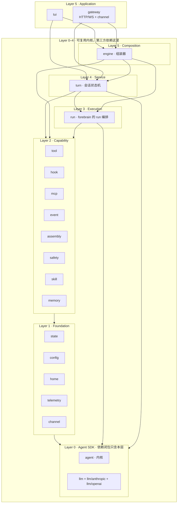
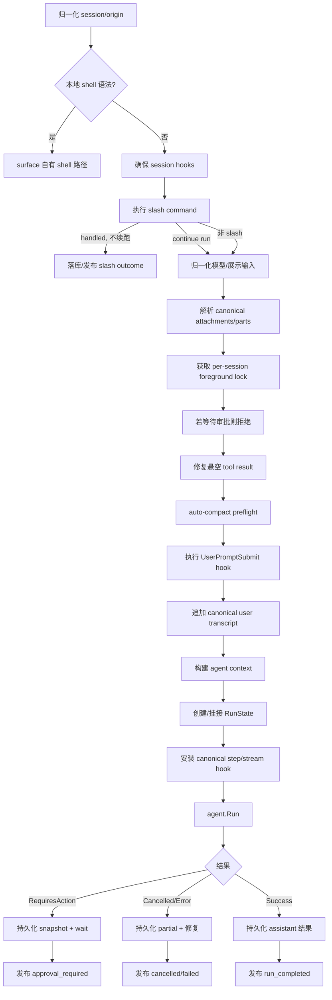
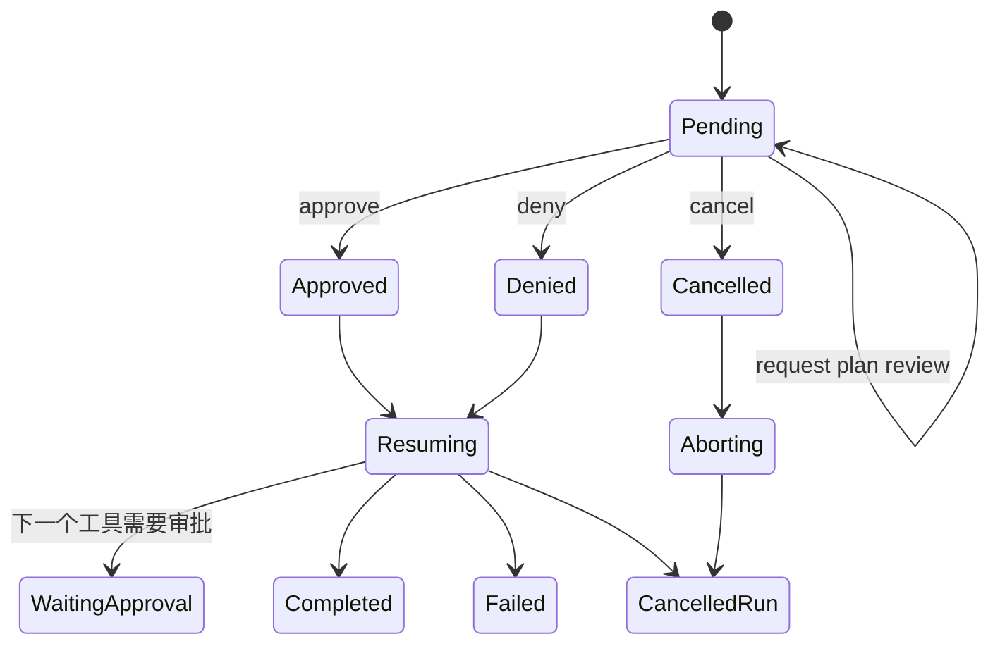

# TUI-First 共享运行时重构方案

> 状态：设计方案，待评审
>
> 基线：HEAD `693f9c64` + 未提交的 CLI 冻结与 `internal/agent` 迁移
>
> 一句话：**TUI 是语义基准，`pkg/` 的共享层承载该语义，Gateway 与 Channel 只做协议翻译。**
>
> 包结构目标：**144 个 package 收敛到 25 个**（上限 30），并取消 `internal/`——
> `pkg/` 下 Layer 0–4 是可复用内核（第三方可依赖），`tui`/`gateway` 是 forebrain 自己的应用，
> 与 `cmd/` 平级。每个 package 名必须贴合其源码的语义与职责，路径一律一段，
> 两段路径只剩 `llm/anthropic` 与 `llm/openai`。

---

## 0. 执行摘要

### 0.1 问题

一次完整的 conversation turn 被两个大型 surface 对象各自编排：

| 语义 | TUI 实现 | Gateway 重复实现 |
| --- | ---: | ---: |
| turn 主链路 | `clifacade/chat_session.go` 1955 行 + `chat_surface.go` 246 行 | `gateway/server.go` 1943 行 + `supervised_run.go` 40 行 |
| turn 落库 | `chat_supervisor_turn.go` 1169 行 | `post_turn_runtime.go` 234 行 |
| 审批 | `chat_surface_approval.go` 646 行 | `approval_ws.go` 133 行 + `network_approval.go` 488 行 |
| auto-compact | `chat_auto_compact.go` 274 行 | `auto_compact.go` 116 行 |
| slash | `chat_session_slash_handlers.go` 1674 行 | `slash_handlers.go` 420 行 |
| run input/cancel | `ChatSession` 字段与方法 | `run_input.go` 471 行 + `run_cancel.go` 119 行 |
| config reload | `chat_session_config_reload.go` 269 行 | `workerhost/config_reload.go` 130 行 |

两边共享存储与 agent runner，却不共享 turn 状态机。注意每一对里 **Gateway 都是 TUI 的
子集**：实现更少、更旧、边界更粗。合并方向因此只有一个——**下沉 TUI，删除 Gateway**，
不存在"取中间语义"。

与之并存的是包结构问题：144 个 package、112 个顶层目录、60+ 个单文件微包，
`clifacade` fan-out 63、`gateway` 51、`agentrun` 46。同一个领域被实现细节切成十几个包
（Skills 9 个、per-session state 5 个、telemetry 5 个、context 6 个），
目录里看不出领域边界。

### 0.2 方案

一条主线，两个产物：

1. **语义下沉**：把 TUI 成熟的 turn / approval / run-control / command / compact / reload
   语义原样移动到 `pkg/` 的共享层；Gateway 与 Channel 调用它；随后删除 Gateway 的重复文件。
2. **按领域合包 + 划出 SDK 边界**：一个领域一个 package，同属一个领域的包一律合并；
   并划出可复用内核，让 `tui`/`gateway` 退化成它的两个消费者。144 → 24。

两者按同一条阶段线推进：**先换 owner，再合并目录。**

### 0.3 目标形态



规则只有四条：

1. 箭头只能向下（层内允许的边在 §3.6 显式枚举）。
2. **Layer 0–4 不得 import `tui` 或 `gateway`**——这是 SDK 属性的定义。
3. 应用层只能 import `turn`，外加 `event`/`config`/`llm`/`channel` 四个契约包。
4. 只有 `process` 可以横跨 Layer 0–4 组装实例；应用层用它启动，handler 不用它。

---

## 1. 硬性不变式

以下是任何提交都不得违反的约束。违反其一即回退，不接受"后续再修"。

**优先级**：`I0 > I1 > 其余`。I0 与任何目标冲突时，**牺牲另一个目标**——包括本方案的
包结构、命名与分层。架构优雅不是降低缓存命中率的理由。

### I0 · prompt 缓存命中率只能提高，不能降低（全 provider，最高优先级）

这是全项目第一优先级约束，高于本文档其余全部目标。重构完成后，**每一个已支持的 provider**
的输入 token 缓存命中率都必须 ≥ 重构前基线；持平可接受，任一 provider 下降即回退，
"先合完包再优化缓存"不被接受。

约束覆盖范围（catalog 中已存在的全部条目）：Anthropic Claude、OpenAI GPT/o 系列、
智谱 `zhipuai/glm-5` `glm-5.1` `glm-5.2` `glm-5.3` `glm-5.3-flash` `glm-5-turbo`、
DeepSeek `deepseek/deepseek-v4-flash` `deepseek-v4-pro`、Moonshot `moonshotai/kimi-k3`、
阿里云百炼 `alibaba/qwen3.8-max` `qwen3.8-max-preview` `qwen3.8-flash` 等 Qwen 系列，
以及任何后续接入的 provider。

> 新增模型进入 catalog 时必须同时纳入命中率基线，否则它在 I0 门禁下是盲区。
> `glm-5.3` / `glm-5.3-flash` 已于 2026-08-14 入库，基线需覆盖到。

#### I0.1 各 provider 的缓存机制差异

不同 provider 的缓存是**不同机制**，同一处改动对它们的伤害方式不同。下表是本次重构必须
按 provider 分别校验的依据（标 ⚠ 的条目需在 P0 用真实 API 探针复核，来源为厂商文档但
版本可能变动）：

| Provider | 机制 | 命中字段 | 最小长度 | TTL | 备注 |
| --- | --- | --- | --- | --- | --- |
| **Anthropic** | **显式** `cache_control` 断点，opt-in | `cache_creation_input_tokens` / `cache_read_input_tokens` | 无显式下限 | 5 分钟默认，**forebrain 用 1 小时** | 最多 4 断点；回看窗口约 20 block |
| **OpenAI** | 自动前缀缓存 | `usage.prompt_tokens_details.cached_tokens` | 1024 token（旧模型 2048），128 递增 | 5–10 分钟；可设 `ttl="30m"` 或 `retention="24h"` ⚠ | `prompt_cache_key` 只影响路由，不保证命中 |
| **DeepSeek** | 自动磁盘 KV 缓存，默认开 | **`prompt_cache_hit_tokens` / `prompt_cache_miss_tokens`** | 按"缓存前缀单元"，无固定 chunk | best-effort，不保证 | 必须**完整匹配**一个缓存前缀单元 |
| **智谱 GLM** | 自动前缀缓存 | `usage.prompt_tokens_details.cached_tokens` | 未公开 ⚠（百炼部署版为 512） | 未公开 ⚠ | 命中率非 100%，即使上下文完全相同 |
| **Kimi** | 自动隐式 + 显式 cache 对象 | 顶层 `cached_tokens` **与** 嵌套形式两种 ⚠ | 256 token ⚠ | 未公开 ⚠ | 稳定 system prompt 与 tool 定义显著提升命中 |
| **阿里云百炼 Qwen** | **隐式 + 显式双模，互斥** | OpenAI 兼容：`prompt_tokens_details.cached_tokens` **加** `cache_creation_input_tokens`；Anthropic 兼容：`cache_read_input_tokens` | 显式 **1024 token**（第三方部署模型 512） | 显式 **5 分钟，每次命中续期**；隐式无固定 TTL，系统管理 | 见 I0.2 |

**共性**：全部按 **prefix 精确匹配**。因此"稳定内容放前面、易变内容放后面"这一条对所有
provider 同时成立，也正是 forebrain 现有 tools → system → messages 渲染顺序的价值所在。

**关键差异**：Anthropic 需要主动放断点（放错就完全不缓存），其余 provider 自动生效
（但也因此完全没有补救手段——前缀一变就是全额重算）。

#### I0.2 provider 专有条件（本次重构高危）

OpenAI 官方明确列出会使缓存失效的变更，其中三条正好落在本次重构的改动面上：

1. **tool 定义内容或顺序变化** —— 直接命中 P9-11d（tool registry 合并与 catalog 排序）
   和 P9-12d（tool 注册顺序）。
2. **reasoning effort / verbosity / `parallel_tool_calls` / 输出格式变化** —— 命中
   `/fast` 与模型参数相关的 slash 命令路径（P4-6）。
3. **上下文压缩** —— 命中 `assembly` 合并（P9-10）。

forebrain 现有代码已经理解第 1 条：`agentrun/tool_visibility_llm.go` 的 `revealed` 集合
**只增不减**，注释写明"tool 数组渲染在 system 与会话之前，任何变化都会作废整个缓存前缀，
让工具再消失一次等于白白多付一次作废"。**这个单调性不变量必须在重构后原样保留**，
且它现在是全 provider 关键，不只对 Anthropic。

**阿里云百炼 Qwen** 的两点专有约束：

- **tools 定义是 system prompt 的一部分参与缓存计算，tools 一变即无法命中**——与 OpenAI
  第 1 条同源，进一步抬高了 `revealed` 单调性与 catalog 排序确定性的重要性。
- **显式与隐式缓存互斥**：请求中带 `cache_control` 即走显式（最多 4 个断点、块最小
  1024 token、TTL 5 分钟且命中续期、创建按输入价 125%、命中按 10%），不带则走隐式
  （无固定 TTL、系统管理、命中按 20% 计价）。**这意味着一旦为 Qwen 加上显式断点，就同时
  放弃了隐式缓存**，不是纯增益，必须实测比较（见 E-7），不得想当然照搬 Anthropic 的做法。

#### I0.3 硬性要求

1. **前缀逐字节稳定**：注入到 conversation 之前的内容在同一 session 内必须逐字节相同。
   保持"每 session 计算一次并复用同一字符串"，不得改成每次调用重新读盘或重新派生。
2. **序列化顺序确定**：tool 表、skill 表、context source 的序列化顺序必须确定。任何来自
   map 迭代的顺序都会在每次调用静默重新计费整个前缀——对 OpenAI 更是被官方列为失效条件。
3. **工具集合单调**：不得把已暴露的工具再收回。需要限制可用工具时，用
   `allowed_tools` / `tool_choice` 之类的**不改变 tool 数组**的手段。
4. **不得改变渲染顺序**：不得把 tool 定义移到 system 之后，不得把易变的 developer
   instruction 折进 system 块。
5. **易变内容只能进尾部**：确需中途送达的内容追加到消息列表尾部。
6. **模型参数在 session 内稳定**：reasoning effort、verbosity、`parallel_tool_calls`
   等在一次 session 中途切换会使 OpenAI 前缀失效；切换只能在新 session 生效
   （与 skill 变更同一策略）。
7. **Anthropic 断点参数不得随手改**：`anthropicCacheBreakpointBudget=4`、
   `anthropicCacheBlockStride=15`、`TTL=1h` 三个常数与放置算法的任何调整必须带
   A/B 命中率数据。

#### I0.4 可测量口径（存在阻断性缺口，P0 必须先补）

统一口径：

```text
hit_rate = cache_read / (cache_read + cache_creation + uncached_input)
```

**当前缺口（已核实到根因）**：`agentrun/openai_compat_llm.go` 只读
`resp.Usage.PromptTokensDetails.CachedTokens`。而 go-openai v1.41.2 的 `Usage` 结构体
（`common.go`）**只有** `prompt_tokens` / `completion_tokens` / `total_tokens` /
`prompt_tokens_details` / `completion_tokens_details` 五个字段——DeepSeek 的
`prompt_cache_hit_tokens`、Kimi 的顶层 `cached_tokens`、百炼的
`cache_creation_input_tokens` **在 SDK 解码阶段就被丢弃了**，根本到不了 forebrain 的代码。

**因此 DeepSeek 的命中率恒为 0，Kimi 与 Qwen 显式缓存的写入量完全不可见——这三个
provider 目前无法被测量，也就无法保证"不下降"。**

这不是"换个字段读"能解决的，必须在 **transport 层拿原始 JSON**。补齐 usage 归一化是
I0 的**阻断性前置任务**（P0-5f），必须在移动任何 prompt 相关代码之前完成。设计要点：

- 新增一个**只读响应**的 `http.RoundTripper`（与现有 `openAIPromptCacheKeyRoundTripper`
  同一模式，但不修改请求，因此对所有 provider 安装都安全，**不会扰动它要测量的前缀**）。
- 非流式：读完 body 解析后用 `io.NopCloser` 复原，交还 SDK 解码。
- 流式：包一层 `io.ReadCloser`，边透传边扫描 `data:` 行解析，只缓存当前不完整的一行，
  避免把整条流留在内存里。
- 读取字段的优先级（谁报了自己的专有字段就信谁，避免重复计数）：
  `prompt_cache_hit_tokens` → `cache_read_input_tokens` → 顶层 `cached_tokens` →
  `prompt_tokens_details.cached_tokens`；另外单独取 `cache_creation_input_tokens`。
- 保持 `llm.Usage` 现有的"cached 与 input 互斥"语义（OpenAI 系把 cached 计入
  `prompt_tokens`，需要相减，`openai_responses_llm.go:305` 已有该处理）。
  各家对 `cache_creation_input_tokens` 是否计入 `prompt_tokens` 口径不一，**相减并 clamp
  到 0** 可以让 `read + creation + input` 在两种口径下都等于上报的 prompt 总量——
  而这正好是命中率的分母，因此该选择不影响指标。

#### I0.5 三层门禁 × 每个 provider

| 层 | 内容 | 频率 | 覆盖 provider |
| --- | --- | --- | --- |
| **前缀字节 golden** | 同一 session 连续两次调用，序列化后的 tools + system + developer 逐字节相等 | 每个 PR | 全部（与 provider 无关） |
| **结构断言** | 渲染顺序 tools → system → messages；tool 集合单调；Anthropic 额外断言断点数 ≤ 4、间距 = 15、首断点在 system 末尾、TTL = 1h；OpenAI 额外断言 `prompt_cache_key` 稳定且 ≤ 64 字符 | 每个 PR | 全部 |
| **命中率回归** | 固定录制场景重放，按 provider 分别计算 `hit_rate` 并与该 provider 的基线比较，**任一 provider 低于基线即失败** | 每个阶段出口 | DeepSeek、OpenAI 各一组基线（owner 已将逐 provider 实测范围收缩至这两家，2026-09-03；其余 provider 退出计划，见任务清单附录 G） |

#### I0.6 "只能提高"如何落实

"不降低"是底线，"提高"是本次重构必须交付的收益。合包完成后应至少拿到：

- `process` 在建立 session 时**一次性**计算前缀（system、tool 表、skill 表、memory 指令），
  `turn` 与 `agent` 全程复用同一份，消灭当前分散的重复派生路径。
- 补齐 DeepSeek / Kimi 的 usage 归一化后，这两个 provider 从"不可观测"变为"可观测"，
  并按测出的实际情况做针对性优化。
- OpenAI 路径：确认 `prompt_cache_key` 对每个 session 稳定；评估显式设置更长的
  cache TTL / retention（官方支持 `30m` 与 `24h`）——forebrain 是交互式工具，用户读 diff、
  答审批的间隔经常超过默认的 5–10 分钟，这与当初把 Anthropic TTL 设成 1 小时是同一个理由。
- `prompt_cache_key` 目前已按 provider 收敛：`newOpenAICompatLLMWithPromptCaching` 的
  `promptCaching` 开关只对 OpenAI 打开，"compatible third-party endpoints never receive
  an unknown field"。P0-5g 只需复核这一门是否对 Qwen / GLM / DeepSeek / Kimi 都关着，
  以及 OpenAI 侧该 key 在 session 内是否稳定。
- 阿里云百炼 Qwen：评估是否启用显式缓存。**这是一个真实的取舍而非纯增益**——显式与隐式
  互斥，显式给出 5 分钟内的确定性命中但创建要多付 25%，隐式免创建成本、无固定 TTL 但
  命中不确定。forebrain 的形态是"一次 turn 内密集多次调用 + turn 之间用户长时间思考"，
  两种模式各有优势，必须用 E-7 的 A/B 实测决定，不得照搬 Anthropic 的显式断点做法。

### I1 · TUI 语义是唯一基准，零回退

TUI 现有行为就是产品定义。下沉过程中不得改变：输入含义、transcript 内容与 parts JSON、
auto-compact 时机、tool step 顺序、审批选项与记忆规则、deny 后模型继续处理、cancel 后
partial 落库与修复、steer/follow-up 跨审批门存续、config reload 时机、session
resume/clear/mode/fast/skill/memory 行为。

TUI 现有测试是第一层回归门。TUI 与 Gateway 冲突时**一律采用 TUI 语义**。

### I2 · 零重复语义

TUI 已有、Gateway 也需要的能力，必须下沉到 `pkg/` 的共享层由 Gateway 复用。
"Gateway 再写一份"——即使能跑通——一律视为缺陷。
同一段逻辑同时存在于 `tui` 与 `gateway` 即不合格，必须删掉一侧（删 Gateway 那侧）。

判断归属只需三问：

1. 把终端换成 WebSocket，这段逻辑是否仍必须执行？是 → 共享层。
2. 把 WebSocket 换成 Telegram，是否仍必须执行？是 → 共享层。
3. 这段逻辑是否决定 transcript / run / approval / permission / resume 的正确性？
   是 → **绝不能留在 surface**。

### I4 · 根因修复，禁止防御性补丁

迁移中出现的 panic、nil、状态错乱，一律追到被破坏的不变量并修复该不变量。
禁止用 nil guard、bounds check、fallback、retry、recover 把症状盖住。
若某状态在不变量成立后不可能出现，就用结构消除它（删掉死分支、删掉让错误用法变容易的
API），而不是留一个带注释的检查。
防御性代码只允许出现在真正的外部输入边界：用户输入、provider 响应、文件系统状态。

§3.4 的四个结构性冲突全部按此原则处理：不用别名和包拆分绕开循环，而是把放错位置的类型和
调用方向搬回正确的 owner。

### I5 · 直接切换，不建兼容层

本地状态可丢弃，仓库单一 owner，因此：

- **禁止** deprecated forwarding package、`type Turn = Message` 之类别名、双写、
  `gateway.shared_turn_runtime` 之类 feature flag。
- 改名与移动一次性做完：`git mv` + 全仓改 import + 编译通过 = 一个提交。
- 旧包在同一个 PR 里删除，不允许"先留着以后删"。
- 废弃的表（如 `fb_jobs`）直接删除，不写 migration。
- 唯一允许的过渡态是 `ChatSession` 这一层**纯委托** facade，必须在 P7 结束时删除，
  facade 内不得出现任何业务分支。

回滚靠"阶段 PR 足够小 + 可 revert"，不靠 flag。

### I6 · 状态只有一个 owner

| 状态 | 唯一 owner |
| --- | --- |
| session transcript | `state` + `turn` 的落库策略 |
| run status / wait | `state` + `turn.TurnService`/`ApprovalService` |
| action status | `state` + `turn.ApprovalService` |
| 活动 cancel handle | `run.Controller` |
| turn 输入队列 | `run.Controller` |
| runner / config / sandbox 活视图 | `process.Environment` |
| 终端 overlay / composer | `tui` |
| WebSocket 连接与 request 映射 | `gateway` |
| channel 连接与 listener | `channel` |

Surface 可持有显示镜像，不得持有权威副本。

### I7 · 先持久化，后通知

状态变更若影响恢复正确性，必须先持久化再发布事件：

```text
persist wait / action / run state  →  publish approval_required  →  surface 渲染
```

### I8 · 不做有副作用的双跑

不得为对比新旧实现把同一个真实 turn 跑两次。允许的 shadow compare 仅限纯函数：approval
request 构建、slash 结果归一化、wire event 映射、parts JSON 序列化、status 文本格式化。

---

## 2. 当前状态审计

### 2.1 规模（实测）

| 指标 | 值 |
| --- | ---: |
| `internal` package | 144 |
| 顶层目录 | 112 |
| 生产代码行 | ~144.6k |
| 测试代码行 | ~109.5k |

最大生产包：`tui` 25.6k / `agentrun` 15.0k / `codetools` 12.0k / `gateway` 8.6k /
`sandboxrt` 8.4k / `clifacade` 8.4k / `permissions` 4.8k / `config` 4.5k / `outfilter` 3.8k。
与之并存的是 60+ 个单文件微包（`runutil` 14 行、`logredact` 10 行、`fastctx` 22 行、
`turndiff` 39 行……）。

问题不是"包太大"或"包太小"，而是**包边界与领域边界不重合**：一个领域被切成十几个包，
同时几个领域被塞进一个包。

### 2.2 依赖图信号（实测）

| 信号 | 实测 | 结论 |
| --- | --- | --- |
| fan-out 最高 | `clifacade` 63、`gateway` 51、`agentrun` 46、`workerhost` 28、`tui` 27 | surface 与 runner 都在自行组装系统 |
| fan-in 最高 | `config` 28、`llm` 20、`codetools` 15、`modelcatalog` 15、`protocol` 13、`session` 13 | 稳定节点，迁移需谨慎 |
| 反向泄漏 | `agentrun → uinotify` | 执行层认识 TUI 消息类型 |
| 持久化混投影 | `runrt → protocol, diffview` | store 在生成 UI/wire event |
| 平台层倒挂 | `datadir → systemskills, modelcatalog` | 路径层在装 skill 与模型目录 |
| 工具层上调 | `codetools`/`toolreg`/`hooks` → `agent.New` | 工具与 hook 在自己 new agent |
| 微包链 | `skillhub → skilllifecycle → skillmeta → skillroots/skilltoggle/skilltrust` | 一个领域切成 9 个顶层包 |
| 双 surface 重复 | `clifacade` 与 `gateway` 同时依赖 run/session/approval/compact/slash | 应下沉到 `turn` |

### 2.3 无生产 importer 的包（实测）

`contextmap`、`jobs`、`mcprt`、`reviewrt`、`shellargv`、`skillpath`、`workerproc`、
`channels/httpproto`；`channels/common` 仅被测试引用；`workercallback.Post` 无 caller。
这 8 个包全部**删除**，不为它们在新架构里安排位置。

### 2.4 已完成/进行中的前置工作

- `cmd/forebrain` 命令面冻结**已在工作区完成**：仅剩 `root` / `resume` /
  `gateway {start,status,stop}`。本方案对 CLI 只做**验证与守卫**，不再规划改动。
- 旧 SDK 聚合根拆除（`internal/phero/*` → `internal/agent`）**已在工作区进行中，尚未提交**。
  P0 第一件事是提交它并让 `go test ./...` 变绿，之后所有阶段以此为基线。

---

## 3. 目标包结构

### 3.1 分层与公开边界

**不再有 `internal/`**。全部 Go 包都在 `pkg/` 下，`cmd/forebrain` 是唯一入口，其余顶层
目录（`frontend/`、`npm/`、`docs/`、`deploy/`、`packaging/`、`third_party/`
等）是非 Go 资产——`pkg/` 的作用是把 Go 代码与这些资产分开。

```text
Layer 5 · Application   tui  gateway           ← 用户运行的就是这两个
Layer 4 · Composition   process                ← 唯一组合根
Layer 3 · Orchestration session  turn  run     ← 三个作用域包
Layer 2 · Capability    tool  hook  mcp  event  assembly  safety  skill  memory
Layer 1 · Foundation    state  config  home  telemetry  channel
Layer 0 · Kernel        agent  llm(+anthropic/openai)   ← 可独立复用的 agent SDK
```

产品由此变成 **可复用内核 + 两个应用**：`pkg/tui` 与 `pkg/gateway` 是 forebrain 自己写的
两个应用，`cmd` 只负责挑一个启动；第三方只依赖 Layer 0–4，写自己的应用。

**Layer 0 是最底层，也是最核心**：`agent` 是可独立复用的 agent 内核（loop、tool call、
handoff、Tracer 契约），**内部依赖只有 `llm` 一个**；forebrain 自己的全部产品逻辑都是它的
消费者。"依赖图的底"与"产品价值的核心"在这里重合，是本次分层的目标。

#### 按作用域命名的四个包

Layer 3 的三个包与 Layer 4 的 `process` 以**作用域**命名——四级作用域四个包，一眼可知各自拥有什么：

| 包 | 作用域 | 拥有 |
| --- | --- | --- |
| `process` | 一个进程 | DB、runner、hook pipeline、sandbox、config 热加载、agent 切换、首次 setup |
| `session` | 一段会话 | create/resume/clear/switch、mode/plan/fast 上下文解析、transcript 与 active-context 视图、session-start hooks、**per-session foreground 串行锁** |
| `turn` | 一次用户交互 | turn 提交状态机、审批、slash command、compaction 编排、event 分发 |
| `run` | 一次 agent 执行 | 执行、cancel、steer、follow-up、retract、subagent、fork、goal continuation |

**领域包含关系是 `process ⊃ session ⊃ turn ⊃ run`，但依赖关系不是这条线性链**：

```text
process ──→ turn ──┬──→ session ──┐
                   └──→ run  ←────┘
```

- `turn` 要读所属 session 的 mode/plan/transcript 上下文 → `turn → session`
- `turn` 执行多次 run → `turn → run`
- `session` 在 clear/switch 前要检查活动 run → `session → run`
- `session` 不需要知道 turn 怎么执行；`run` 不需要知道 session

**容器不依赖被包含者，被包含者依赖容器提供的上下文**——所以 `session` 在领域上包含
`turn`，在依赖上却位于 `turn` 之下，与 `run` 平级。session 的**状态**在 `state`
（`state.Session`/`state.Message`），**生命周期行为**在 `session`。

> 归属按**谁拥有**划分，不按**谁调用**划分。`run.Controller`（cancel/steer/follow-up/
> retract）因此归 `run` 而不是 `turn`——它们全是 run 作用域的操作。`turn` 通过接口
> 使用它（§3.2 原则二），依赖方向单一。

> **另两个容易混的词**：`agent`（Layer 0）是**通用 agent 内核**（loop、tool call、
> handoff、Tracer 契约）；`process`（Layer 4）是 **forebrain 运行环境的组装器**。
> 本文提到"内核"一律指前者，"组装器 / 运行环境"一律指后者。

分层**不由目录深度表达，而由依赖方向表达**：`pkg/tui` 与 `pkg/agent` 在树里长得一样，
编译器也不会拦 `pkg/agent → pkg/tui`——它编译通过、外部使用者照样能构建，只是会把
bubbletea 一并拖进去，直到有人去看依赖图才发现。因此
**Layer 0–4 的任何包不得 import `tui` 或 `gateway`**，这条必须由架构测试强制（§11.1），
且属于 P0 而不是 P10——它是分层唯一的早期信号。

需要真正私有的实现细节时，用 Go 惯用的嵌套写法 `pkg/<pkg>/internal/...`
（只有该包子树可见），而不是恢复顶层 `internal/`。

### 3.2 设计原则

#### 原则一：一个领域一个包

**合并规则（默认动作）**

同属一个领域的包一律合并。以下都**不是**独立成包的理由：

- "文件太多了" —— 用文件分组表达，不用包分组表达。
- "它是一个技术分层"（parser / store / service / util / helper）—— 分层是文件名的事。
- "只有一个 helper"、"想缩短文件"、"将来可能会用"。
- "不知道放哪，所以叫 common / utils / misc"。

**禁止单文件包。** 任何 package 的生产 Go 文件数必须 ≥ 2。一个文件不构成一个领域；
给单个文件一个包名，正是本仓库 60+ 个微包和 17 个"一个文件一个包"的 channel
provider 的成因。CI 强制此规则（§11.2）。

**拆分规则（例外，需理由）**

只在以下两种情况才允许独立成包，且必须在架构测试 allowlist 中登记理由：

1. **带独立重型依赖的可插拔实现**：运行时按配置选择、且各自拖入不同第三方 SDK 的等价
   实现。收敛后只剩 `llm/anthropic` 与 `llm/openai`——把 provider SDK 挡在被广泛依赖的
   `llm` 契约包之外，是真实的分层收益。
2. **仅测试依赖**：`architecture`、`testutil`。**这两个不是领域包**：
   - `architecture` 是 `package architecture_test`，生产文件数为 0。它的语义是
     **"对其它包的约束断言集"**——分层依赖、包深度、包名黑名单、单文件包、fan-out、
     缓存门禁。这些断言的主语是别的包，不属于任何单个包，Go 又要求测试落在某个目录里。
   - `testutil` 是跨包共享的测试设施。
   二者同样受"禁止单文件包"约束：当前各只有 1 个文件，P0 之后分别装入完整规则集与
   共享设施，届时均为多文件。

> **channel provider 不属于例外 1**：17 个 provider **每个只有一个文件**，全部 22 个
> `channels/*` 目录合计仅 4,843 行，且都是手写 HTTP 客户端而非引入平台 SDK。用 17 个
> 包名装 17 个文件正是"一个领域被实现细节切碎"，合并为 `gateway` 内的 `telegram.go`、
> `slack.go`…… 即可。`weixin` 的 cgo 依赖已经是 `silk_cgo.go`（`//go:build cgo`）与
> `silk_nocgo.go`（`//go:build !cgo`）成对实现，包内 build tag 原样生效，合并无构建风险。
>
> 曾经还存在第三类"为断循环而拆包"。C1–C4 用根因修复消除全部循环之后它不再需要：
> `hook` 现在凭领域（扩展点契约）独立。**每一个包的存在理由都是领域，没有一个是技术
> 妥协或凑数。**

#### 自查：本方案曾违背原则二的 6 处（已修正）

写完设计后按原则二逐条自查，发现 6 处违背。记录在此，既是修正说明，也是后续 review 的
检查表。

| # | 违背 | 修正 |
| --- | --- | --- |
| **V1** | `process.Environment` 的字段全是具体类型（`*state.Store`、`*tool.Registry`、`*run.Controller`…），与"第三方可替换实现"的承诺矛盾 | `Environment` 对外暴露**接口**；`process.Options` 增加可选 port 覆盖，未提供时用 forebrain 默认实现 |
| **V2** | provider 选择留在 `run`——实测 `agentrun/config.go:367–392` 按 config 分支构造 anthropic/openai，随包进 `run` 后它就 import 了两个具体 provider | **`process` 按 config 构造 `llm.LLM` 并注入 `run`**；`run` 只认 `llm.LLM` 接口，不 import 任何 provider 包 |
| **V3** | §3.6 曾把 `turn → run` 列为允许的数据类型边 | 实际传递的是 sessionID、`[]llm.ContentPart`、goal 字符串，回传 `*agent.Result`——**全是 Layer 0/1 类型**。`turn` 定义 `RunExecutor` 接口即可，**不 import `run`** |
| **V4** | §3.6 曾把 `session → run` 列为允许边 | 实际只需"该 session 有无活动 run"一个 bool。`session` 定义 `ActiveRunProbe` 接口，**不 import `run`** |
| **V5** | 未定义谁把能力包的 hook 注册进 `hook.Pipeline`；各包自行 `Register` 就是在做组装 | **能力包只返回 hook 值，由 `process` 注册**。`assembly`/`skill`/`safety` 不持有 pipeline 实例 |
| **V6** | `Environment.DB *sql.DB` 与 `Config *config.Root` 把底层实现泄漏到公开 API | `DB` 不导出；`Config` 改为只读接口 |

**V3/V4 修正后 Layer 3 的层内 import 边为零**——`session`/`turn`/`run` 三个包互不 import，
只靠注入接口连接。这是原则二最直接的回报：**分层不再靠"允许边"清单维持，而是靠没有边。**

#### 已评估并否决的合并（避免重复讨论）

包数停在 25，不是没再找过，而是以下每一条都过不了"包名必须贴合内容"这一关：

| 候选合并 | 否决理由 |
| --- | --- |
| `hook` → `tool` | hook 是**同步拦截点**（可改变行为），tool 是**可调用能力**；且 hook 覆盖整个 turn 生命周期含 `UserPromptSubmit` |
| `mcp` → `tool` | MCP 是外部工具**来源**，自身是协议客户端（server 生命周期、OAuth、transport），与 registry 职责不同 |
| `event` → `hook` | 控制流 vs 观测流，见 §3.6 的辨析 |
| `home` → `config` | "东西在本机哪里" ≠ "用户配置了什么"；`config` 不该拥有 `WorkspaceBootstrap` |
| `home` → `state` | **实测双环**：`store → config → datadir(home)` 使 `state → config → state`；`runrt → telemetry → datadir(home)` 使 `state → telemetry → state`。`home` 被 `config`/`telemetry` 依赖，而这两者又是 `state` 的下游 |
| `memory` → `assembly` | memory 有独立 backend、job、evidence，是有自身生命周期的子系统；assembly 是逐 turn 装配 |
| `skill` → `assembly` | skill 有 install/trust/toggle 生命周期，不只是 context source |
| `turn` + `run` → 单包 | 合并后约 21k/107 文件，会同时装入 `retry_policy.go`、`subagent_dispatch.go`、`plan_mode.go`、`permission_replace_windows.go`——**找不到一个能概括它们的名字，这本身就说明是两个领域**。更实质的是会焊死 `RunExecutor` 这道 IoC 缝：`turn` 是用例，`run` 是执行机制，该缝让 turn 编排可脱离真实 agent 测试、也让第三方能替换执行层 |
| `session` → `turn` | **曾采纳后撤回**。首次否决理由是作用域命名一致性；随后按"仅 56 行"采纳合并；再实测发现那只数了 `sessionctx`，散在 `clifacade` 的实体还有 248 行，**合计约 434 行、3–4 文件**，比已保留的 `channel`（370 行）还大。已恢复独立包 |
| `session` → `process` | `process` 是组合根，职责是**接线**而非提供能力。session 生命周期放进去，`turn` 依赖的 `SessionContext` 就由组合根实现，IoC 层次错乱；且需要为"归属好看"制造一次反转（与 C4/C7/C8 那些为打破真实循环的反转性质不同）。此外 `process` 是进程级装配，session 是运行期反复发生的操作 |
| `llm` → `agent` | `llm` fan-in 20 覆盖每一层，`agent` 仅 ~3；且 `tool` 需 `llm.Tool`，合并后 `tool → agent` 会抵消 C4 |
| `llm/anthropic` + `llm/openai` | 合并后只用一家 provider 的使用者也要编译另一家的 SDK |
| `gateway` → `tui` | 两个独立应用，且 §7 要求 channel 能脱离 Web UI 单独启动 |
| `architecture` + `testutil` | 约束断言集 vs 测试设施，混在一起两边都说不清 |

> **判断一个包能否上移的通用规则**：看它的 fan-in 是否**全部来自更高层**。
> `home` 的 fan-in 含 `config`/`telemetry`，而 `state` 依赖这两者，所以 `home` 必须留在
> 最底层、fan-out 保持 0。同理 `llm` fan-in 20 覆盖每一层，不能并进只被 3 个包用的
> `agent`。**高 fan-in 的叶子包只能下沉，不能上并。**

#### 原则二：控制反转与依赖注入

**没有任何包自己构造它的跨包依赖，一律构造函数注入；`process` 是唯一组合根。**

Go 的结构化类型让这条原则不只是"多加一层接口"，而是能**真正删掉 import 边**：

1. **消费者定义接口，实现方不 import 消费者。**
   `turn` 需要执行 run，就在 `turn` 里定义它需要的最小接口；`run.Service` 只要方法签名
   吻合就自动满足，**`run` 不需要 import `turn`，`turn` 也不需要 import `run`**。
2. **接口签名只用更低层的数据类型**，这样双方都只依赖 Layer 0–2 的类型包，不产生行为耦合。
3. **上层可以 import 下层的数据类型**（`llm.Message`、`state.Message`、`event.RunEvent`），
   但**下层的行为一律通过自己定义的接口访问**。数据类型是契约，行为不是。
4. **只有 `process` 可以 import 具体实现并把它们接起来。** 其余任何包出现跨包
   `New*(...)` 构造调用，都是把组装职责漏到了错误的层。

```go
// package turn —— 消费者声明它需要什么
type RunExecutor interface {
    Execute(context.Context, agent.Request) (*agent.Result, error)
}
type SessionContext interface {
    Resolve(context.Context, string) (state.SessionContext, error)
}

type Service struct { runs RunExecutor; sessions SessionContext }
func New(runs RunExecutor, sessions SessionContext) *Service { ... }

// package run —— 实现方对 turn 一无所知，签名吻合即满足
func (s *Service) Execute(ctx context.Context, req agent.Request) (*agent.Result, error)

// package process —— 唯一组合根，唯一知道两边具体类型的地方
func Open(o Options) (*Environment, error) {
    runs := run.New(...)
    sess := session.New(...)
    return &Environment{Turns: turn.New(runs, sess)}, nil
}
```

**收益不只是可测试性**：`turn → run`、`session → run` 这些边在实现层面消失了，
§3.6 里剩下的跨层边基本只有数据类型依赖。这也直接支撑 SDK 属性——第三方可以用自己的
`run` 或 `state` 实现替换 forebrain 的，只要签名吻合。

C4（`tool.AgentSpawner` / `ForkRunner`）、C7（skill 不 import memory）、
C8（skill 不 import turn）本质上都是这条原则的实例，不是特例。

**路径规则**

默认形态是 `pkg/<package>` **一段路径**。第二段只允许用于第 1 类例外，收敛后只剩
`pkg/llm/anthropic` 与 `pkg/llm/openai`。不存在纯分组目录，也不存在 `adapters` 层。

> 为什么不用 `state/`、`execution/`、`context/`、`tool/`、`safety/` 这类分组目录：
> Go 里读者在每个引用点看到的是**包名**，不是路径。分组目录只在目录树里好看一次，却把
> 包名压成 `run.`、`process.`、`process.`、`output.`、`builtin.` 这种在调用点毫无信息量
> 的词，还制造重名（`state/run` 与 `execution/run`、`tool/runtime` 与 `internal/runtime`
> 与标准库 `runtime`）。它同时让路径变长。分组目录想表达的"这几个包属于一个领域"，
> 正确做法是**把它们合成一个包**。

**命名规则**

- **包名必须贴合它实际装的代码的语义与职责**。这条优先于包数量：如果为了减少包数把 A
  塞进 B，导致 B 的名字不再准确描述其内容，那就是拆错了——应当保留独立包。
  反例（本方案曾一度采纳、后已撤回）：把 hook 管线塞进 `tool`（hook 拦截的是整个 turn
  生命周期，不只是工具调用）、把 `datadir`/`envguard`/`workspacebootstrap` 塞进 `config`
  （"配置"不能表达"本机数据目录与环境"）。
- 包名在调用点必须自解释且全局唯一：`state.Message`、`agent.Run`、`safety.Decide`、
  `tool.Registry`、`hook.Context` 合格；`process.New`、`run.Service`、`output.Filter` 不合格。
- 优先单词；允许"恰好一个概念"的复合词（`assembly`：没有单词能表达"上下文装配
  引擎"，拆成 `context/engine` 只会让调用点变成无意义的 `process.`）。
- 禁止无 owner 的名字：`common`、`utils`、`misc`、`manager`、`facade`、`host`、`core`、
  `base`。缩写只保留已成为产品/协议术语的 `tui`、`mcp`、`llm`、`http`、`ws`。
- 避开标准库：不用 `fs`（与 `io/fs` 在 14 个文件冲突）、不用 `context`（503 个文件用
  标准库 `context`）。
- **局部变量遮蔽不是否决理由**。实测同名局部变量声明数：`tool` 182、`state` 156、
  `model` 115、`run` 50、`event` 39、`turn` 23——`tool`/`state` 比 `model` 还高却完全可用，
  因为遮蔽只在声明它的作用域内生效，而那些作用域多半就在该包内部。
  **`model` 被否是因为歧义**（数据模型？LLM 模型？领域模型？），不是因为遮蔽。

#### 领域名词优先，职责命名是例外

**默认用领域名词命名**——名词本身就说明了职责："`turn` 拥有关于一次 turn 的一切"。
24 个包里 18 个如此（`state`、`tool`、`skill`、`memory`、`event`、`hook`、`agent`、`llm`、
`safety`、`channel`、`turn`、`run` …）。

**24 个包全部如此，没有例外**：`process`（一个进程）、`turn`（一次交互）、`run`（一次执行）
是作用域名词；`state`/`tool`/`skill`/`memory`/`safety`/`assembly` 等是领域名词——
两者都是"名词命名它拥有的东西"，不是角色命名。

不要为了"命名风格统一"把领域名词改成职责名。`executor` / `runner` / `orchestrator` /
`coordinator` 这一串 `-er/-or` 后缀属于被禁的 `manager` 家族：只说角色、不说领域，且
`run.Execute()` 改成 `executor.Execute()` 还会 stutter。

> `assembly` 取自该包自身的核心类型 `AssemblyRequest`/`AssemblyResult`——它命名的是
> **"本次调用装配出来的上下文"** 这个东西。曾评估并否决的备选：`context`（标准库占用，
> 503 个文件冲突）、`window`（TUI 侧 "window" 已用 65 次，撞义）、`prompt`（I0 中
> "prompt 前缀"特指 tools+system，而本包并不拥有它们，在最关键的不变量上会误导）。

### 3.3 目标包清单：144 → 25

#### Layer 0 · Kernel（4）

**这一层就是可独立复用的 agent SDK：禁止依赖任何上层包，依赖闭包只含本层。**

| 包 | 领域与职责 | 合并来源 |
| --- | --- | --- |
| `agent` | **agent 内核**：loop、tool call、handoff、agent-as-tool、session builder、hook 契约、human-in-the-loop、compaction 算法，以及自身的**运行事件模型与 `Tracer` 契约**（`AgentStartEvent`/`AgentIterationEvent`/`LLMRequestEvent`/`RunSummary`/`NoopTracer`） | `internal/agent`、`trace`、`tool/human`、`compact` 的算法部分 |
| `llm` | **LLM 契约**：Message/ContentPart/Tool/ToolCall/Result/Usage、`LLM` 接口、tool 执行计时、reasoning 续跑、model catalog 与能力、token 估算与 context window 上限、retry/limiter/fallback 中间件 | `llm`、`llm/middleware` 的 retry/limiter/fallback、`modelcatalog`、`reasoningcarry`、`tokestimate`、`contextwindow`、`toolruntime.ExecutionTiming`、`forebrainstr` 的 API error |
| `llm/anthropic` | Anthropic client，含 prompt cache 断点放置算法 | `agentrun/anthropic_*` |
| `llm/openai` | OpenAI / 兼容端点 client 与 auth | `agentrun/openai_*`、`chatgptauth` |

#### Layer 1 · Foundation（5）

| 包 | 领域与职责 | 合并来源 |
| --- | --- | --- |
| `state` | **持久化状态**：一个 SQLite 库的 session/transcript、run/step/wait/usage、approval action、上传文件，以及 mode/fast/plan/todo/intermediate 等 session 作用域状态 | `store`、`session`、`sessionid`、`runrt`、`actionrt`、`filert`、`modestore`、`faststate`、`planstore`、`todostore`、`intermediatestore` |
| `config` | **用户配置**：schema、load/save、validation、active agent profile 与 roster、channel 配置 | `config`、`primaryagent`、`cli/agentmodel` 的配置读写 |
| `home` | **本机环境**：FOREBRAIN_HOME 解析、data path、目录布局、workspace bootstrap。回答"东西在本机哪里"，与 `config` 的"用户配置了什么"是两件事。**fan-out 为 0** | `datadir`（除 seeding）、`workspacebootstrap`、`forebrainstr` 的 path |
| `telemetry` | **运维可观测基础设施**：OTEL provider 与 exporter、HTTP 日志、metrics、redaction、panic 上报、build info。与 `agent` 的运行事件模型是两件事——后者是 agent 语义，这里是运维设施 | `telemetry`、`inprocmetrics`、`logfile`、`logredact`、`paniclog`、`buildinfo` |
| `channel` | **channel 扩展点契约**：`Bus`、`Inbound`、`Outbound`、provider 接口与注册表。第三方实现自己的平台 provider 就依赖这里 | `pkg/channel`（已存在）、`channels/common` |

#### Layer 2 · Capability（8）

| 包 | 领域与职责 | 合并来源 |
| --- | --- | --- |
| `tool` | **工具**：模型可调用的能力。registry、catalog、policy、审批门、文件/shell/web 工具、输出流水线（filter/compress/budget/pager/truncate） | `codetools`（除 product tools）、`toolreg`、`toolruntime`、`outfilter`、`textpager`、`outputbudget`、`forebrainstr` 的 truncate |
| `hook` | **扩展点**：在 turn 与工具调用各阶段插入逻辑的 dispatch 与实现。**不是工具**——它拦截整个 turn 生命周期（含 `UserPromptSubmit`） | `kernel`、`hooks` |
| `event` | **产品事件协议**：typed run/tool/approval/compact event、tool metadata、脱敏、per-run FIFO 队列、task event、**diff 模型**（diff 是事件载荷的表示形式，不是工具实现）。载荷里带 permission 建议，因此依赖 `safety`/`tool`——**这也是它不能下沉到 Layer 0 与 `agent` 的事件模型合并的原因** | `protocol`、`agentnotify` 的 builder、`metasafe`、`taskbus`、`notifyq`、`diffview`、`turndiff` |
| `mcp` | **MCP 协议接入**：server 注册与生命周期、OAuth、transport、结果处理。是工具的一个来源，但自身是协议客户端 | `mcpbridge` |
| `assembly` | **上下文窗口管理**：planner、source、metrics、repository/git 上下文、workspace rules、快照诊断，以及压缩的编排与 checkpoint | `assembly`、`gitcontext`、`forebrainrules`、`contextdebug` 的快照、`compact` 的编排部分 |
| `safety` | **可做什么**：permission 规则与决策、sandbox 与网络/进程策略、guardrail 及其 LLM 中间件、project trust、路径守卫、敏感环境变量保护、命令归一化重写（规则匹配前用） | `permissions`、`sandboxrt`、`guardrails`、`llm/middleware` 的 guardrail 部分、`projecttrust`、`pathguard`、`envguard`、`rewrite` |
| `skill` | **技能**：discovery、install、metadata、roots、toggle、runtime、trust、bundled skills | `skill`、`skillhub`、`skilllifecycle`、`skillmeta`、`skillroots`、`skillrt`、`skilltoggle`、`skilltrust`、`systemskills` |
| `memory` | **记忆**：抽取管线、store、evidence、job、workspace、backend | `memories`、`memories/localbackend`、`texttruncate` |

#### Layer 3 · Orchestration（3）

| 包 | 领域与职责 | 合并来源 |
| --- | --- | --- |
| `run` | **一次 agent 执行的生命周期与控制**：创建/执行/cancel/status/usage、**steer/follow-up/retract 与 turn input 队列**、goal continuation、subagent 与 fork、one-shot、provider 编排 middleware、plan mode、权限中间件。**forebrain 产品定制，与 Layer 0 的通用内核分开** | `agentrun`（除 provider 与 compact 算法）、`supervisorrun`、`goalcontinuation`、`runutil`、`forkagent`、`subagents`、`agentdefs`、`fastctx`、`hybrid`、`workerhost` 的 one-shot 与 subagent 执行、`agentrun/turn_input_runtime.go` |
| `session` | **一段会话的生命周期与上下文**：create/resume/clear/switch、mode/plan/fast 上下文解析、transcript 与 active-context 视图、session-start hooks、**per-session foreground 串行锁**。领域上包含 turn，依赖上位于 turn 之下——turn 向它取上下文 | `sessionctx`（186 行）、`clifacade` 的 session 生命周期（`ResumeSession`/`ClearSurfaceSession`/`ListSessionsRecent`/`EnsureSurfaceTranscript`/`SurfaceTranscript*`/`NewSessionID`/`ensureSessionStartHooks`/fast 与 mode 开关，实测 248 行） |
| `turn` | **一次用户交互的状态机**：提交（归一化 → slash → 附件 → 悬空修复 → auto-compact → 落 transcript → 跑 run → 落库 → 发事件）、审批构建/决策/恢复、slash command、compaction 编排、canonical event 分发。**唯一会话语义 owner**，只编排不实现 | `appcore`、`surface`、`slashcmd`、`runtimecompact`、`mention`、`planreview`、`clifacade` 的 turn/审批/命令部分与输入归一化（`surfaceTurnContentParts`/`buildSurfaceUserPartsJSON`）、`runrt.ProjectRunEvents` |

#### Layer 4 · Composition（1）

| 包 | 领域与职责 | 合并来源 |
| --- | --- | --- |
| `process` | **一个进程的组装与生命周期**：`Open(Options) *Environment` 装配 runner/stores/hook/sandbox/config 与上面各层的服务，并持续维护——首次运行 setup、config 热加载与原子替换、active agent 切换。**第三方的入口**；装配器依赖被装配者，它 import Layer 0–4，反向禁止 | `workerhost` 的组装部分、`agentswitch`、`runtimecontext`、`planmodehooks`、`cli/runtime`、`cli/setup`、`cli/onboard`、`cli/llmsetup`、`cli/onboardlog` |

#### Layer 5 · Application（2）

| 包 | 领域与职责 | 合并来源 |
| --- | --- | --- |
| `tui` | **终端界面**：renderer、composer、overlay、审批提示、本地 shell 语法、canonical event → view model 投影、终端文本格式 | `tui`、`clifacade` 的 TUI 部分、`uinotify`、`tuilog`、`slashfmt`、`slashmodel`、`planupdate`、`contextdebugfmt` |
| `gateway` | **外部协议接入**：HTTP/WS server、认证、CORS、限流、连接与 request 关联、上传 transport、静态 UI、wire projector，以及 **channel service、bind、17 个平台 provider、webhook listener**。入站与出站都是协议翻译，与 HTTP/WS 同一领域 | `gateway`、`rest`、`httpauth`、`httprouter`、`webui`、`workercallback`、`channelbind`、`channels/*` 的 21 个目录 |

#### 仅测试（2）

`architecture`、`testutil`。

#### 删除（8）

`contextmap`、`jobs`、`mcprt`、`reviewrt`、`shellargv`、`skillpath`、`workerproc`、
`channels/httpproto`，以及 `workercallback` 的 client。
`jobs` 对应的 `fb_jobs` 表按 I5 直接删除，不写 migration。

#### 拆分后消失的包

`clifacade`、`agentrun`、`codetools`、`workerhost`、`forebrainstr`、`contextdebug`、
`agentnotify` —— 内容按领域进入上表，包本身删除。

#### 源码审计：内聚度与规模（实测）

按目标包统计其源包的**相互 import 边数**（内聚度）与规模，用于暴露"技术分组"而非领域分组：

| 目标包 | LOC | 文件 | 源包 | 内聚 | 备注 |
| --- | ---: | ---: | ---: | --- | --- |
| `tui` | 36.0k | 82 | 8 | 8 边 | **最大包，是次大者的 2.5 倍**；P9-14 收窄 renderer 后复核 |
| `run` | 17.8k | 84 | 10 | 11 边 | 高内聚 |
| `tool` | 16.3k | 70 | 6 | 6 边 | 高内聚 |
| `safety` | 15.2k | 67 | 7 | 4 边 | `guardrails`、`pathguard` 与其余无边 |
| `gateway` | 14.1k | 56 | 27 | 30 边 | 高内聚（provider 共用 transport） |
| `state` | 5.9k | 31 | 11 | **0 边** | 见下 |
| `config` | 5.3k | 34 | 3 | 2 边 | |
| `memory` | 4.7k | 20 | 3 | 3 边 | |
| `event` | 3.9k | 17 | 7 | 2 边 | `notifyq`、`diffview` 与其余无边 |
| `llm` | 3.9k | 25 | 6 | 1 边 | 四个成员相互无边 |
| `skill` | 3.5k | 15 | 9 | 19 边 | 内聚度最高 |
| `turn` | 3.1k | 23 | 6 | 1 边 | |
| `process` | 3.0k | 17 | 8 | 8 边 | |
| `assembly` | 2.5k | 15 | 5 | 2 边 | |
| `mcp` / `telemetry` / `agent` / `hook` / `home` | 1.0–2.0k | 6–19 | 1–6 | 0–3 边 | `hook` 的 `kernel`/`hooks` 相互无边 |
| `channel` | 0.4k | 3 | 2 | 0 边 | `pkg/channel`(2 文件) + `channels/common` |

**必须诚实记录的三点**：

1. **`state` 的 11 个源包相互零 import**。合并依据是**共享领域**（同一个 SQLite 库、同一份
   schema）而非现有共享代码；跨聚合查询（`FindRunByAction`）目前也不存在，是合并后才natural
   的能力。合并后必须让 5 个 JSON store 共用原子写与路径校验，**把内聚度做出来**，否则它就
   退化成 §3.2 明令禁止的"技术分层分组"。
2. **`hook` 的 `kernel` 与 `hooks` 相互零 import**，`llm`/`event`/`safety` 也各有孤立成员。
   判据是"读者是否期望在这里找到它"，不是"它们现在是否互相调用"。
3. **`session` 的规模曾被两次误判**：先按 `sessionctx` 56 行判定"撑不起一个包"而并入
   `turn`，再实测发现 `clifacade` 里还有 248 行同类实体，合计约 434 行、3–4 文件——
   比已保留的 `channel`（370 行）还大，遂恢复独立包。**教训是抽取规模必须把散落在
   god object 里的部分一起数**，只数现存同名包会系统性低估。

### 3.4 最终清单

```text
pkg/
  agent/   llm/   llm/anthropic/   llm/openai/                 Layer 0 Agent SDK
  state/   config/   home/   telemetry/   channel/             Layer 1 基础
  tool/    hook/    mcp/    event/    assembly/
  safety/  skill/   memory/                                    Layer 2 能力
  session/ turn/    run/                                       Layer 3 编排
  process/                                                     Layer 4 组装
  tui/     gateway/                                            Layer 5 应用
  architecture/   testutil/                                    仅测试
cmd/forebrain/                                                    入口
```

**25 个包**（上限 30，留有余量），全部在 `pkg/` 下。全部为一段路径，两段路径只剩
`llm/anthropic` 与 `llm/openai`。每个包的生产文件数均 ≥ 2。

分层不由目录深度表达，而由依赖方向表达：**`tui`/`gateway` 与 `agent` 同在 `pkg/` 下，
但前者可以 import 后者，后者绝不能 import 前者。** 这条由架构测试守住。

第三方的使用姿势：

```go
env, _ := process.Open(process.Options{Home: "...", SessionSource: "myapp"})
svc := turn.New(env)
outcome, _ := svc.Turns.Submit(ctx, turn.TurnRequest{...}, mySink)
```

规模分布（估算，生产代码行）：`tui` ~29k、`tool` ~17.5k、`gateway` ~14k、
`safety` ~13.5k、`run` ~13k、`turn` ~8.6k、`session` ~0.4k、`state` ~6k、`llm` ~6k、`config` ~5k、
`memory` ~4.7k、`process` ~3.7k、`event` ~3.5k、`assembly` ~3.4k、`skill` ~2.5k、
`telemetry` ~2k、`mcp` ~2k、`hook` ~1.4k、`agent` ~1.1k、`home` ~0.9k、`channel` ~0.3k。

### 3.5 必须先解决的十二个结构性冲突

这四个是当前代码里真实存在的、会让上述合并编译不过的问题。
按 I4 一律走根因修复：把放错位置的类型或调用方向搬回正确 owner，**不靠拆包绕开**。

#### C1 · `llm` ↔ 工具输出

实测 `llm → toolruntime`，而工具注册又需要 `llm`。但 `llm` 从 `toolruntime` 只用到一个
30 行的值类型 `ExecutionTiming`（工具执行起止时间），它本来就是 LLM 工具执行结果的字段。

**根因修复**：`ExecutionTiming` 移入 `llm`。循环随即消失，整条工具输出流水线可以并入
`tool`，不需要为了断环单列 `output` 包。

#### C2 · `home` ↔ `skill`

实测 `datadir → systemskills, modelcatalog`：路径层在触发 bundled skill 安装与模型目录
落盘，而 skill 又需要 home 路径，形成 `home → skill → home`。

**根因修复**：`home` 只提供路径与目录，**不触发任何 seeding**。bundled skill 安装与
model catalog 落盘的调用点上移到 `process`。`home` 的 fan-out 收敛到 0，成为真正的叶子。

#### C3 · 持久化层在做投影

实测 `runrt → protocol, diffview`：存储层在生成 UI/wire event。

**根因修复**：`state` 只写记录；`ProjectRunEvents` 移到 `turn` 的 event projector。
`state` 的 import 收敛到 `llm`、`telemetry`、`config`、`home`。

#### C4 · 工具与 hook 在自己 new agent（本次分层的关键）

实测 `toolreg`、`codetools`、`hooks` 都 import `agent` 且只用 `agent.Agent` / `agent.New`；
同时 `agentrun → codetools, toolreg, hooks`，`kernel → agentrun`。

**这条冲突的严重性比原先估计的高**：`internal/agent` 是已经依赖闭合的引擎内核
（并入 `trace` 后依赖只剩 `llm`），如果按早期计划让它吸收 `agentrun`(15k)+`supervisorrun`+
`subagents`+`forkagent`，**Layer 0 就被 forebrain 产品逻辑污染，SDK 属性彻底消失**。

**根因修复**，分两步：

1. `agent` 保持纯净，**不吸收 `agentrun`**。forebrain 的 run 生命周期与编排另立
   `run`（Layer 3），由它消费 `agent`。
2. 工具与 hook 不得 import 执行层，改为定义窄 port：

```go
// package tool
type AgentSpawner interface {
    Spawn(ctx context.Context, spec SpawnSpec) (SpawnHandle, error)
}

type ForkRunner interface {
    RunFork(ctx context.Context, spec ForkSpec) (ForkResult, error)
}
```

`run` 实现这两个 port，`process` 在组装时注入。`kernel → agent`、`kernel → agentrun`、
`kernel → codetools`、`hooks → agent`、`hooks → forkagent`、`toolreg → agent`、
`codetools → agent` 七条上行边直接删除。

#### C5 · `llm/middleware` 跨层

实测 `llm/middleware → config, guardrails, llm`。它混了两类中间件：retry/limiter/fallback
是纯 LLM 关注点，guardrail 中间件却依赖 `config` 与 `guardrails`（Layer 1/2）。整包并入
`llm` 会把这两层拖进 Layer 0，SDK 属性作废。

**根因修复**：按关注点拆开——retry/limiter/fallback 并入 `llm`（Layer 0）；guardrail
中间件并入 `safety`（Layer 2），由 `process` 在组装时把它包在 provider 外面。

同层还有一条同类边：`tokestimate → config`。实测它只是
`Configure(c appcfg.TokenEstimateConfig)` 接了个配置结构体——把该选项类型移入 `llm`，
由 `process` 读配置后注入即可（§3.2 原则二的标准用法）。两条都解完，
**`llm` 的内部依赖为零**。

> 已验证的相关拆分：`compact` 的两个文件依赖截然不同——`trim.go` 只依赖 `llm`（纯算法，
> 归 `agent`），`service.go` 依赖 `session`/`modelcatalog`/`tokestimate` 且持有
> `*session.Store`（编排，归 `assembly`）。因此把算法部分放进 `agent`
> **不会**破坏 `agent` fan-out = 1。

#### C6 · `event` ↔ `tool`

实测 `agentnotify → codetools, forebrainstr`（event→tool）与 `codetools → protocol`
（tool→event）双向存在，合并后成环。

**根因修复**：**step event 的载荷类型属于 `event`，`tool` 只负责填充**。把
`agentnotify` 的 builder 依赖倒过来——`event` 定义 `ToolStepEvent` 等类型，`tool` 产生
事件时 import `event`，`event` 不再 import `tool`。
同时 `diffview`/`turndiff` 归 `event`（diff 是事件载荷的表示，不是工具实现），
`rewrite` 归 `safety`（`permissions` 用它在匹配规则前归一化命令）。

#### C7 · `skill` ↔ `memory`

实测 `memories → skill`（memory 把 skill 定义当作记忆来源）与
`skilllifecycle → memories`（安装 skill 时注册记忆来源）双向存在。

**根因修复**：**`skill` 不得 import `memory`**。"安装后注册为记忆来源"是组装期的接线，
不是 skill 领域的知识——由 `process` 在装配时通过 port 注入。方向收敛为 `memory → skill`。

#### C8 · `skill` ↔ `turn`

实测 `slashcmd → skillmeta`（chat→skill）与 `skilllifecycle → slashcmd`（skill→chat）
双向存在，且后者还是一条 L2 → L4 的上行边。

**根因修复**：**`skill` 不得 import `turn`**。skill 的 slash 命令注册倒置——由
`turn.CommandService` 主动向 `skill` 查询，或由 `process` 注入注册回调。

#### C9 · `Runner` 是隐形的 `Environment`

实测 `agentrun.Runner` 有 **40 个字段**，横跨每一层：路径（Home/WorkspaceRoot/ProjectKey/
ProjectRoot/StateDir）、配置（AppCfg/AgentName/MCPServers/YOLO）、stores（Actions/
MemoryStore/SessionStore/RunRT/StateDB）、SDK（`main *agent.Agent`/forkLLM/loadedTools）、
能力（codetools.State/permissionStore/permissionEngine/guardian/hookRT/memPipeline），
以及**三个 surface 回调**（`UINotify`、`AttachRunCancel`、`DetachRunCancel`）。

它与 `process.Environment` 要持有的东西高度重叠。**让 Environment 再持有一个 Runner，
等于同一批依赖有两个 owner，直接违反 I6。** 这也是 `agentrun` fan-out 高达 46 的直接原因——
Runner 伸手到每一层。

**根因修复**：目标架构里**不保留 `Runner` 类型**，按 owner 解散：

| Runner 的内容 | 去向 |
| --- | --- |
| 路径、配置、stores、`main *agent.Agent` | `process.Environment`（唯一 owner） |
| 执行期行为（fork cache、skill activation 观察、subagent 调度） | `run` |
| permissionStore / permissionEngine / guardian / YOLO | `safety` |
| memPipeline、memory startup | `memory` |
| codetools.State、loadedTools | `tool` |
| hookRT | `hook` |
| MCPServers、mcpStop | `mcp` |
| **`UINotify`** | **删除**——改为发布 `event`，由 surface 投影（P1-6） |
| **`AttachRunCancel` / `DetachRunCancel`** | **删除**——cancel 归 `run.Controller`（P6） |

`Runner : Run = 1 : N`（长生命周期的已配置执行器 : 一次执行）这个概念本身没错，错在它被实现
成了一个 god object。解散后这层含义由 `Environment`（1）与 `run.Execute`（N）承载。

#### C10 · `contextwindow` 把三个 provider SDK 拖进 Layer 0

实测 `contextwindow` 的三方依赖是 **`anthropics/anthropic-sdk-go` + `openai/openai-go` +
`sashabaranov/go-openai`**——它解析各家 provider 的 context-window 溢出错误。把它并入
`llm`，等于**任何 import `llm` 的人都要编译三家 provider SDK**，`llm/anthropic` 与
`llm/openai` 分开的意义当场作废。

**根因修复**：按 owner 拆开——通用的 window 上限与溢出错误类型留 `llm`（零 SDK 依赖）；
**各家的错误解析归各家的 provider 包**（`llm/anthropic`、`llm/openai` 各自认自己的错误）。

修复后 Layer 0 的三方依赖账本（实测）：

| 包 | 三方依赖 |
| --- | --- |
| `agent` | **零** |
| `llm` | `invopop/jsonschema`（tool schema）、`tiktoken-go`+`regexp2`（token 估算） |
| `llm/anthropic` | `anthropic-sdk-go` |
| `llm/openai` | `openai-go`、`go-openai` |

**`agent` 零三方依赖**是这次分层最有价值的产出之一，应写入 DoD 并由 CI 守住。

#### C11 · 还有五个与 `Runner` 同源的 god object

C9 只处理了 `Runner`。实测字段数 >20 的结构体还有：

| 结构体 | 字段 | 病理 | 目标 |
| --- | ---: | --- | --- |
| `tui.Renderer` | 57 | 渲染器直接认识大量领域类型 | 收窄为只接 view model（P9-14） |
| `clifacade.ChatSession` | 54 | 与 `Runner` 完全同源：一个对象横跨全部层 | 按 owner 拆到 `turn`/`run`/`process`/`tui` |
| `codetools.State` | 36 | 工具运行时状态的聚合 | 留 `tool`，但需在包内按工具族拆分持有 |
| `surface.ToolApprovalRequest` | 31 | 审批请求携带过多可选项 | 留 `turn`，按 decision kind 分组 |
| `gateway.Server` | 25 | 业务语义与 transport 混合 | 删业务后应降到 10 以内 |
| `supervisorrun.Options` | 24 | 参数对象混了依赖/请求/回调/出参 | 见下 |
| `slashcmd.Context` | 23 | 注入杂物袋 | 收敛为消费者定义的窄接口 |

**这些不是风格问题，而是拆包的前置条件**：一个横跨全部层的结构体，无法被拆进任何单一
包。`ChatSession`（54 字段）与 `Runner`（40 字段）是同一种病理的两个实例，前者是 surface
侧、后者是执行侧。

#### C12 · 既有的 ad-hoc 控制反转需要收敛

实测代码里已经在用 **func 字段**做依赖倒置，但没有结构：

- `supervisorrun.Options` 24 个字段里有 6 个回调：`TrackCancel`、`ForgetCancel`、
  `SuspendCancel`、`BeforeAgent`、`AfterSuccess`、`OnWallExceeded`
- `runtimecontext` 有 6 个 provider 函数：`SnapshotWriter`、`RunUsage`、
  `RunTokenEstimate`、`ReadStatesProvider`、`PrimaryModel`、`PinsProvider`
- 另有 `workerhost.OnConfigReload`、`skilllifecycle.OnInstallProgress`、
  `runtimecompact.Now`、`sandboxrt.OnOutput`

**好消息**：IoC 不是要新加的负担，代码里已经在做了。要做的是把散落的 func 字段收敛成
**消费者包内定义的具名接口**（§3.2 原则二）。

**更好的消息**：其中三个会**直接消失**——`TrackCancel`/`ForgetCancel`/`SuspendCancel`
之所以要回调，是因为 cancel 状态由 surface 持有；新架构里 cancel 归 `run.Controller`，
执行方自己就能管，不需要回调出去。`supervisorrun.Options` 因此从 24 字段降到
"依赖（构造期注入）+ `run.Request`（请求数据）"两块。

### 3.6 依赖方向与层内允许边

- 任意包只能 import 更低 Layer 的包。
- Layer 5（`tui`/`gateway`）只能 import `process`（启动）与 `turn`（提交请求），
  外加 `event`/`config`/`llm`/`channel` 四个类型契约包。
- `process`（Layer 4）是**唯一组合根**：只有它可以 import 具体实现、调用其它包的
  `New*` 并接线。下层**一律不得** import `process`。
- **Layer 0 的依赖闭包只含 Layer 0**，这是 SDK 属性的定义，由架构测试强制。
**行为依赖一律倒置**（§3.2 原则二），因此下表列出的是**数据类型依赖**——即"谁可以 import
谁的类型"。跨层调用行为必须走消费者自定义的接口，由 `process` 注入，不产生 import 边。

- 层内允许的边**由实测 import 图导出**（不是按语义推断），唯一枚举，其余禁止：

  ```text
  Layer 0   agent -> llm

  Layer 1   config -> home          state -> config
            telemetry -> home       state -> telemetry

  Layer 2   safety -> （无）
            event  -> safety
            tool   -> event, safety
            hook   -> tool
            mcp    -> tool, safety
            skill  -> event, safety, tool
            memory -> skill
            assembly -> event, hook, safety, skill, tool

  Layer 3   （零边）—— session / turn / run 互不 import，全部靠注入接口连接：
            turn 定义 RunExecutor、SessionContext；session 定义 ActiveRunProbe；
            由 process 注入。见 §3.2 自查 V3/V4
  ```

  Layer 2 的拓扑序为 `safety < event < tool < {hook, mcp, skill} < memory < assembly`。
  实测出的 `tool → memory` 是唯一破坏该序的边（来自 `codetools/memory_tools.go`），
  它构成 `tool → memory → skill → tool` 环，由 P9-11a 把 product tools 移出 `tool` 解决。

**`hook` 与 `event` 的区别**（两者都描述"执行期发生的事"，极易混淆）：`hook` 是
**同步拦截点**——它在 turn 与工具调用的各阶段插入逻辑，**可以改变后续行为**（阻断工具、
改写输入、要求审批）；`event` 是**只读通知**——它异步告诉外界发生了什么，消费者无法影响
执行。前者是控制流，后者是观测流，因此不能合并。

**两套事件系统的分工**（避免重复测量）：`agent`（Layer 0）只发自己的 `Tracer` 事件，
是通用内核内省；`run`（Layer 3）把 Tracer 事件与 forebrain 的产品语义合成 `event.RunEvent`
交给 `turn` 分发。同一件事只测量一次——例如工具耗时由 `agent` 记录，`run` 复用该数值
而不再自行计时。禁止执行层同时向两个系统发两份独立测量。

### 3.7 fan-out 门槛

| 包 | 内部 fan-out 上限 | 说明 |
| --- | ---: | --- |
| `agent` | 1 | **只允许 `llm`**——这是 SDK 属性的硬指标 |
| `tui` | 6 | 只允许 `process`、`turn`、`event`、`config`、`llm`、`channel` |
| `gateway` | 6 | 同上 |
| `turn` | 12 | 通过窄接口依赖底层 |
| `run` | 12 | |
| `session` | 6 | |
| `process` | 无上限 | 组装器，需在 allowlist 中登记；唯一允许 import Layer 3 全部的包 |
| 其余 | 8 | 超过需 architecture review |

### 3.8 完整去向映射（144 个包，无悬空项）

| 目标 | 来源 |
| --- | --- |
| `agent` | agent, trace, tool/human, compact 的算法部分 |
| `llm` | llm, llm/middleware 的 retry/limiter/fallback, modelcatalog, reasoningcarry, tokestimate, contextwindow, toolruntime.ExecutionTiming, forebrainstr(API error) |
| `llm/anthropic` | agentrun/anthropic_*（含 prompt cache 断点算法） |
| `llm/openai` | agentrun/openai_*, chatgptauth |
| `state` | store, session, sessionid, runrt, actionrt, filert, modestore, faststate, planstore, todostore, intermediatestore |
| `config` | config, primaryagent, cli/agentmodel（picker 去 tui） |
| `home` | datadir（除 seeding）, workspacebootstrap, forebrainstr(path) |
| `telemetry` | telemetry, inprocmetrics, logfile, logredact, paniclog, buildinfo |
| `channel` | pkg/channel（已存在）, channels/common |
| `tool` | codetools（除 product tools）, toolreg, toolruntime（除 ExecutionTiming）, outfilter, textpager, outputbudget, forebrainstr(truncate) |
| `hook` | kernel, hooks |
| `mcp` | mcpbridge |
| `event` | protocol, agentnotify 的 builder, metasafe, taskbus, notifyq, diffview, turndiff |
| `assembly` | assembly, gitcontext, forebrainrules, contextdebug 的快照, compact 的编排部分 |
| `safety` | permissions, sandboxrt, guardrails, llm/middleware 的 guardrail, projecttrust, pathguard, envguard, rewrite |
| `skill` | skill, skillhub, skilllifecycle, skillmeta, skillroots, skillrt, skilltoggle, skilltrust, systemskills |
| `memory` | memories, memories/localbackend, texttruncate |
| `run` | agentrun（除 provider 与 compact 算法）, supervisorrun, goalcontinuation, runutil, forkagent, subagents, agentdefs, fastctx, hybrid, workerhost 的执行部分 |
| `session` | sessionctx, clifacade 的 session 生命周期（实测 248 行） |
| `turn` | appcore, surface, slashcmd, runtimecompact, mention, planreview, clifacade 的 turn/审批/命令与输入归一化部分, runrt.ProjectRunEvents |
| `process` | workerhost 的组装部分, agentswitch, runtimecontext, planmodehooks, cli/runtime, cli/setup, cli/onboard, cli/llmsetup, cli/onboardlog |
| `tui` | tui, clifacade 的 TUI 部分, uinotify, tuilog, slashfmt, slashmodel, planupdate, contextdebugfmt |
| `gateway` | gateway, rest, httpauth, httprouter, webui, workercallback(DTO), channelbind, channels/* 的 21 个目录 |
| `architecture` / `testutil` | 原样保留，P0 后各自扩为多文件 |
| **删除** | contextmap, jobs, mcprt, reviewrt, shellargv, skillpath, workerproc, channels/httpproto, workercallback 的 client |

## 4. Canonical 应用模型

内部应用层不得用 `map[string]any` 表达核心状态。核心用 typed request / outcome / event，
adapter 在边界转 JSON / WS payload。

### 4.1 Origin

```go
type Surface string

const (
    SurfaceTUI     Surface = "tui"
    SurfaceWeb     Surface = "web"
    SurfaceSDK     Surface = "sdk"
    SurfaceChannel Surface = "channel"
)

type Origin struct {
    Surface   Surface
    ChannelID string
    RequestID string
}
```

`hook.Context.Channel` 由 `Origin` 派生；应用逻辑不得再用字符串包含关系判断 surface。

### 4.2 TurnRequest

以现有 `surface.TurnSubmission` 为基础扩展，不重新定义 TUI 输入语义：

```go
type TurnRequest struct {
    SessionID string
    Origin    Origin

    UserText    string            // 实际发给模型的语义输入
    DisplayText string            // surface 展示文本
    RawInput    string            // 原始 slash command，持久化展示但不替换模型 parts
    Parts       []llm.ContentPart // 已解析的模型 content parts
    PartsJSON   string            // 需原样持久化时使用；为空时由共享 serializer 构造
    Attachments []Attachment

    GoalObjective   string
    SkillName       string
    SkillActivation string

    ExistingRunID string // approval resume 或 adapter 预创建 run
    ParentRunID   string
}

type Attachment struct {
    ID       string
    Path     string
    Label    string
    MIMEType string
}
```

边界：`gateway` 负责 multipart/upload/file ID → `Attachment`；`tui` 负责本地选择结果 →
`Attachment`；**共享层负责 attachment 如何进入 model parts、display text 与 parts JSON**。

### 4.3 TurnOutcome

```go
type TurnStatus string

const (
    TurnCompleted       TurnStatus = "completed"
    TurnWaitingApproval TurnStatus = "waiting_approval"
    TurnCancelled       TurnStatus = "cancelled"
    TurnFailed          TurnStatus = "failed"
)

type TurnOutcome struct {
    SessionID string
    RunID     string
    Status    TurnStatus

    Result   *agent.Result
    Approval *ToolApprovalRequest
    Error    error
    Usage    Usage
    Duration time.Duration
}
```

TUI 在 `TurnWaitingApproval` 时同步弹窗；Gateway 先推 approval event，稍后经 HTTP 调
`ApprovalService.Decide`。两者走同一个 outcome。

### 4.4 Canonical events

以现有 `protocol.RunEvent` 为基础补齐 typed payload，**不新增第二套事件协议**：

```go
type EventSink interface {
    Publish(context.Context, event.RunEvent) error
}
```

必须覆盖：`run_started`、`assistant_delta`、`reasoning_delta`、`tool_started`、
`tool_output_delta`、`tool_completed`、`plan_updated`、`context_compacting`、
`context_compacted`、`context_compact_failed`、`approval_required`、`approval_resolved`、
`pending_input_updated`、`run_completed`、`run_cancelled`、`run_failed`、
`session_switched`、`config_reloaded`。

约束：同一 run 内事件严格按发布顺序交付（per-run FIFO），慢 consumer 不得拖垮其他 sink；
EventSink 失败不得回滚已执行的工具；断线是否影响 run 由 adapter 的 delivery policy 决定，
不由核心决定。

---

## 5. `turn` 详细设计

`turn` 是唯一会话行为 owner。它**只编排**，不持有 transport、runner、config 或 store 实现。
组合根只持有服务，每个服务只持有它需要的窄接口——不允许把 `ChatSession` 与
`gateway.Server` 的字段原样搬进一个 god object。

```text
turn.Service
├── Submit               一次 turn 的完整状态机
├── ApprovalService      审批请求构建、决策、恢复
├── CommandService       slash 命令的业务 handler
├── CompactionService    auto-compact 编排
└── EventDispatcher      canonical event 分发（per-run FIFO）
```

按作用域拆分后，两组能力不在 `turn`：

- **`run.Controller`**（Layer 3）—— cancel、steer、follow-up、retract、per-run 状态与
  turn input 队列。
- **`session.Service`**（Layer 3）—— create/resume/clear/switch、mode/plan 上下文、
  transcript 视图、**per-session foreground 串行锁**。

两者都由 `turn` 通过自己定义的窄接口使用（§3.2 原则二），不产生 import 边。

### 5.0 职责链示例：创建一个 session

用它检验分层是否真的能回答归属问题。**现状是四处各自创建，其中两处硬编码 source**：

```text
appcore/session_store.go   → sessionid.New("web")            ← 硬编码
gateway/server.go          → sessionid.New("web")            ← 硬编码
clifacade/chat_session.go  → sessionid.New(prefix)
slashcmd/executor.go       → sessionid.NewForSurface(surface, channel)
```

行写入在 `session/store.go:102` 的 `INSERT INTO fb_sessions`。

目标架构里拆成四段，每段只有一个 owner：

| 环节 | 归属 | 内容 |
| --- | --- | --- |
| 记录 | `state` | ID 生成 + `INSERT INTO fb_sessions`。**纯持久化**——不决定何时创建，也不决定 source |
| 策略与编排 | `session` | 何时需要新 session（首个 turn / `/clear` 后 / resume 未命中）、用什么 source 前缀、project key 与 cwd/git_branch/agent_id 如何填、session-start hooks 何时触发。这是 `session.Create(...)` |
| 装配期输入 | `process` | 只提供 `Options.SessionSource` 与 project context，**不参与单次创建** |
| 触发 | `tui` / `gateway` / `turn` | 只调 `session.Create(...)`；**不得自己调 `state` 的 ID 生成或写库** |

**source 不再由调用点硬编码**：它来自 `process.Options.SessionSource`（TUI 传
`"tui"`，Gateway 传其现值，Channel 传 channel 标识），一路传到 `state` 的 ID 生成。
上面四个调用点收敛为一个，`gateway` 与 `appcore` 里那两处 `"web"` 属于 §21 的删除清单。

### 5.1 TurnService

```go
func (s *TurnService) Submit(ctx context.Context, req TurnRequest, sink EventSink) (TurnOutcome, error)
```

`Submit` 严格按 TUI 当前顺序执行：



#### Slash 边界

`TurnService` 调用 `CommandService`，得到 canonical `SlashOutcome`：

- `ShouldContinueRun=true`：用 `ContinueInput` 替换模型输入，保留 `RawInput`。
- `Handled=true` 且不续跑：按 `Ephemeral` 决定是否写 transcript，然后发布 outcome event。
- `SelectSession` / `ManagePermissions` / `SelectSkill` 等 UI intent 作为事件交给 surface。
  TUI 弹 UI，Gateway 转 typed response，**都不得重新执行命令**。

#### Transcript 落库策略（从 TUI 原样迁移）

- **用户消息**：`content` 存用户实际看到/输入的 `RawInput` 或 display content；
  `parts_json` 存模型实际使用的展开输入与附件；append 前确保 session 存在。
- **assistant 消息**：优先持久化完整 `agent.Result.Session` message 序列；没有完整 session
  时按 `Result.Parts` 构建 structured turn；持久化 reasoning、model、usage、
  started/finished/duration；memory citation 按 TUI 现有语义保留。
- **cancel/error**：保存 `PartialSessionCapture` 中已完成的 tool call 与 tool result，
  保存已流式展示但未进入完整 session 的 assistant/reasoning 文本，调用悬空 tool result 修复。
  Gateway 走同一策略，其 stream capture 可以为空。

**每个 user turn 只有一个 append owner。** 切换 Gateway 时先断旧路径再启用共享路径，
禁止过渡期双写。

#### Step / stream hook

runtime hook 记录 `state.StepEvent` 与 tool audit；canonical formatter 产出 typed event
payload；`tui` 转 view model，`gateway` 转 WS message。
**Hook 不得直接持有 WebSocket writer 或 TUI callback。**

#### Auto-compact

`CompactionService` 负责：装配 context snapshot → 判断是否压缩 → 执行 compact →
构建 canonical payload → 在 run 创建后追加 compact step → 发布
compacting/compacted/failed → 更新 tool runtime context snapshot。
TUI 的事件时机与失败行为为基准；`gateway/auto_compact.go` 删除。

### 5.2 run.Controller（位于 `run`，此处说明 `turn` 如何使用）

```go
type Controller struct {  // package run
    mu       sync.RWMutex
    sessions map[string]*SessionRuntime // ForegroundMu
    runs     map[string]*RunState
}

type RunState struct {
    RunID, SessionID string
    Origin           Origin

    mu        sync.Mutex
    cancel    context.CancelCauseFunc
    input     *agent.TurnInputRuntime
    followUps []TurnInput
    phase     RunPhase // running | waiting_approval | finishing | finished
    sink      EventSink
}
```

并发模型：

- 同一 session 的 foreground turn 串行（`SessionRuntime.ForegroundMu`），不同 session 并发。
- 同一 run 的 resume 复用原 `RunState` 与原 input runtime。
- subagent run 按现有 parent/child 关系并发，**不得被 foreground lock 错误串行化**。
- 不持锁调用 LLM、tool、EventSink 或数据库。
- lookup 后用 phase 防 stale mutation；approval gate 不删除 RunState，只改 phase。

> R2 风险：机械复用 TUI 的全局 `dispatchTurnMu` 会让所有 Web session 串行。
> 语义复用，但锁作用域必须改为 per-session。

Cancel 顺序（必须幂等，第二次返回已完成结果或 typed no-op）：

1. 原子取得并触发 cancel cause。
2. 标记 finishing，拒绝新的 steer。
3. 等待执行路径完成 partial 落库——**HTTP handler 不自行写 transcript**。
4. 清理 wait 与 descendants。
5. 发布 canonical cancelled event。
6. 释放 RunState。

Steer / follow-up / retract 以 TUI 语义为准：

- steer 一旦被模型 runtime drain 就不可 retract。
- approval gate 只 suspend cancel，**不清空输入队列**。
- 队列在整个 surface turn 最终结束时清理，而不是 `RequiresAction` 返回时清理。
- rejected steer 可转为 follow-up 并反映在 preview。
- preview 更新由共享层发布，adapter 不自行推断交付情况。
- Gateway 的附件 follow-up 先转成 canonical `TurnInput`，附件 ID 不得侵入
  `agent.TurnInputRuntime`。

### 5.3 ApprovalService

**本次重构风险最高的部分**，必须以 TUI 实现为唯一来源。

```go
func (s *ApprovalService) Pending(ctx context.Context, actionID string) (*ToolApprovalRequest, error)
func (s *ApprovalService) Decide(ctx context.Context, actionID string, d ToolApprovalDecision, sink EventSink) (TurnOutcome, error)
```

统一：request 构建、permission suggestion、available decisions、destination options、
exact/prefix rule、network context 与 amendment、`request_permissions` answer、
ask-user answer、clear-context exit plan、approve/deny/cancel 幂等、remembered permission
update、audit、run wait/resume。

Gateway 只做 wire ↔ canonical 映射，**不做合法性校验**（合法性由 `Decide` 统一校验）：

| wire decision | canonical |
| --- | --- |
| `accept` | `Approved` |
| `decline` | `Denied` |
| `cancel` | `Cancelled` |
| `accept_for_session` | `Approved` + session `PermissionUpdate` |
| `accept_and_remember` | `Approved` + local settings `PermissionUpdate` |
| `accept_with_execpolicy_amendment` | `Approved` + 已校验的 exec update |
| `apply_network_policy_amendment` | `Approved/Denied` + network amendment |

提交顺序：

1. 加载 action 与 run wait。
2. 校验 decision 与 action kind。
3. 预构建 permission/network effect，**不提前应用**。
4. 原子更新 action 状态。
5. 应用 permission/network effect。
6. 必要时 clear session context。
7. 追加 approval audit。
8. 更新 plan mode。
9. 清除 run wait 并恢复 run。
10. 发布 approval_resolved 与后续 run event。

并发提交必须幂等：另一路已提交同一结果时返回当前状态；**不得用后到的请求扩大先到审批的
权限范围**；冲突 decision 返回 typed conflict。

Resume（迁移 TUI `resumeAfterApproval` / `resumeAfterDenial` / `runResumeTurn`）：

- 从 `state.FindRunByAction` 恢复持久化 wait；进程重启后不得依赖内存 pending approval。
- approved resume 注入 approved action ID；denied resume 注入 denial result/reason，
  让模型继续寻找替代方案。
- clear-context exit plan 使用 `agent.MinimalClearedResumeSnapshot`；必要时先持久化最小
  tool-call anchor。
- resume 继续使用同一 RunID / RunState / input queue；再次遇到 `RequiresAction` 时继续等待，
  **不结束整个 surface turn**。
- 必须防止同一 run 被并发恢复两次（action transition + RunState phase CAS + resume guard）。

Plan review 是 approval 的子流程，不是 surface state：共享层维护 review 结果，
TUI 只负责选择 review model 与展示。



### 5.4 CommandService

保留 `slashcmd` 的 registry/executor，把 handler 从 `ChatSession` 移入共享 service，
随后删除 `gateway/slash_handlers.go`（420 行，是 TUI 1674 行的子集）。

| 类别 | 命令 | 归属 |
| --- | --- | --- |
| 纯共享 | `/compact` `/clear` `/context` `/status` `/permissions explain` `/mcp` `/sandbox` `/diff` `/model` `/fast` `/memories` | `turn` |
| 返回 surface intent | session 选择、权限管理、skill 选择、quit | `turn` 产 intent，surface 渲染 |
| 输入层 | 只改 composer/keybinding 且不含会话语义的 | 留在 `tui` |

状态、权限、MCP、sandbox 的 summary **只计算一次**；surface 可选 markdown/plain/JSON
projector，但不得各自重算。

---

## 6. `process` 详细设计

`process` 持有一个 active primary agent 的进程内运行环境：live runner、hook pipeline、stores
与动态配置，并负责首次运行 setup。它**不表示单次 Run 的生命周期**（那属于 `agent`）。

```go
type OpenOptions struct {
    Home, ConfigPath, LaunchDir string
    Config                      *config.Root
    SessionSource               string // 显式 option，不由包名推断

    EnableUploads     bool
    EnableChannels    bool
    EnableTelemetry   bool
    EnableApprovalTTL bool
}

type Environment struct {
    Home, LaunchDir string
    Project         safety.ProjectContext
    ActiveAgent     config.AgentSummary
    Config          config.Reader          // 只读接口，不暴露 *config.Root

    // 对外一律接口：第三方可用 Options 覆盖任一实现（§3.2 自查 V1/V6）
    State    state.Store
    Memories memory.Store
    Tools    tool.Registry
    Hooks    hook.Pipeline
    Safety   safety.Policy
    Skills   skill.Registry
    MCP      mcp.Registry
    Kernel   agent.Runner

    Sessions session.Service
    Runs     run.Controller
    Turns    turn.Service

    db *sql.DB   // 不导出：底层实现不进公开 API
}
```

要求：

- **默认行为从 TUI 初始化路径提炼**，不是从 `workerhost.Open` 提炼。
  TUI 侧决定 project root 与 project key 算法、session source、memory defaults。
  `workerhost.Open`（694 行）里 Gateway 独有的 upload service、channel registry、telemetry、
  approval TTL 作为**可选模块**合并进来。
- Runner、Pipeline、State 全局只有一套实例。
- active primary agent 切换时，environment **原子替换**所有 tenant-scoped dependency。
- 按 C2，bundled skill 安装与 model catalog 落盘由这里触发，`platform` 只提供路径。
- 按 C4，在这里把 `agent` 实现的 `tool.AgentSpawner` 与 `tool.ForkRunner` 注入下去。

### 6.1 配置热加载

统一 watcher，采用 TUI 的 defer-while-running 语义（`workerhost` 当前直接 `ReloadConfig`
是错误行为，删除）：

```text
文件变更
  → 标记 pending
  → 有活动 foreground run？ 有：等待 / 无：load + validate + 原子应用
  → 最后一个活动 run 结束
  → 只应用一次最新 config
```

原子应用步骤：完整读取新 config → 应用 YOLO/preset/effective sandbox → startup validation →
在临时 runner/config view 上验证 load → 成功后替换 live config → 更新 MCP、memory defaults、
sandbox、rules hook、context hook、skills。**失败保留旧 config，不留半应用状态。**

> 与 I0 的交叉约束：reload 会重建 tool 表与 skill 表，从而改变 prompt 前缀。
> 因此 reload 只能在没有活动 run 时生效，且新前缀只对**之后新建的 session/run** 生效——
> 这正是 TUI 现有语义，必须保留。

---

## 7. Surface adapter 契约

### 7.1 `tui`

保留：终端渲染与 composer、overlay 与审批提示、本地 shell 输入语法、UI 队列与合并、
canonical event → view model 的投影、选择型 intent 的具体 UI、终端文本格式化。

移出：runtime 组装、transcript 落库、run state/cancel handle、审批状态机、resume context、
turn input 所有权、auto-compact 编排、config reload 变更逻辑、slash 业务 handler。

迁移期 `ChatSession` 作为**纯委托** facade：

```go
func (s *ChatSession) DispatchSurfaceTurn(ctx context.Context, sub TurnSubmission) error {
    outcome, err := s.app.Turns.Submit(ctx, mapTUISubmission(sub), s.projector)
    return s.projector.HandleOutcome(ctx, outcome, err)
}
```

facade 内不得出现业务分支，并在 P7 结束时删除。

`tui` 整包只允许 import `turn` / `event` / `config` / `llm`（fan-out ≤ 4）：
session replay 转换、model selector、setup prompt 全部通过 `turn` 的 typed 结果驱动，
渲染代码不得直接触碰 `state`、`agent`、`safety`。

### 7.2 `gateway`

handler 的标准结构：

```text
authenticate → 解码校验 transport shape → 解析 upload/file transport
→ 映射为 canonical request → 调用 chat service → 映射 outcome/event 到 HTTP/WS
```

**禁止**在 handler 中：调 `agent.Run`、安装 runner step hook、追加 transcript、
更新 run wait/action、计算审批选项、应用 permission update、构造 approval resume context、
执行 compact、直接访问 `state`。

管理类 API（session / memory / MCP / agent 列表与详情）**也必须走 `session.Service`
等只读方法**。不设"少数管理 API 可直接访问 store"的例外——那正是重复语义的入口。
所需 read model 补进 `turn`。

最终保留：REST server wiring、认证授权中间件、CORS、限流、gzip/timeout/graceful shutdown、
health/readiness、WebSocket upgrade 与 request 关联、HTTP/WS DTO 与 canonical mapper、
文件上传 transport、静态 UI、canonical event projector、可选的 Channel route 挂载。

### 7.3 `channel`

```go
type Service struct {
    Registry *Registry
    Turns    TurnPort // 由 chat 实现的窄接口
}

func (s *Service) Bind(ctx context.Context, active config.AgentSummary) error
func (s *Service) PublishInbound(ctx context.Context, msg Inbound) error
func (s *Service) DeliverOutbound(ctx context.Context, msg Outbound) error
```

入站：`channel handler → TurnRequest{Origin: channel} → TurnService.Submit →
canonical events/outcome → channel projector → DeliverOutbound`。

Webhook channel 仍需 HTTP listener，但该 listener 属于 Channel transport：
**不要求加载 Web UI、WebSocket chat 或 Gateway 会话语义**。
`channel` 通过 `TurnPort` 反转依赖，因此 provider 包只依赖 `channel`，不依赖 `turn`。

---

## 8. 一致性、幂等与恢复

### 8.1 数据库是恢复的事实源

内存 `RunState` 只用于活动执行。进程重启后必须从 `state` 的 run、wait、action、session 表
恢复。**内存状态不得成为 approval resume 的唯一来源。**

### 8.2 幂等

| 对象 | 规则 |
| --- | --- |
| turn 提交 | 支持可选 idempotency key，最终绑定到 run ID；已创建 run 的重试返回相同 outcome，不重复追加 user transcript。TUI 无 key 时维持"一次调用一次 turn" |
| approval | action transition 以 `state` 为准；相同最终 decision 重试成功返回；冲突 decision 返回 typed conflict；permission effect 必须可判断是否已应用 |
| cancel | 第二次 cancel 返回已完成结果或 typed no-op，不重复追加取消事件 |
| resume | 同一 run 不得被并发恢复两次 |

### 8.3 事件持久化与投递

影响恢复的 run step 先写 `state`；surface event 是投影，断线后可从 run events 重放。
TUI 的即时 stream delta 可以不全部持久化，但最终/partial transcript 必须可恢复。

---

## 9. 迁移阶段

一条阶段线，业务语义与包结构在同一序列里推进。**先换 owner，再合并目录。**

每个阶段是一组可独立 review、可 revert 的 PR。三类提交不得混合：
① 行为下沉 PR（换 owner，尽量不改包名）；② 机械合并 PR（只改目录/包名/import）；
③ 清理 PR（删死代码，在全部 caller 迁移后）。

### P0 · 基线与守卫

- 提交工作区已有的 `internal/agent` 迁移与 CLI 冻结，`go test ./...` 变绿作为唯一基线。
- 记录 package/import graph 为可重生成的 architecture test fixture。
- 为 TUI 补齐 characterization test（§10.1 必测清单），建立 canonical fixture 记录
  transcript / run / action / wait / event 顺序。
- 在 `internal/architecture` 增加边界测试，**先封住新增反向依赖**：
  `agentrun → tui|gateway|channel`、`gateway → 执行层/存储层`、package 深度 > 2。
- **补齐 DeepSeek / Kimi 的 cache usage 归一化**——这是 I0 的阻断性前置，
  否则这两个 provider 的命中率恒为 0，无法验证"不下降"。
- 建立 §1-I0 的三层缓存门禁，并为 DeepSeek、OpenAI **各自**录制命中率基线（逐 provider
  实测范围已收缩至这两家，见任务清单附录 G）。
- 统计待删 Gateway 代码的**全部**调用点（含非 WebSocket 路径）。

**验收**：无生产代码改动；每个关键语义都能指出对应 fixture/assertion。

### P1 · `event` 与依赖倒置

- 从 `protocol` + `agentnotify` 提炼 `event`（含 `metasafe`、`taskbus`、`notifyq`）。
- 把 `agentrun/subagent_tool.go` 里构造 `uinotify` 的代码换成 event sink。
- `tui` 与 `gateway` 各建 projector，保证现有输出顺序与 wire schema 不变。
- 解 C3：`runrt.ProjectRunEvents` 移到 `turn` 的 projector。

**完成标志**：执行层对 `uinotify` / `tui` / `gateway` / `clifacade` 的 import 归零；
`runrt` 不再 import `protocol` / `diffview`。

**删除**：`agentnotify` 的 surface 通知部分、`notifyq`、`metasafe`、`taskbus`。

### P2 · `process.Environment`

- 以 **TUI constructor** 为基准创建 `process.Open(options) (*Environment, error)`。
- 合并 `workerhost`、`agentswitch`、`runtimecontext`、`planmodehooks` 的组装语义。
- uploads / channels / telemetry / approval TTL 作为 optional module。
- `ChatSession` 改为持有 `*process.Environment`。
- 解 C2：`platform` 不再触发 seeding，bundled skill 与 model catalog 落盘上移到 `process`。

**验收**：TUI 启动、切 agent、sandbox、MCP、memory、subagent 行为不变；
TUI 与 Gateway 不再各自创建 runner/store/hook；**`workerhost` 包删除**。

### P3 · 统一配置热加载

- 抽取统一 watcher 与 `ConfigManager`，采用 TUI 的 defer-while-running。
- 活动 foreground run 计数接到 `run.Controller`。
- 实现 validate-then-swap 与失败回滚。

**验收**：活动 run 中配置变化不 reload runner；run 结束后只应用一次最新 config；
broken config 不改变 live runtime；**两个旧 watcher 都删除**；prompt prefix golden 不变。

### P4 · `CommandService`

- 把 TUI `Handle*Slash`（1674 行）移入 `turn`，保持 `slashcmd.Context` 与 `SlashOutcome`。
- Gateway slash parser 改调 `CommandService`。

**验收**：同一命令在 TUI/Gateway 得到相同 canonical outcome，仅 projector 形态不同；
**删除 `gateway/slash_handlers.go`** 及其辅助 formatter。

### P5 · `TurnService`（正常 turn）

- 从 `DispatchSurfaceTurn` / `dispatchUserTurnContent` 移动 normalization、guard、repair、
  compact、hook、append、context、run、success/error 落库。
- 新增 per-session foreground lock 与 canonical TurnRequest/Outcome。
- `ChatSession` 改为纯委托 facade。
- 切换 Gateway 的普通 text / tool success / error 路径——**按入口整体切换，禁止双写**。

**验收**：普通 turn、tool turn、cancel/error contract 全部一致；Gateway 不再直接调
`supervisorrun.Run`；**删除 `gateway/post_turn_runtime.go`、`supervised_run.go`、
`auto_compact.go`**。

### P6 · `run.Controller`

- 从 TUI 移动 cancel/suspend/forget/input queue 语义，字段改为 session/run scoped。
- TUI composer 通过 projector 维护显示镜像，不拥有权威队列。
- Gateway 的 run input / cancel handler 改调 `run.Controller`。

**验收**：同 session 串行、不同 session 并发；审批前排队的消息在 resume 后仍存在；
已交付的 steer 不可 retract；**删除 Gateway 的 `runInputs` / `runCancelings` /
`activeRunInputState` 业务状态**。

### P7 · `ApprovalService` 与 resume

- 移动 TUI approval request builder、decision 校验/应用/audit、pending approval 恢复与
  resume pipeline；支持 approve/deny/cancel/plan review/clear context。
- Gateway HTTP/WS decision 转 canonical decision。
- 覆盖并发 decision、restart resume、多重 gate 测试。

**验收**：TUI approval golden 零变化；Gateway available decisions 来自同一 typed request；
所有 action decision endpoint 只调 `ApprovalService`；
**删除 `gateway/approval_ws.go` 的业务计算、`network_approval.go` 的决策语义、
`api_extra.go` 的 resume、`tryResumeRunAfterAction*`**；
**删除 `ChatSession` facade 与 `clifacade` 包**。

### P8 · `channel` 独立

- 移动 channel registry bind 与 active-agent rebinding，`channel.Service` 实现 bus。
- 入站调 `TurnService`，出站由 canonical outcome/projector 发送。
- webhook route 挂到独立 listener 或 Gateway transport router。
- 新增"只启动 Channel service、不启动 Web/WS Gateway"的集成测试。

**验收**：bot-token channel 在独立 Channel service 下可用；webhook channel 通过最小
listener 可用；`channel` 不依赖 `gateway`；**删除 `gateway/channels_bind.go`**。

### P9 · 按领域合包

先解 C1 与 C4，再按 §3.2 逐个领域合并，每个领域一个独立 PR：

1. **C1/C4 前置**：`ExecutionTiming` 移入 `llm`；`tool.AgentSpawner` 与
   `tool.ForkRunner` 两个 port 落地，删除 `kernel → agentrun`、`kernel → codetools`、
   `hooks → forkagent`、`toolreg → agent`、`codetools → agent` 五条上行边。
2. `state`：合并 11 个存储包，统一 atomic write、path validation 与 scope 类型；
   同时完成 `session.Turn → state.Message` 全量改名（含 `ListRecentTurns` 等 API，无 alias）。
3. `llm`：合并 middleware、modelcatalog、reasoningcarry、tokestimate、contextwindow。
4. `safety`：合并 permissions、sandboxrt、guardrails、projecttrust、skilltrust。
5. `skill`、`memory`、`telemetry`、`platform`、`config`、`event`：各自吸收微包。
6. `assembly`：吸收 gitcontext、forebrainrules、contextdebug 快照、compact；`hook` 合并 kernel+hooks。
7. `tool`：拆 `codetools` 的 product tools 到 `memory`/`state`/`agent`，其余与输出流水线、
   diff 合并为 `tool`。
8. `agent`：合并 supervisorrun、subagents、forkagent、agentdefs 等；
   provider 拆到 `llm/anthropic`、`llm/openai`。
   顺序：**先移 provider，再移 subagent，最后收窄 agent loop**。
9. `tui`：`tui` 与全部 TUI 微包合并，fan-out 降到 4；
   `gateway` 吸收 rest/httpauth/httprouter/webui；`channels/*` 全部并入 `channel`（17 个 provider 各成一个文件）。

拆 `codetools` 与 `agentrun` 时，**tool name、JSON schema、approval behavior、output
envelope、prompt/middleware 顺序、retry、usage、tool ordering、compaction behavior 全部是
兼容 contract**：每次移动都比对 tool catalog golden 与 prompt prefix golden，不得同时改名。

### P10 · 死代码清除与守卫收口

- 删除 §3.2 列出的 8 个无 importer 包与 `workercallback` client；删除 `fb_jobs` 表。
- 验证旧包名在源码、import、alias、配置、文档中零命中。
- 打开 §11 的全部守卫：包深度、包名黑名单、分层依赖表、fan-out 门槛。

**验收**：`go list ./pkg/...` 输出 25 个包（≤30）；全量 test / race / vet 通过；
**给出 DeepSeek、OpenAI 各自的重构前后缓存命中率实测对比，且每一个当前值 ≥ 该 provider 的
基线**（GLM/Kimi/百炼 Qwen 已退出逐 provider 实测范围，见任务清单附录 G）。

---

## 9.1 `Runner` 解散序列（R1–R8）

C9 给出了终点，这一节给出路径。`Runner`（40 字段）是本次重构里最难的单点，必须用
**绞杀式**推进：每一步之后 `Runner` 仍可编译可用，只是越来越薄。

### 为什么要单列一条线

实测爆炸半径：**21 个生产文件引用 `Runner`，其中 12 个在 `agentrun` 包内**，外部只有 9 个
文件（`supervisorrun` 2、`clifacade` 2、`workerhost`/`kernel`/`gateway`/`config`/
`agentswitch` 各 1）。31 个导出方法 + 36 个未导出方法。外部调用高度集中：

| 方法簇 | 外部调用点 | 目标 owner |
| --- | ---: | --- |
| 权限（`EvaluatePermission` / `*ForSession` / `PermissionSnapshot*` / `ApplyPermissionUpdate` / `ExplainPermission`） | ~56 | `safety` |
| `Tools()` | 40 | `tool` |
| `StateRoot()` | 13 | `process.Environment` |
| `Load()` | 9 | `process`（装配） |

**关键调度结论**：R1–R4 是**在现有目录结构内**的行为保持提取——目标包今天就存在
（`permissions`、`codetools`），只是尚未改名。因此这条线要**早于 P9 合包**推进，
不能等到搬目录时才动，否则"解散 god object"与"移目录"两类风险叠加，回归无法定位。

### 序列

| ID | 类型 | 内容 | 前置 | 出口判据 |
| --- | --- | --- | --- | --- |
| **R1** | B | **冻结 `Runner`**：架构测试断言其字段数与导出方法数**只减不增** | P0 | 新增字段即失败 |
| **R2** | B | **按关注点拆锁**：`Runner.mu` 实测被三个不相关关注点共用——`runner.go` 16 处、`permissions_api.go` 14 处、`fork_cache.go` 4 处。拆成 `loadMu` / `permMu` / `forkMu` | R1 | 34 处改完；`go test -race` 通过 |
| **R3** | B | **权限簇出栈** → `permissions`（将成为 `safety`）：`permissionStore`、`permissionEngine`、`guardian`、`YOLO`、`permMu` 与 6 个方法（1.6k 行 `permission*.go`）。`Runner` 改为持有 `safety.Permissions` 并转发 | R2 | ~56 个调用点改指 `safety`；权限 golden 不变 |
| **R4** | B | **工具簇出栈** → `codetools`（将成为 `tool`）：`tools *codetools.State`、`loadedTools`、`FileResolver`、`Tools()` | R2 | 40 个调用点改指 `tool`；tool catalog golden 与 I0 前缀 golden 不变 |
| **R5** | C | **surface 回调删除**：`UINotify`（P1-6 已做）、`AttachRunCancel`/`DetachRunCancel`（P6 已做）。本任务只做核销 | P1-6, P6 | `Runner` 无 func 字段；执行层不再回调 surface |
| **R6** | B | **paths/config/stores 归 `Environment`**：`Home`/`WorkspaceRoot`/`ProjectKey`/`ProjectRoot`/`StateDir`/`AppCfg`/`AgentName`/`MCPServers`/`Actions`/`MemoryStore`/`SessionStore`/`RunRT`/`StateDB`。`Runner` 改为读 `Environment`，**不再持有副本**——这是消除 I6 双 owner 的关键一步 | P2, R3, R4 | `StateRoot()` 等 13 处改指 Environment；两个对象不再重复持有同一批依赖 |
| **R7** | B | **子系统出栈**：`hookRT` → `hook`；`memPipeline` → `memory`；`forkCacheBySession` → `forkCacheStore`；`subagentFlight` → `subagentSemaphore`；permission cluster → `safety.Runtime`；`SubagentHost`/`SkillCommands` → 消费方定义接口、由 `process` 注入。**`mcpReg` 例外**：owner 决定 `mcp.Registry` 按 Runner/session 键控，必须留在 `Runner` 上 | R6 | `Runner` 上不再有可归属于某个子系统的字段；剩余字段全部是「一个 Runner 一份」的运行时状态 |
| ~~**R8**~~ | ~~C~~ | ~~**删除 `Runner` 类型**~~ **已关闭·不做**（owner 决策 2026-09-03）：`Runner` 是 67 方法的内聚对象，被 261 处生产代码与 336 处测试引用；拆成自由函数加以 `Runner` 为 key 的旁表没有功能收益，只是把内聚换成散落。`agentrun` 包已删除 | R7, P9-12 | 不适用 |

### 与 `ChatSession` 的关系

`ChatSession`（54 字段）是同一病理的 surface 侧实例，但它**不需要单列序列**——P4–P7 的
TUI-first 下沉本身就是它的解散过程：slash 归 `turn`（P4）、turn 主链路归 `turn`（P5）、
cancel/steer 归 `run.Controller`（P6）、审批与 resume 归 `turn`（P7），
session 生命周期归 `turn`（P6），组装归 `process`（P2）。P7-13 删除该类型。

**两条线共享一个出口判据**：字段数 >20 的结构体全部解散或降到阈值以下（C11）。

## 10. 测试与门禁

### 10.1 TUI 必测语义（P0 建立，全程为回归门）

普通 text turn｜streaming assistant/reasoning｜tool start/delta/complete｜
slash handled/continue/ephemeral｜attachment + raw/display/model input｜
auto compact 成功与失败｜approval approve/deny/cancel｜accept once/session/local settings｜
network approval｜`request_permissions`｜ask user question｜enter/exit plan mode + clear
context｜审批后再次 RequiresAction｜LLM/tool/stream 期间 cancel｜瞬时错误的 partial 落库｜
steer/retract/follow-up｜活动 run 期间配置变更｜进程重启后 approval resume。

### 10.2 测试金字塔

| 层 | 覆盖 |
| --- | --- |
| 纯函数单元 | request 归一化、parts JSON、approval request/decision 映射、permission update 校验、event 构建与投影、slash outcome、pending input preview |
| Service contract | TurnService、ApprovalService、RunController、CommandService、ConfigManager（fake EventSink + 真实临时 SQLite + fake runner/LLM/tool） |
| 跨 surface contract | 同一 canonical scenario 分别经 `tui` / `gateway` WS / `channel` 执行，比较应用层副作用 |
| 端到端 | TUI live loop、WebSocket chat、HTTP approval、Channel 收发、config reload、进程重启 resume |

跨 surface 比较用统一采集结构：

```go
type ScenarioResult struct {
    Messages    []state.Message
    Runs        []state.Run
    Steps       []state.StepEvent
    Actions     []state.Action
    Waits       []state.Wait
    Events      []event.RunEvent
    Permissions safety.PermissionSnapshot
}
```

只比较应用层副作用，不比较终端布局与 JSON 字段顺序。

### 10.3 Race 门禁

同 session 并发 submit｜不同 session 并发 submit｜cancel 与 tool completion 竞争｜
approval decision 并发提交｜config reload 与 run completion 竞争｜steer drain 与 retract
竞争｜WS 断线与 event publish 竞争｜agent switch 与 channel rebind 竞争。

### 10.4 Wire 兼容门禁

Gateway projector 必须通过已有 WebSocket/HTTP schema 测试：op/type 字段、
request/run/session ID、tool payload、approval available decisions、pending input preview、
run completion/error/cancel、session 与 run event 重放。

### 10.5 命令

```bash
go test ./pkg/tui ./pkg/turn ./pkg/process ./pkg/gateway ./pkg/session
go test ./pkg/agent ./pkg/llm ./pkg/run ./pkg/tool ./pkg/state ./pkg/safety
go test -race ./pkg/turn ./pkg/run ./pkg/session ./pkg/tui ./pkg/gateway
go vet ./...
go test ./...
```

包尚未创建时从命令中临时移除，但 PR 描述必须列出实际执行的命令。

---

## 11. 架构守卫

### 11.1 分层依赖表（编码进 `pkg/architecture`）

按 §3.6 的 Layer 与层内允许边生成规则，逐条断言：

```text
Layer 0–4 的任何包        !-> tui, gateway        # SDK 属性的定义，最高优先级守卫
agent                     -> 仅 llm               # fan-out 恰好为 1
llm, state, config,
home, telemetry, channel  !-> Layer 2 及以上全部
home                      !-> 任何 pkg 包（fan-out 必须为 0）
tool, hook, mcp, event,
assembly, safety,
skill, memory             !-> session, run, turn, process, tui, gateway
tool, hook                !-> agent 之上任何执行层  （C4：改用 tool.AgentSpawner / ForkRunner）
event                     !-> tool                 （C6：载荷类型归 event，tool 只填充）
skill                     !-> memory, turn         （C7/C8：由 process 注入）
state                     !-> event                （C3：投影在 turn）
session, turn, run 互不 import（V3/V4 修正后为 0 边，见 §3.2；此前曾把 `session -> run`
                          列为允许边，已撤回：session 通过自定义的 `ActiveRunProbe`
                          接口查询活动 run，不直接 import run）
session, run              !-> turn, process, tui, gateway
turn                      !-> process, tui, gateway
process                   !-> tui, gateway         （组装器可 import Layer 0–4）
tui                       !-> gateway；gateway !-> tui
```

surface 的启动代码若确需 `process`，那是允许的（Layer 5 → Layer 4）；但 handler 不得
直接 import Layer 0–3。

**控制反转守卫**（AST 扫描，对应 §3.2 原则二）：

```text
除 process 外，任何包不得调用其它包的 New*/Open* 构造函数
  —— 违反即说明组装职责漏到了错误的层
接口定义必须位于消费者包内；实现包不得 import 消费者包
每个跨层依赖字段必须是接口类型，不得是其它包的具体 struct 指针

# 由自查 V1–V6 追加的三条
process.Environment 的导出字段必须全部是接口或值类型，不得是其它包的 struct 指针（V1/V6）
run 不得 import llm/anthropic、llm/openai —— provider 由 process 构造后注入（V2）
Layer 3 层内 import 边必须为 0：session / turn / run 互不 import（V3/V4）
能力包不得持有 hook.Pipeline 实例，只返回 hook 值由 process 注册（V5）
```

同时禁止新增调用（扫描 `gateway` 与 `tui`）：`agent.Run`、`hook.RunAgentContent`、
`state.Sessions.Append*`、`state.Runs.SetWaitingAction`、`Runner.ApplyPermissionUpdate`、
`turn` 之外的 compact preflight。

### 11.2 包结构守卫

- 从 `go list -json ./internal/...` 读真实 package 目录；去掉 `internal/` 后段数只能是 1，
  **段数为 2 时必须匹配 `llm/anthropic` 或 `llm/openai`**，其余一律失败。不设豁免。
- **禁止单文件包**：每个 package 的生产 Go 文件（排除 `_test.go`）数量必须 ≥ 2，
  低于 2 直接失败。`architecture` 与 `testutil` 按测试文件数适用同一下限。
- 断言不存在 `internal/`（顶层）与 `adapters` 目录。
- 断言包名中不出现 `common`、`utils`、`misc`、`manager`、`facade`、`host`、`core`、`base`。
- 断言 package 总数 ≤ 30（当前目标 25）；新增任何包必须在 allowlist 中登记
  **"名称、领域、为何现有包名无法准确容纳它、属于 §3.1 两类例外中的哪一类"**，
  未登记直接失败。
- 断言 §3.6 的 fan-out 门槛。

### 11.3 缓存门禁（I0，全 provider）

编码为独立测试与 CI 步骤，与分层守卫同级：

- **前缀字节 golden**：同一 session 连续两次调用，tools + system + developer 序列化逐字节相等。
- **顺序确定性**：tool 表、skill 表、context source 的序列化顺序在重复运行间相同（用打乱
  map 插入顺序的测试反向验证）。
- **工具集合单调**：断言 `tool_visibility` 的 `revealed` 只增不减；断言限制工具时不改变
  tool 数组本身。
- **Anthropic 断点结构**：渲染顺序 tools → system → messages；`cache_control` 数量 ≤ 4；
  相邻断点间距 = 15 个 content block；首断点落在 system 块末尾；TTL = 1h。
- **OpenAI 兼容层**：`prompt_cache_key` 在一个 session 内稳定且 ≤ 64 字符；对不支持该字段
  的 provider 不发送。
- **usage 归一化**：对 5 个 provider 的真实响应样本断言 `cache_read` 被正确解析
  （尤其 DeepSeek 的 `prompt_cache_hit_tokens` 与 Kimi 的顶层 `cached_tokens`）。
- **命中率回归**：固定录制场景重放后按 provider 分别计算
  `cache_read / (cache_read + cache_creation + uncached_input)`，**任一 provider 低于该
  provider 的基线即失败**；报告输出每个 provider 的 基线/当前/差值。逐 provider 实测
  范围为 DeepSeek、OpenAI（owner 决策，2026-09-03；见任务清单附录 G）。

### 11.4 清单报告

CI 生成并与基线比较：package 数、每包生产/测试 LOC 与 fan-in/fan-out、无生产 importer 的包、
`tui`/`gateway`/`channel` 之外引用 terminal/HTTP/channel 库的违规、
prompt prefix golden 的 diff。

---

## 12. 风险与缓解

| 编号 | 风险 | 缓解 |
| --- | --- | --- |
| **R0** | **任一 provider 的 cache 命中率下降（最高优先级）**：前缀被 per-call 派生、map 迭代顺序、tool 数组增删、渲染顺序调整或断点常数改动破坏 | 三层门禁按 provider 分别跑；每个触碰 prompt 组装的 PR 附 DeepSeek、OpenAI 的前后命中率（逐 provider 实测范围已收缩至这两家）；发现下降立即 revert，不接受“后续再优化” |
| **R0b** | **DeepSeek / Kimi 命中率不可观测**：usage 字段名与 OpenAI 不同，当前恒读为 0，"不下降"无法验证 | P0-5f 阻断性前置：usage 归一化按 `prompt_cache_hit_tokens` → 顶层 `cached_tokens` → `prompt_tokens_details.cached_tokens` 依次尝试，并用真实响应样本断言 |
| **R0c** | **OpenAI 因 tool/参数变化失效**：官方明确 tool 定义与顺序、reasoning effort、verbosity、`parallel_tool_calls` 变化均使缓存失效 | 保留 `revealed` 单调性；限制工具改用 `allowed_tools`/`tool_choice`；模型参数切换只在新 session 生效 |
| R1 | 移动时改变 TUI 事件顺序（tool card / delta / approval overlay / run ended 乱序） | P0 先建 event trace golden；EventDispatcher 保证 per-run FIFO；移动阶段不改异步策略 |
| R2 | Gateway 并发退化（机械复用全局 `dispatchTurnMu`） | 语义复用但锁作用域改为 per-session；加跨 session 并发与 race test |
| R3 | Approval 重复恢复（并发 decision 或 retry 启动两个 resume） | action transition + RunState phase CAS + resume guard；幂等测试 |
| R4 | Transcript 双写 | 按 endpoint 一次性切换 owner；fixture 比较 turn 数量与 ID |
| R5 | Config reload 中途替换 runner | TUI defer-while-running + validate-then-swap；跨 session active count 纳入判断 |
| R6 | Adapter 把 transport 类型泄漏进核心 | 分层依赖测试；核心只接受 typed canonical request/event |
| R7 | Channel 抽取后 webhook 路由丢失 | 区分 Web Gateway 与最小 inbound listener；Channel service 拥有可替换 route table |
| R9 | 合包后领域内部再次混乱 | 每个包内按领域子概念分文件组并在包 doc.go 中写明；`tool` 与 `safety` 额外要求文件组清单进 review |
| R10 | 合包引入隐藏循环 | C1–C12 必须在 P9 第一个 PR 里全部解决；分层依赖测试在合并前先生效 |
| R11 | 大爆炸重构无法回滚 | 严格按阶段拆 PR，每阶段有独立删除目标；靠小 PR + revert 回滚，不靠 flag |

---

## 13. Definition of Done

### 语义

- [x] `tui`、`gateway`、`channel` 使用同一个 `process.Environment`（P2-9/P2-12，
      `TestCompositionIsIdenticalAcrossSurfaces`）。
- [x] 三个 surface 通过同一 `TurnService` 提交 turn（P5-14，
      `TestSameTurnRequestProducesTheSameScenarioAcrossSurfaces`）。
- [x] 所有审批进入同一 `ApprovalService`；所有 cancel/steer/follow-up 进入同一
      `run.Controller`（`turn.ApprovalService.Decide`；`run.Controller` 的
      `Cancel`/`Steer`/`Track`/`TrackRuntime`）。
- [x] slash handler、config reload policy、compact 编排各只有一套（P3-5 删掉 TUI 侧
      重复的 reload 协调器；P4 线 `turn.CommandService`；P5-13 compaction 收口）。
- [x] `turn` 是唯一会话行为 owner，不存在 `app`/`appcore`/`chat`/`conversation` 并行包
      （`go list` 零命中）。
- [x] `channel` 不依赖 `gateway` 业务层（零命中）。

### TUI 零回退

- [x] 现有 TUI 测试与 golden event order 全部通过（27 包全绿，含 characterization 套件）。
- [x] approval / cancel / resume / compact / steer 行为无变化（characterization 套件覆盖
      这五类场景，全部通过；`TestCharacterizationNetworkApproval` 见 1.63 节的已知
      flake 说明，单独重跑稳定通过）。
- [~] 终端渲染与 composer 无回退——**测试套件层面已验证**（`pkg/tui` 的
      `render_test.go`/`reducer_test.go`/composer 相关测试全绿，无已知回归），但本轮
      重构没有做过交互式终端里的人工视觉走查；按系统提示的原则，测试通过验证的是
      代码正确性而非可视效果，这一条严格意义上仍需要一次人工终端验证才算完全落实。

### Gateway 瘦身

- [~] Gateway 不直接运行 agent turn、不写 transcript、不计算审批决策、不拥有 run input
      状态、不直接访问 `state`。前四项已达成（`run.Run(` 零命中；落库经
      `turn.PersistUserTurn`/`PersistAssistantTurn`；审批经
      `turn.ApprovalService.Decide`；`run.TurnInputRuntime` 只经 context 透传，
      非自持副本）。**"不直接访问 `state`" 字面未达成**：gateway 有 6 个文件
      引用 `state.Run`/`Action`/`Message` 等 DTO 与 store 句柄（约 180 处），
      但均是从 `Deps` 拿到的句柄与 surface 正常读写的 DTO，不是重复实现 state
      的逻辑（1.66 节已记录此判断）。
- [~] §9 各阶段列出的 Gateway 文件全部删除。6/7 已删（`post_turn_runtime`/
      `supervised_run`/`auto_compact`/`approval_ws`/`network_approval`/
      `channels_bind`）。`gateway/slash_handlers.go` 保留（130 行，8 个 handler
      全是对 `turn.*` 的薄委托，无重复实现），按 1.66 节的判断视为 P4-10 的
      实质达成形态，不做机械删除。
- [x] （不直接删）新增闭环：`TestSharedSlashCommandsDispatchIdenticallyOnBothSurfaces`
      守住这两个 surface 的 slash 语义不会再分叉，弥补了没有整文件删除的那部分保障。

### 数据与恢复

- [x] 进程重启后 approval 可恢复；cancel/error partial transcript 可恢复
      （characterization 套件的"重开会话"场景覆盖，含
      `TestCharacterizationNetworkApproval` 一类跨重启恢复用例）。
- [x] 相同 request retry 不重复写 transcript；并发 decision 不重复 resume（P7 行的
      phase CAS + resume guard；`pkg/turn/approval_test.go`、
      `pkg/gateway/run_control_test.go`、`pkg/gateway/notification_hook_test.go`
      等多处覆盖 resume 幂等，全部通过）。

### 包结构

- [x] `go list ./pkg/...` 输出 **25 个包**（≤ 30 上限）——直接验证，25。
- [x] 所有包路径为 `pkg/<word>`，两段路径仅剩 `llm/anthropic` 与 `llm/openai`；
      `internal/` 已不存在（直接验证）。
- [x] **不存在单文件包**：每个包的生产文件数 ≥ 2（`TestPackageShape` 等守卫通过）。
- [x] 每个包名都能准确概括其内容；不存在"为凑数塞进去"导致包名失准的情况（包名
      黑名单守卫通过；25 个包名逐一对应到明确领域）。
- [x] 顶层 `internal/` 与 `adapters` 均不存在；无 `host`/`common`/`utils` 类命名；
      无未登记的包（守卫通过）。
- [x] 每个包对应一个领域，且在 `doc.go` 中写明领域与内部文件组（`TestEveryPackageHasDocGo`，
      25 个包全部有 `doc.go`）。
- [x] C1–C4 四个结构性冲突全部按根因修复，`platform` fan-out 为 0（`platform` 包
      已不存在），`tool`/`hook` 不 import 执行层（直接验证：`pkg/tool`、`pkg/hook`
      对 `pkg/run` 零 import），`state` 不 import `event`，`event` 不 import `tool`
      （`TestStateDoesNotImportEvent`、`TestEventDoesNotImportTool` 通过）。
- [x] Layer 0–4 对 `tui`/`gateway` 的 import 为零；`agent` 是可独立复用的 SDK 内核
      （`TestLowerLayersDoNotImportSurfaces`、`TestAgentFanOutIsLLMOnly` 通过）。
- [x] `state.Message`、`turn` 的 Turn、`state` 的 Run 三个概念不再混用（三者在本轮
      工作中各自收口到独立的类型与职责；无守卫测试机械断言，基于全会话对这几个
      类型的直接接触判断，非工具化验证）。
- [x] 无生产 importer 的包已删除；无 deprecated alias、forwarder、feature flag、旧目录
      （`TestEveryPackageHasAnImporter`，P10-7 新增；`jobs`/`reviewrt`/`shellargv`/
      `workerproc`/`workercallback` 均零命中）。

### 验证

- [x] **DeepSeek、OpenAI 的缓存命中率各自 ≥ 重构前基线**——**owner 决策收口
      （2026-09-03d）："provider相关的测试和验证全部结束，不需要再继续，可以标记
      完成"**。owner 已将逐 provider 实测范围先收缩为这两家（GLM / Kimi / 百炼
      Qwen 不再要求，见任务清单附录 G），随后对收缩后的范围本身也画了终止线，
      不要求 100% 的字面覆盖。实际交付：**DeepSeek** 六个具名场景全部用真实 key
      录制完成，写入 `cache_baseline.json`（`deepseek/deepseek-v4-pro`，
      77%~93%，`agent_switch` 因系统提示整体切换正确读到 0%），
      `scripts/hitrate.sh` 自比对全绿（§1.10c）。**OpenAI** 侧 E-3 复核用真实
      ChatGPT/Codex 端点拿到了明确结论（`cache_read` 三轮恒定，未见崩溃）；完整
      6 场景基线录制被账号侧问题挡住（`codex/responses` 路由全面 404，鉴权正常、
      不挑模型，像是限流或临时封禁，非代码或模型名问题）未能补全，owner 决定
      到此为止，不再追（§1.10c、附录 G 2026-09-03d）。录制工具
      （`cmd/cachebaseline`，含 compaction 场景与 `chatgpt` provider 支持）作为
      可复用基础设施保留，但不再是任何任务的悬项。
- [x] DeepSeek `prompt_cache_hit_tokens` 已被正确解析并实测（§1.10）。~~Kimi 顶层
      `cached_tokens` 的解析~~ —— **Kimi 已退出逐 provider 实测范围，不再要求**（P0-5f
      的跨 provider usage 归一化本身是结构性实现，不依赖 Kimi 的真实凭据，已完成）。
- [x] tool 集合单调性在重构后保留：`revealed`/`tool_search` 整套机制已随提交 `66c39ae6`
      **删除**（不是"保持单调"，是这类问题赖以存在的机制本身不复存在），断言收口为
      `TestCharacterizationToolArrayIsStableAcrossTurns`。
- [x] **限制工具时不改变 tool 数组本身**（E-3）—— **已确认解决，非代码修复，而是架构
      性移除**。原本的违规根源 `tool_visibility_llm.go`（连同 `tool_search` 工具、
      hybrid selector、State 的 selector/exclude API）已在 `66c39ae6` 整体删除；skill
      现在作为 prompt 文本（developer instruction）随会话冻结注入，从未进入 tool
      数组，数组因此对全部 provider 都是会话生命周期内的常量。2026-09-03 复核：
      (1) 全仓审计确认无任何幸存的"按 turn/session 状态收窄主 agent tool 数组"路径
      （`filterToolsForSubagentSubtype`/`effectiveToolsForContext` 只按**固定**
      subagent 子类型过滤，对子代理的整个生命周期恒定，不构成 turn 间变化）；
      (2) 用真实 ChatGPT/Codex 端点复测三轮对话（含"use a skill please"轮），
      `cache_read_input_tokens` 三轮恒为同一值，命中率未见崩溃，与旧机制存在时
      76.2%→98.3% 那种断崖式差异形成对照。原先"过滤法 76.2% / `allowed_tools`
      98.3%"的实测数字仍然是真实历史记录，只是它所描述的那条代码路径已经不存在了。
- [x] prompt prefix 字节 golden、顺序确定性、断点结构断言全部通过
      （`TestCharacterizationStablePrefixAcrossTurns`、
      `TestCharacterizationToolArrayIsStableAcrossTurns` 等）。
- [x] 前缀已收口为 `process` 每 session 计算一次，无 per-call 派生路径残留（P9-18/E-4；
      `pkg/run/memory_llm.go` 的 `memoryInstructionLLM.instructionForSession` 按
      session 缓存渲染结果，`pkg/run/controller.go` 的
      `CacheSafeParams.RenderedSystemPrompt` 一次性渲染后复用，均非 per-call 重算）。
- [x] 跨 surface contract、wire 兼容、Channel 独立集成测试通过（P2-12、P4-11、P5-14
      三组契约测试全部通过）。
- [x] 分层依赖测试、包结构守卫、fan-out 门槛通过（`pkg/architecture` 全部守卫测试通过）。
- [x] `go test ./...`、重点包 `go test -race`、`go vet ./...`、各平台构建通过（27 包
      全绿；`turn`/`run`/`process`/`session`/`state`/`tui`/`gateway` 的 `-race` 通过；
      `go vet` 干净；`GOOS=windows/linux CGO_ENABLED=0` 构建通过）。

---

## 14. 命名词表

| 名称 | 精确语义 | 决策 |
| --- | --- | --- |
| Session | 可持久、可恢复的长期会话，含多条 message 与多次 turn | `state.Session` |
| Message | transcript 中一条 role/content/parts/usage 记录 | `session.Turn` 全量更名 `state.Message`（含 `ListRecentTurns → ListRecentMessages` 等 API，一次改完，无 alias） |
| Turn | 一次用户交互事务，可含 user message、多次 tool call 与 assistant message | `turn` 包整体以它为领域：`turn.Request` / `turn.Outcome` / `turn.Submit`。审批是 turn 暂停、cancel 是 turn 中止、steer 是给运行中的 turn 补输入、slash 是 turn 的一种输入形式——都归它 |
| Run | agent 执行实例，可 pause/resume/cancel，可有 parent/child | 记录是 `state.Run`，执行由 `run` 包编排，内核方法是 `agent.Agent.Run` |
| Runner | 现有 `agentrun.Runner`：长生命周期的已配置执行器，`Runner : Run = 1 : N` | **目标架构中取消该类型**（C9）。它是 40 字段的 god object、`Environment` 的影子；1 的那一侧由 `process.Environment` 承载，N 的那一侧由 `run` 承载 |
| Process | forebrain 运行环境的**组装器**：把 runner、stores、hook、sandbox、config 装成 `process.Environment` 并持续维护（热加载、切 agent） | `process`。**不要**用 `runtime` 命名——仓库里 `runrt`/`toolruntime`/`sandboxrt`/`actionrt` 一批 `rt` 正在删除，不应再添一个 |
| Kernel / 内核 | 通用 agent 内核：loop、tool call、handoff、Tracer 契约 | `agent`（Layer 0）。**本文一律称"内核"，不称"引擎"** |
| 作用域命名 | 四级作用域四个包：`process`（进程）⊃ `session`（会话）⊃ `turn`（交互）⊃ `run`（执行） | **领域包含 ≠ 依赖方向**：容器不依赖被包含者，`session` 因而位于 `turn` 之下、与 `run` 平级 |
| 控制反转 | 消费者定义接口，实现方不 import 消费者；`process` 是唯一组合根 | 见 §3.2 原则二。跨层**行为**依赖一律倒置，只有**数据类型**依赖保留 import 边 |
| Chat | 口语词，指用户与 agent 的对话 | **不作为包名**——它覆盖不了审批、cancel、steer、slash，且与 `channel` 撞语感。这些语义统一归 `turn` |
| Conversation | 用户层自然语言概念，通常等同 Session | 不作为包名 |
| Host | 无法判断是进程宿主、sandbox 机器、worker 还是网络主机 | 禁止作为包名/类型名 |

不建立 `adapters` 层，也不建立 `adapters/worker`：当前没有一个拥有独立输入输出协议、可单独
部署、与 TUI/Gateway/Channel 对等的 worker surface。"one-shot" 是执行模式，"subagent" 是执行
领域，都不是 adapter。将来真的引入独立 worker 进程协议（queue lease、heartbeat、callback
schema、部署生命周期）时再经架构评审建立，不预留空包。

### CLI 面（已冻结，仅需守卫）

```text
forebrain                    启动 TUI
forebrain resume <id>        带 session ID 的 TUI 启动
forebrain gateway start      Gateway 唯一启动入口
forebrain gateway status
forebrain gateway stop
```

`forebrain gateway` 裸调用必须返回非零 validation error，其 `RunE` 不得触发任何启动逻辑。
应用级 flag 只有 `--home`、`--yolo`。禁用 completion 默认命令，不保留任何隐藏 alias。
CLI 路由测试必须精确断言子命令集合，并断言裸 `gateway` 报错且未调用启动函数。

---

## 15. 立即执行顺序

1. 提交工作区已有的 `internal/agent` 迁移与 CLI 冻结，确立绿色基线。（P0）
2. **建立缓存命中率基线与三层门禁**——必须在移动任何 prompt 相关代码之前完成。（P0）
3. 扩展 `internal/architecture`：封住反向依赖与包深度。（P0）
4. 建立 `event`，消除 `agentrun → uinotify` 与 `runrt → protocol/diffview`。（P1）
5. 以 TUI constructor 建立 `process.Environment`，删除 `workerhost`。（P2）
6. 统一 config reload，删掉第二个 watcher。（P3）
7. 下沉 slash handler，删掉 `gateway/slash_handlers.go`。（P4）
8. 下沉正常 turn，删掉 Gateway 的 turn/落库/compact 三个文件。（P5）
9. 下沉 run control 与 approval，删掉 `clifacade`。（P6–P7）
10. Channel 独立。（P8）
11. 解 C1/C4，按领域合包，完成 144 → 23 与死代码清除。（P9–P10）
12. 收口前缀单次计算，交付命中率 ≥ 基线的实测结果。（P10）

每一步都同时降低"重复语义"或"反向依赖"，不会只产生一次全仓 import 动荡。
